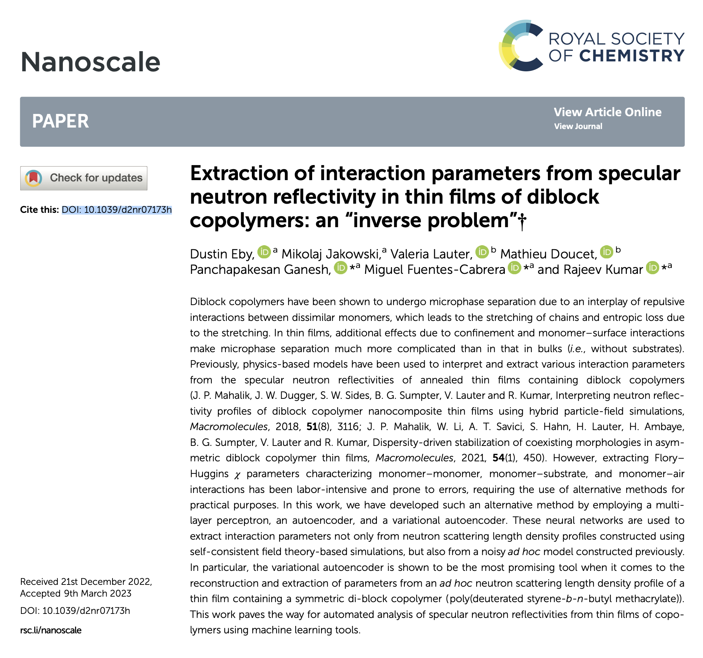

# polyswift_plusplus
Recently open-sourced PolySwift++ source code. A self-consistent field theory code for simulating block copolymer structure

PolySwift++ enables researchers to model complex block copolymer mixtures at the
mesoscopic level critical to many nanoscience applications. PolySwift++ provides a flexible
simulation tool for studying the mesoscale structure of complex polymeric materials
by combining self-consistent field theory (SCFT) methods with high-performance
computing.

Certain proprietary files and dependent libraries have been removed
and are still available from Tech-X.

For a list of PolySwift++ papers see Publications section on https://www.linkedin.com/in/scottwsides

Selected publication:

