.. _psimcomposer-intro:

PSimComposer Introduction
-------------------------------

This introduction to the PSimComposer Graphical User Interface
demonstrates setting up, running, and visualizing simulations.  The
rest of *PSim Examples* assumes that you have
reviewed this section to familiarize yourself with the PSimComposer GUI.

The first sub-section provides an explanation of the basic workflow through
the application, consisting of the three steps: Setup, Run, and Visualize.
Following this portion of the document is a detailed explanation of the options
and commands available through the menu bar at the top of the PSimComposer
window. Finally, this section includes explanations of the default
settings supplied by PSimComposer.

In the HTML version of this document, click on any illustration to see
a full size view.  The images presented in this section have been captured
on a computer running Mac OS X; the PSimComposer interface will
appear slightly different on Windows and Linux platforms.

.. _pci-create-new-runspace-from-example:

Create New Runspace From Example
~~~~~~~~~~~~~~~~~~~~~~~~~~~~~~~~~~~~~

To run one of the examples in PSimComposer, one must first create a runspace from
the many templates that come with PSimComposer. There are two ways to create a
runspace from one of the templates. The first is to choose *New from Template...*
from the File menu.  The second is in the **Setup** window;
click on the *New* button next to *New from Template...* in
the middle of the **Setup** window. See :ref:`pci-setup-window`.

.. _pci-setup-window:

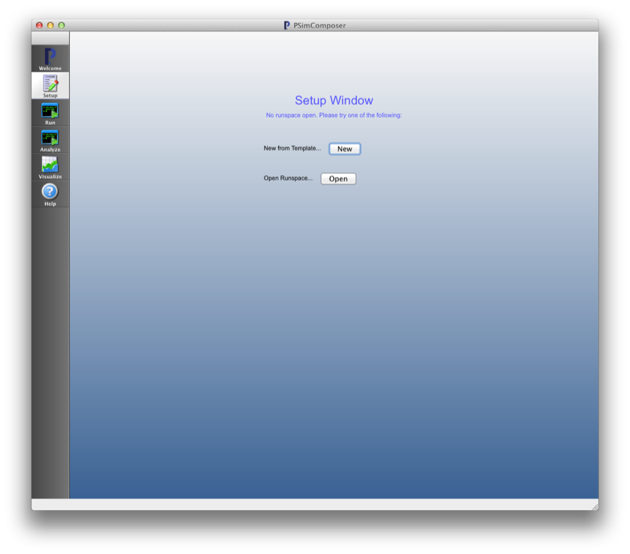

   Setup Window

.. _pci-select-example-dialog:

Select Example Template
~~~~~~~~~~~~~~~~~~~~~~~~~~~~

From the *New from Template* dialog, choose a new example template
from one of the packages.  Only those templates which you have licensed 
will run.

If you have clicked once on your selection in the *Choose Example*
pane, your selection is highlighted. Now click on the **Choose**
(middle) button in the lower right area of the **New from Template**
window as in :ref:`pci-new-from-template`.  Alternatively, you could
double-click on an example name and PSim will behave the same
as if you had selected the example and then the **Choose** button.

For this example we will use the "PSimBase - Linear Diblock" example.
Once an example is selected, click the **Choose** button at the lower right 
in the *New from Template* dialog or double-click on the example name.

.. _pci-new-from-template-package:

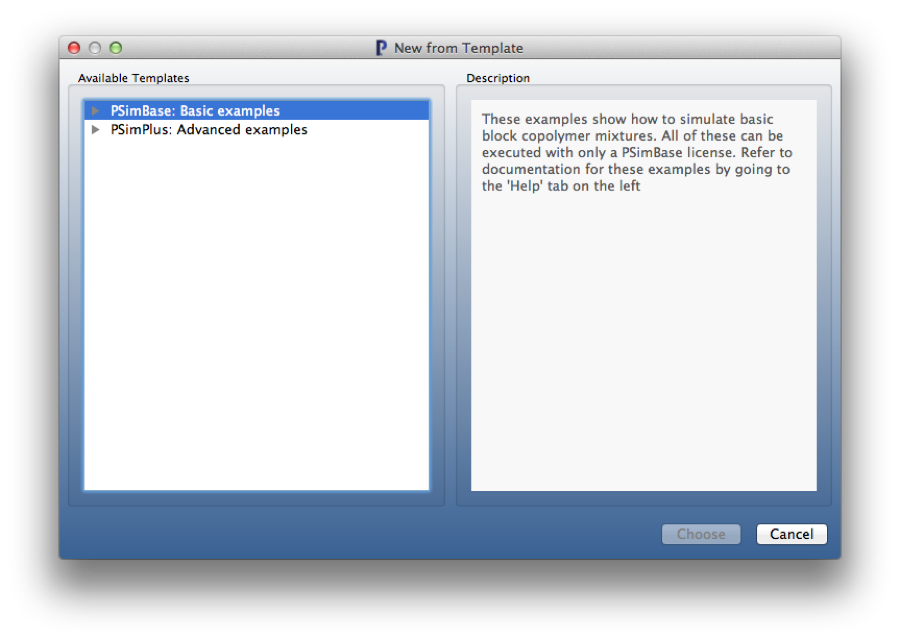

   Selecting a package from the "New from Template" Dialog

.. _pci-new-from-template:

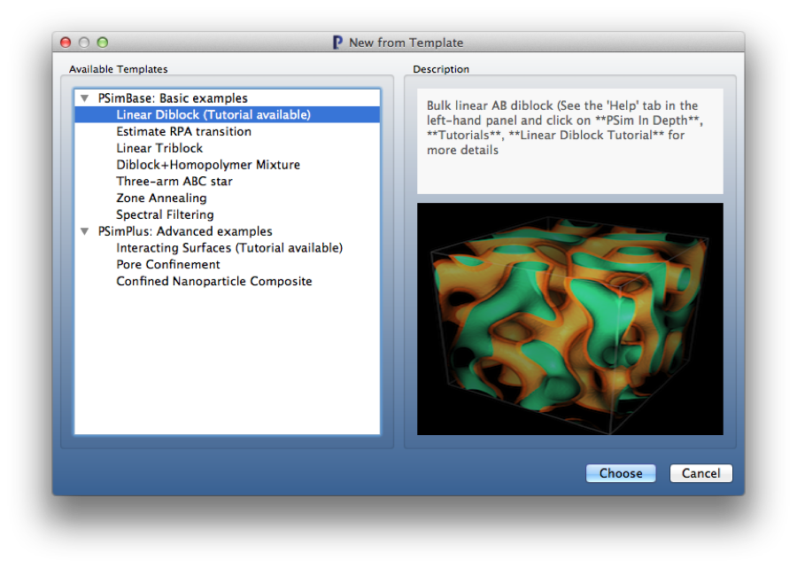

   Selecting a specific template example from the "New from Template" Dialog

.. _pci-choose-a-name-for-the-new-runspace:

Choose a Name for the New Runspace
~~~~~~~~~~~~~~~~~~~~~~~~~~~~~~~~~~~~~~~~

The dialog *Choose a name for the new Runspace* allows you to choose
the directory to which the example files will be copied from the template.
The default name of the directory is displayed in the *FileName*
field.  For this example, the default name is :samp:`linearDiblock`.  If you
want to use a different name, you may type a different name into the *FileName*
field.  When you are satisfied with the directory name and location, click
the **Save** button to proceed.

.. _pci-choose-directory-in-which-to-run:

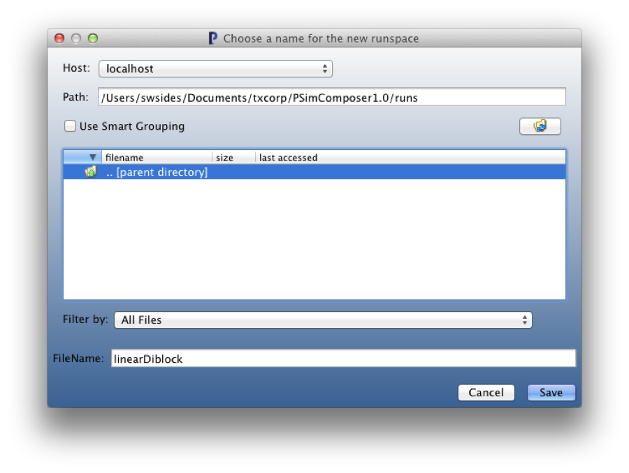

   Create Directory to Use for Runspace

.. _pci-view-the-runspace-files-tab:

Using the Setup Window
~~~~~~~~~~~~~~~~~~~~~~~

After you choose the name for the runspace, PSimComposer
displays the **Setup** window containing a *Navigation* pane on
the left and an *Editor* pane on the right. The icon panel
remains available on the far left.

.. _pci-setup-files-tab:

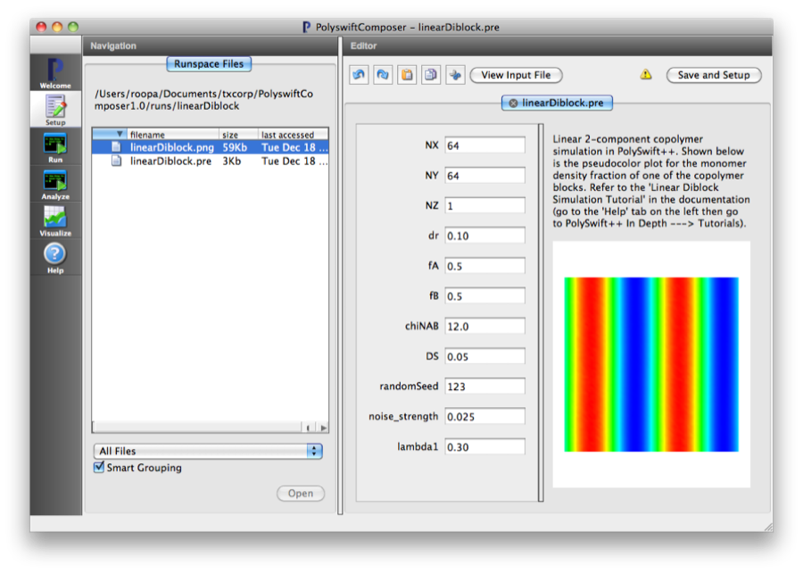

   Setup Files Tab

Below the *Runspace Files* tab in the *Navigation* pane you will find a
pulldown menu for choosing which files are shown. This defaults to *All Files*
and a toggle choice of *Smart Grouping*, which is on by default.
These menus determine the format in which files will be displayed in
the Files tab. Depending on how complex a simulation is, there may be
multiple files used in a simulation, including the input file, macros,
and python geometry files. Many more files produced during the
simulation run at each time step of the run.

To enable convenient viewing of the list of simulation files, PSim
allows you to specify in what order as well as which type(s) of files
you would like to view. *Smart Grouping* causes similar types of files
to be displayed in the same area of the Files tab list. Turning off
*Smart Grouping* causes files to be displayed
in alphabetical order rather than by type. *All Files* indicates that
you want to see all available files involved in the simulation. You
could choose to limit your view to only *Runspace Files*, which are files
such as input files and macros that can be edited in the PSimComposer
Editor pane, or *Text* files, which include all types of human-readable
file formats, or *Data* files, which include incremental dump files and
output files that can be visualized.

File name filtering with these pull-down menus is illustrated later in this
document in the Visualization Pane section, :ref:`pci-visualization-pane-options`.
In addition to Runspace Files, the **Setup** window holds the tab to change
the key parameters for a run and the **Save and Setup** button. See
:ref:`pci-annotated-setup-window`.

.. _pci-annotated-setup-window:

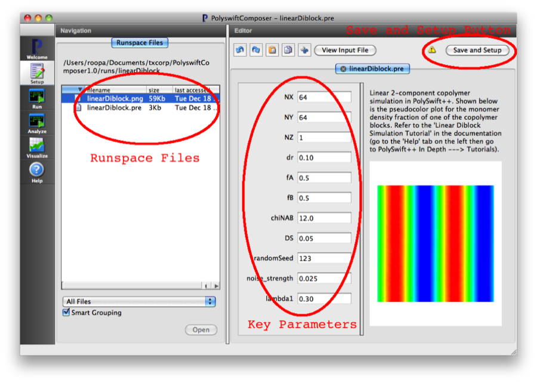

   The main parts of the *Setup Window*

Click on the **Save and Setup** button in the upper right corner
of the PSimComposer **Setup** window to validate the input before running
the PolySwift++ engine.

Key Input Parameters in the Setup Window
^^^^^^^^^^^^^^^^^^^^^^^^^^^^^^^^^^^^^^^^^

All the example files in PSimComposer come with key parameters allowing 
the user to easily adjust basic parameters of the simulation. The default 
**Setup** window will show the exposed variables and an image
of what the simulation looks like. By holding the mouse over the key 
input parameter title, a description of what exactly the variable does will 
pop up. Many examples can actually be significantly modified with just
the key input parameters to be extended for slightly different applications.

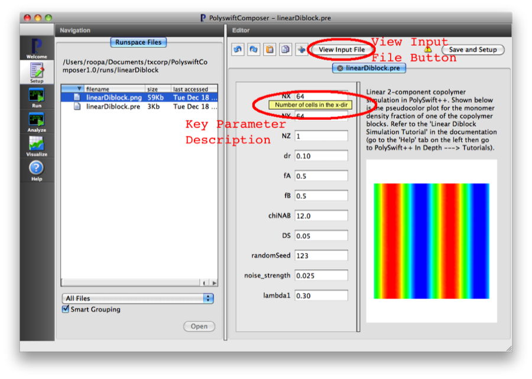

   Key input parameters or the full input file can be edited in 
   the **Setup** window

If you would like to see the actual input file, simply click on 
the **View Input File** button in the upper left hand side of the *Editor* pane.
This will bring you to the traditional .pre file.  Modifications made in 
the **View Parameters** window will carry over if you switch to input file view.

Save and Setup the Input File
~~~~~~~~~~~~~~~~~~~~~~~~~~~~~~~~~~~~~

Click on the **Save and Setup** button in the upper right corner
of the PSimComposer **Setup** window.  Once complete, a green checkmark will
appear as illustrated in the image below.

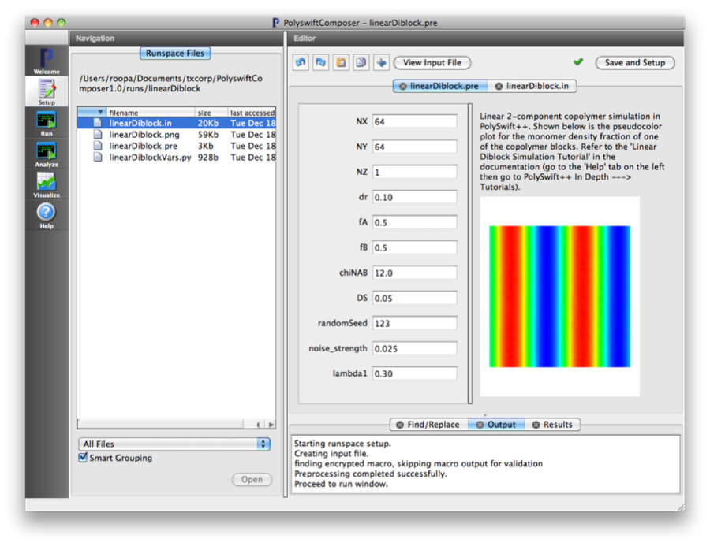

   Save and Setup Button

.. _pci-view-the-output-messages:

View the Output Messages
~~~~~~~~~~~~~~~~~~~~~~~~~~~~~

PSimComposer notifies you of the actions that it is taking in a new window
that opens in the lower portion of the **Editor** pane.

Notice that this new window contains three tabs: a **Find/Replace** tab
an **Output** tab and a **Results** tab. If you had clicked in any tab of the Editor
window, the **Find/Replace** tab would have appeared to assist you with
editing the file. The **Output** tab notifies you each step of the way as to what PSimComposer
is doing as illustrated in :ref:`pci-output-window-message`.

.. _pci-output-window-message:

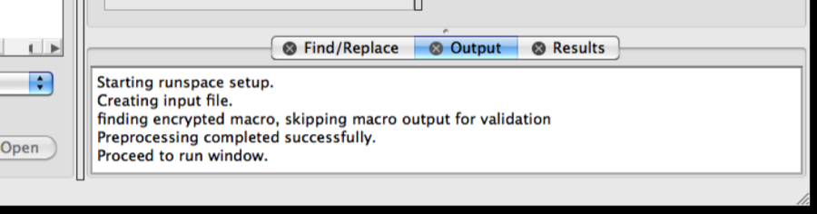

   Setup Window tab for output message

.. _pci-run:

Run
^^^^^

.. _pci-select-the-run-icon:

Select the Run Icon
~~~~~~~~~~~~~~~~~~~~~~~~~~

When your Save and Process activity completes successfully,
PSimComposer reminds you that you can now select the *Run* icon from the icon
panel on the far left of the PSimComposer window. Click on the
**Run** icon now as shown in :ref:`pci-run-icon-on-panel`.

.. _pci-run-icon-on-panel:

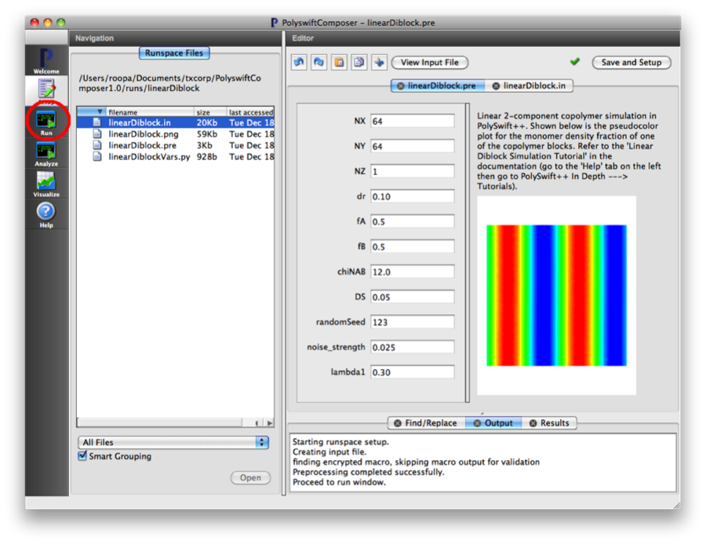

   Run Icon in Icon Panel

.. _pci-view-the-run-window:

View the Run Window
~~~~~~~~~~~~~~~~~~~~~~~~~~~

As in the PSimComposer **Setup** window, the PSimComposer **Run** window
contains two panes. As displayed in
:ref:`pci-newrun-tab-in-logs-and-output-files-pane`, the *Runtime Options*
window on the left contains a *Standard* tab, an *Advanced* tab and 
an *MPI* tab.
The *Logs and Output Files* pane on the right contains a *Engine Log* tab on the
left and a *File Browser* tab on the right.

.. _pci-newrun-tab-in-logs-and-output-files-pane:

   Log: simrun tab in Logs and Output Files pane

.. _pci-view-file-browser-tab-in-logs-and-output-files:

View the File Browser Tab in the Logs and Output Files Pane
~~~~~~~~~~~~~~~~~~~~~~~~~~~~~~~~~~~~~~~~~~~~~~~~~~~~~~~~~~~~~~~~~~~~~

In the previous step the *File Browser* tab was located behind
the *Engine Log* tab in the *Logs and Output Files* pane.
Click on the *File Browser* tab to bring it to the front as shown
in :ref:`pci-file-browser-tab-in-logs-and-output-files-pane`.

Notice that as with the *File Browser* in the **Setup** window, the
*File Browser* in the **Run** window also has the *Smart Grouping*
and *All Files* pull-down menus at the bottom of the tab.

.. _pci-file-browser-tab-in-logs-and-output-files-pane:

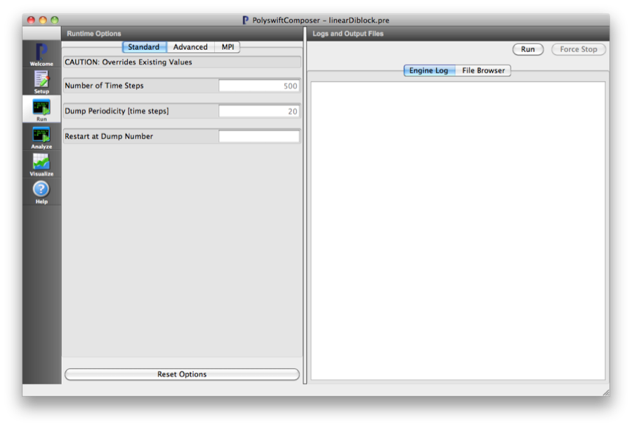

   File Browser Tab in Logs and Output Files Pane

.. _pci-view-runtime-options:

View Runtime Options
~~~~~~~~~~~~~~~~~~~~~~~~~~~~~~~~~~~

Take a look at the *Standard* tab in the *Runtime Options* (left)
pane. PSimComposer enables you to specify runtime options, and in some
cases, override settings in your simulation input file, from this tab.
The *Runtime Options* pane tabs contain fields and options that give
you the flexibility of command line control with the convenience of a
graphical interface much like the key input parameters of the setup window.
To learn about the *Runtime Options* pane tab settings, 
see *PSim In Depth* and *PSim Reference*.

If you make changes to the *Runtime Options*, you can restore the options
to their original settings by clicking on the **Reset Options** button
located below the *Runtime Options* pane on the left.

It is also possible in this menu to restart a paused simulation with 
the *Restart at Dump Number* field.
This will cause the simulation to look for history taken at the 
given dump number, load all the associated
field data, and continue running from that memory dump.

.. _pci-save-options-button:

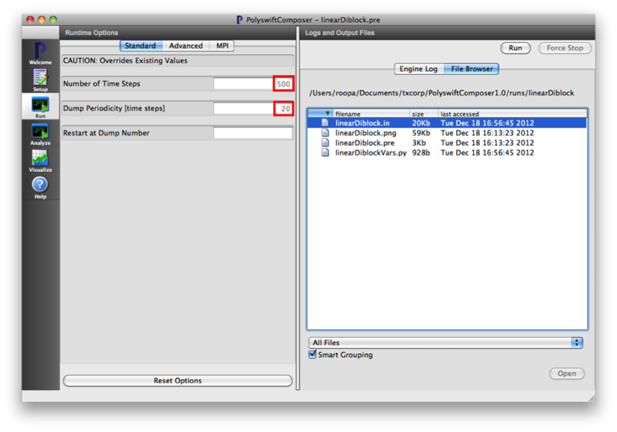

   Reset Options Button

.. _pci-run-the-simulation:

Run the Simulation
~~~~~~~~~~~~~~~~~~~~~~~~

For our example, we'll run this simulation using the default
settings in the input file.  You do not need to select any file in 
particular in the *File Browser* tab before clicking on the **Run** button. 

If the *File Browser* tab display area is too narrow for you to see the 
full file names in the list, you can adjust the width of
the filename field by using your mouse.

Click on the **Run** button at the top of the *Logs and Output Files*
pane as shown in :ref:`pci-run-button`.

.. _pci-run-button:

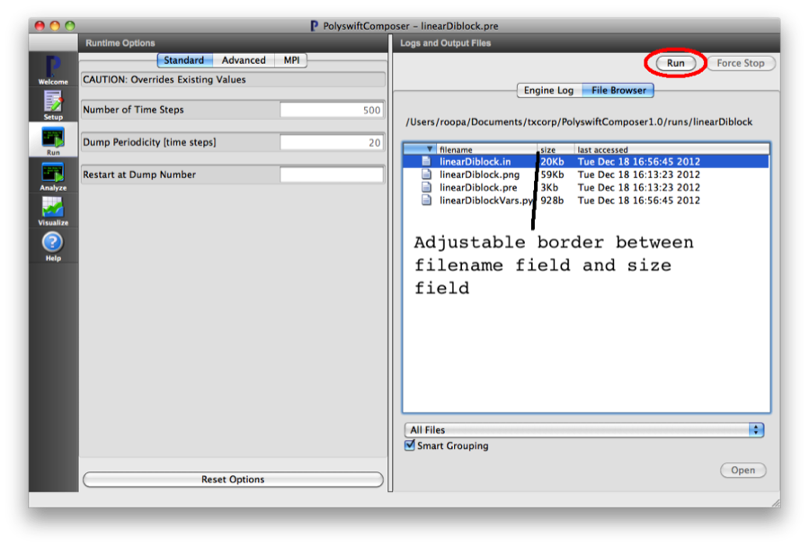

   Run Button

.. _pci-stopping-the-simulation:

Stopping the Simulation
~~~~~~~~~~~~~~~~~~~~~~~~

PSimComposer features the ability to force a stop of a simulation. The button 
for this action is located next to the **Run** button.
The **Force Stop** button is to be used during the setup phase of a problem, 
for example, if you realize that an error was made in the input file after 
clicking **Run** and needs to be corrected.
If a *Force Stop* is used the field and history data will *NOT* be written 
to a .h5 file before the simulation stops.
The output of a successfully force stopped simulation is given below. 

.. _pci-force-stop-button:

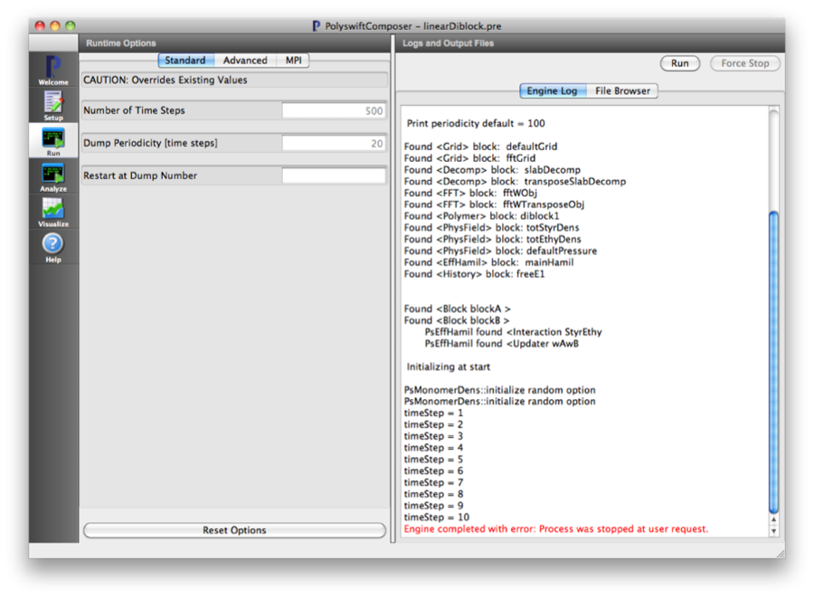

   Force Stopped Simulation

.. _pci-restarting-a-simulation:

Restarting a Simulation
~~~~~~~~~~~~~~~~~~~~~~~~~~

With PSimComposer it is possible to restart a simulation that has been 
paused, or ended. This is useful if it is desired to add more time steps to 
the initial simulation, or if the simulation had been stopped in the middle 
of the run. Underneath the *Standard* tab of the *Runtime Options* pane of 
the **Run** window there is a *Restart at Dump Number* field.

Simply put in the last memory dump of the simulation and then put in the 
number of time steps in the *Number of Time Steps* field and click on 
the **Run** button, like running a normal
simulation. This process is demonstrated in the figure below. 

.. _pci-restart-simulation:

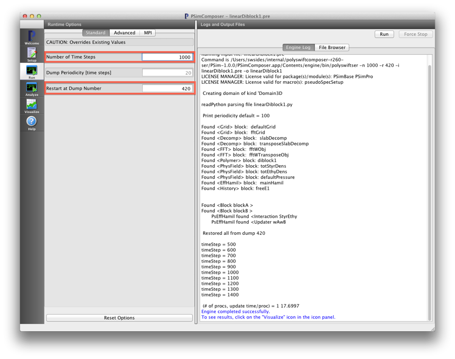

   Restarting a Simulation. This simulation ran for an initial 500 steps. 
   The dump period is 20 steps, so this simulation may be started from a 
   state that is an integer multiple of 20. Here the simulation is started 
   at step 420, run for an addition 1000 steps. The engine log is set to 
   show update step status every 100 steps.

.. _pci-view-the-simulation-log:

View the Engine Log / File Browser
~~~~~~~~~~~~~~~~~~~~~~~~~~~~~~~~~~~~~~~

Just as when processing the setup, PSimComposer again notifies you of the
progress of its activity by reporting results along the way in the
*Engine Log* tab as shown in :ref:`pci-run-log`. If the tab display
area is full, scroll down to the bottom of the tab.

.. _pci-run-log:

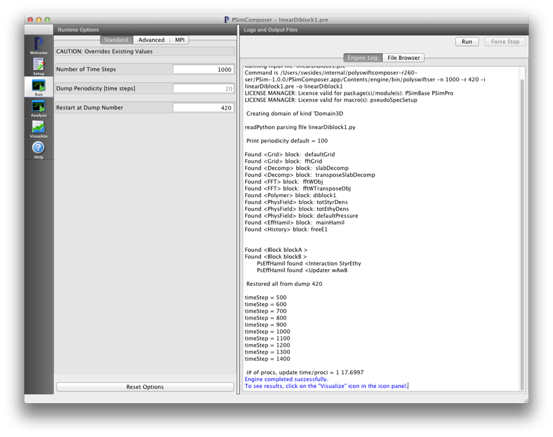

   Engine Log

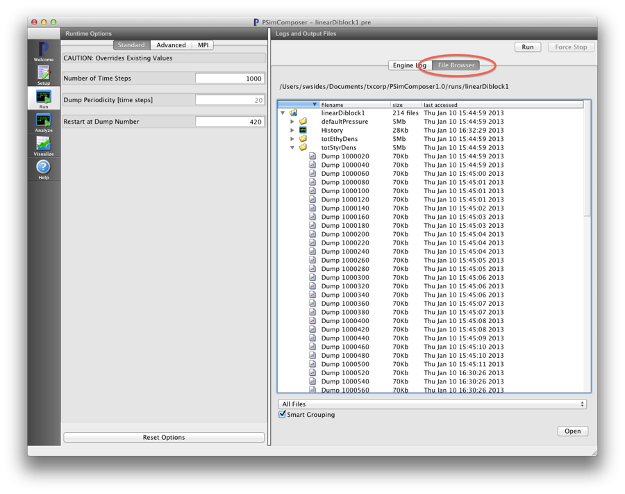

   File Browser. The separate dumps can be seen by drilling down using the gray arrows to the left

.. _pci-analize-the-data:

Analyze the Data
~~~~~~~~~~~~~~~~~~~~~~~~~~~

It is possible to run post processing python scripts on the data generated 
in your simulation run.
For specific applications it is possible to develop your own post processing 
scripts and run them through the "Browse for custom script" button.
The analysis scripts to be used are specified in the input file.

.. _ pci-run-the-analysis:

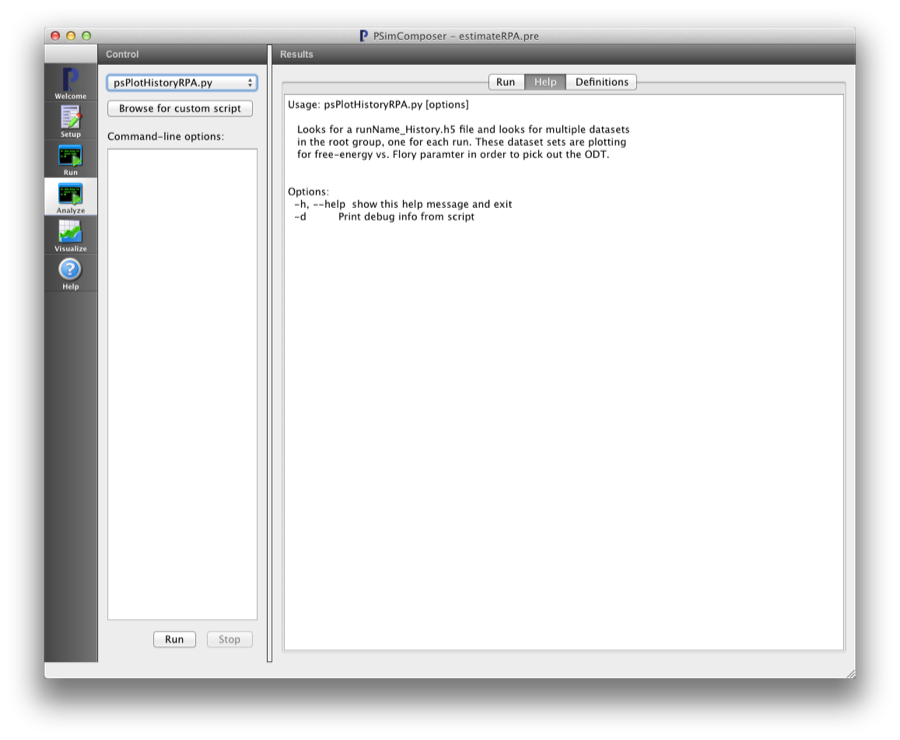

   Analysis Script Run

.. _pci-visualize-the-data:

Visualize the Data
~~~~~~~~~~~~~~~~~~~~~~~~~~~

.. _pci-select-the-visualize-icon-from-the-icon-panel:

Select the Visualize Icon from the Icon Panel
^^^^^^^^^^^^^^^^^^^^^^^^^^^^^^^^^^^^^^^^^^^^^^^^^^^

Notice that upon successful completion of the simulation run,
the last message in the *Engine Log* tab is a reminder that you
can now select the **Visualize** icon from the icon panel on the far
left of the PSimComposer window as seen in
:ref:`pci-visualize-icon-in-icon-panel`. Remember that you may need to
scroll down the *Engine Log* tab to see the completion message.

.. _pci-visualize-icon-in-icon-panel:

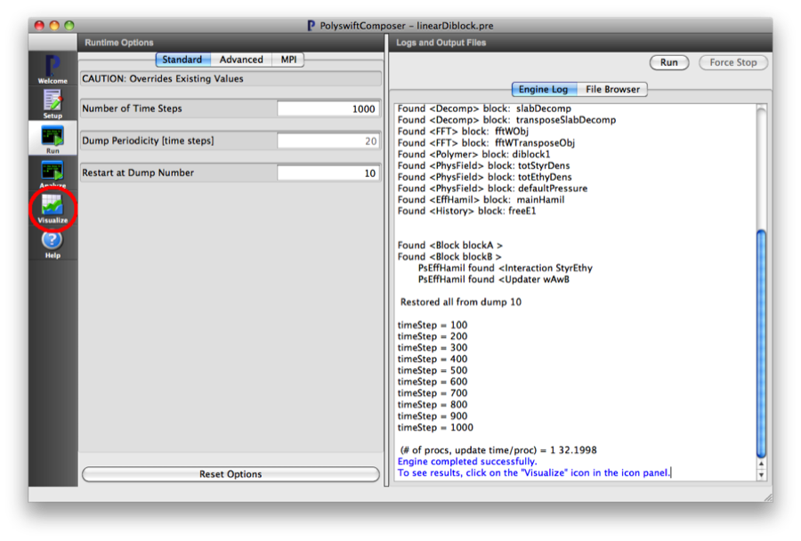

   Visualize Icon in Icon Panel

.. _pci-visualize-the-current-runspace-data:

Visualize the Current Runspace Data
^^^^^^^^^^^^^^^^^^^^^^^^^^^^^^^^^^^^^^^^^^^^^^^^^^^

The simulation was successful and the next step is to visualize the data,
Click on the **Open** Button in the **Visualize** window.

.. _pci-visualize-window-open-button:

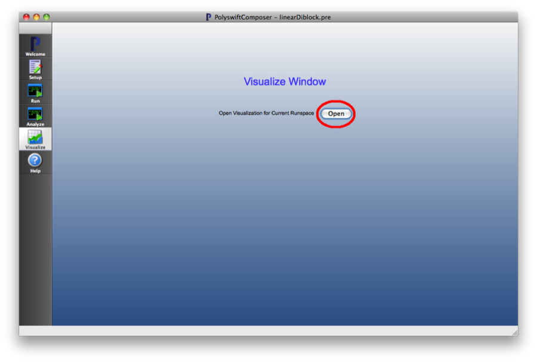

   Visualize Window Open Button

.. _pci-data-visualization-window:

Data Visualization Window
^^^^^^^^^^^^^^^^^^^^^^^^^^^^^^^^^^^^^^^^^^^^^^^^^^^

PSimComposer's visualization feature is a flexible and comprehensive 
viewer based on VisIt. The simulation tutorials and examples 
in *PSim Examples* provide several examples of using
the visualization feature in context.

The **Visualize** window is divided into a *Controls* pane on the left
and a *Visualization* pane on the right.

As displayed in :ref:`pci-scalar-fields-options`, click on the right-facing 
triangle arrowhead next to *Scalar Data* to expand the view of 
the *Scalar Data* options in the **Variables** window.

.. _pci-scalar-fields-options:

.. New_Format
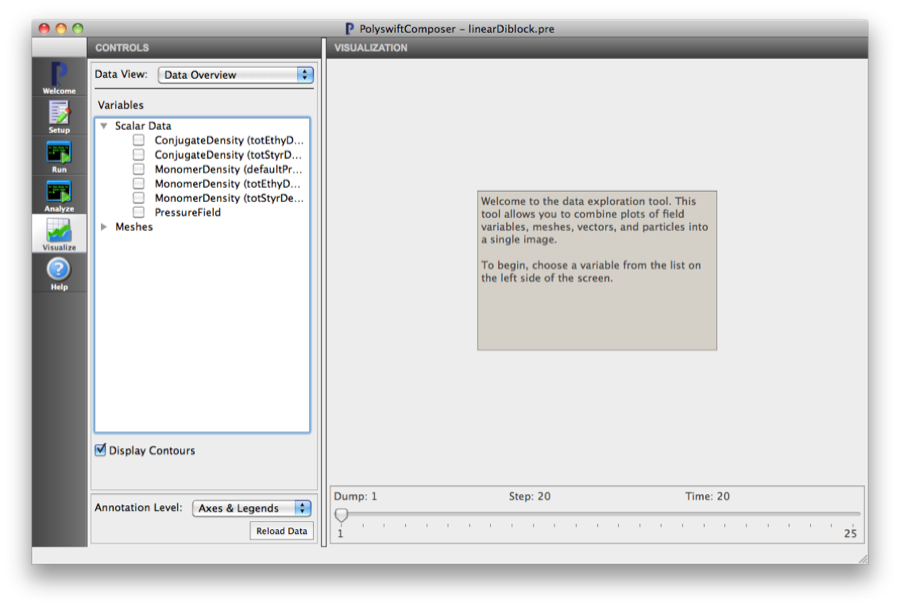

   Select Scalar Data Options

Click on *totEthyDens* in the *Scalar Data* option list.

.. _pci-visualize-totethydens:

.. New_Format
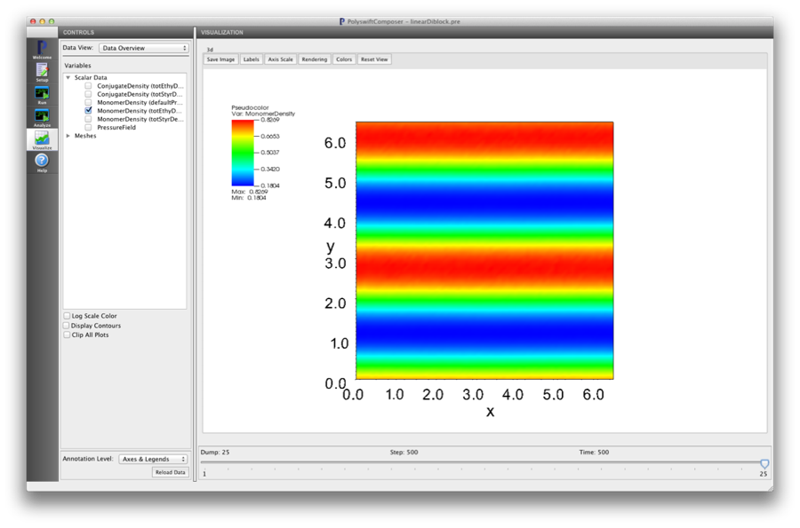

   Visualize the Data

Visualization Pane
^^^^^^^^^^^^^^^^^^^^^^

The PSimComposer Visualization Tool uses a window in the **Visualization** pane on the right side of the PSimComposer
window to dynamically display data modeled according to the selected variables and other **Controls** pane visualization configuration settings.
The following images illustrate how the various features of the Visualization Tool can be used to control rendering of
simulation data to help the user visually explore aspects of the simulation.

.. _pci-visualize-previous-run:

Visualize Data from a Previous Run
^^^^^^^^^^^^^^^^^^^^^^^^^^^^^^^^^^^^

In addition to visualizing the results of a current run immediately 
after conducting the simulation, you can also visualize data from a 
previous run. You can access recent simulations using **Recent Runspaces** in
the **File** menu in the menu bar or the **Welcome** window, or you can 
locate all previous simulations using the *Open Existing Runspaces* in 
the **Setup** window.

.. _pci-recent-runspaces:

Open Recent Runspace from the File Menu
~~~~~~~~~~~~~~~~~~~~~~~~~~~~~~~~~~~~~~~~~~~~~

To access data to visualize from a recently conducted simulation, 
select **Recent Runspaces** from the **File** menu in the menu bar.

.. _pci-recent-runspaces-menu:

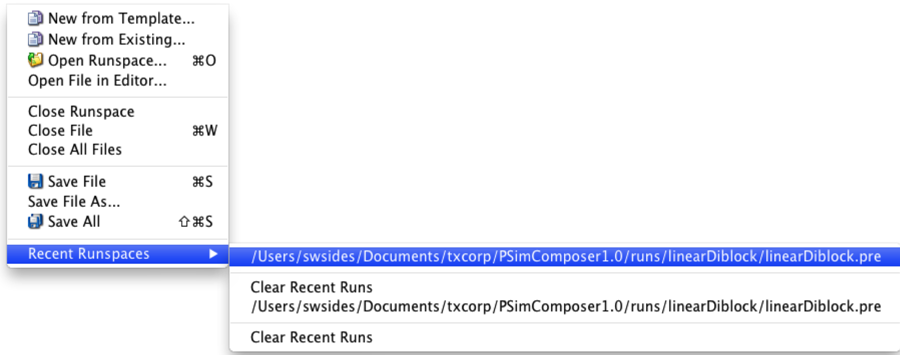

   Recent Runspaces Selection in File Menu

Click on the name of the runspace whose data you want to visualize.  
PSimComposer lists the existing data files in the selected runspace.  Click 
on the **Yes** button if these are the files you want to visualize.

If you would prefer that PSimComposer does not first list the names of the 
detected data files for you to inspect before deciding whether you would 
like to visualize that data, click in the checkbox labeled *Do not ask again*. 
Clicking in this checkbox will cause PSimComposer from now on to immediately 
visualize the data from the selected runspace.

.. _pci-data-files-detected:

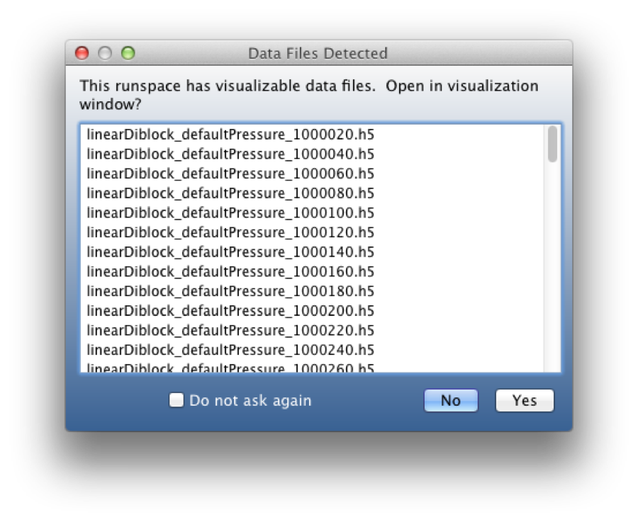

   Data Files Detected in a Runspace

.. _pci-open-existing-runspace-from-setup-window:

Open an Existing Runspace from the Setup Window
^^^^^^^^^^^^^^^^^^^^^^^^^^^^^^^^^^^^^^^^^^^^^^^^^^^^

If the simulation data you want to visualize was not produced recently, 
use the **Setup** window instead of **Recent Runspaces**. Return to the **Setup** window by clicking on the **Setup** icon in the icon panel then select the **Open** button next to *Open Existing Runspace* as shown in :ref:`pci-open-existing-runspace-button`.

.. _pci-open-existing-runspace-button:

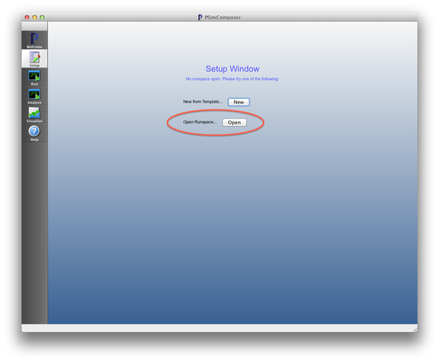

   Existing Run Space button

PSimComposer displays runspaces from which you may select.

.. _pci-open-existing-runspace-selection:

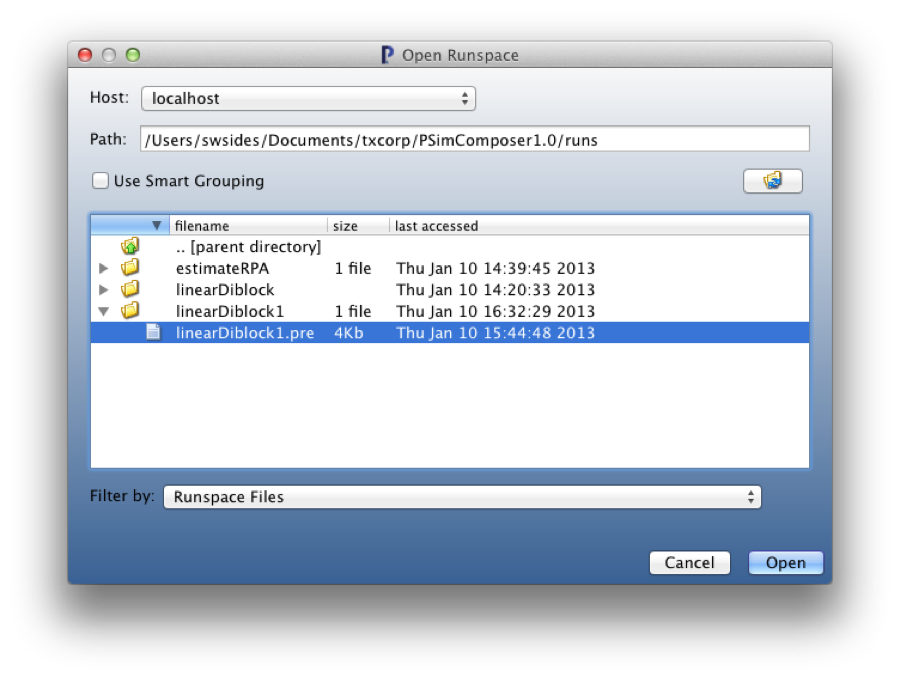

   Existing Run Space Selection. *Note* you must drill down to the 
   input (.pre) file and highlight so the *Open* button will be active.

If you did not previously elect to not display detected data files then just 
as with :ref:`pci-recent-runspaces`, PSimComposer displays a list of data 
files that it has detected in the selected runspace, and you can click on the
**Yes** button to visualize the data.

PSimComposer Menu Bar
-----------------------

This introduction to the PSimComposer menu bar presents features
accessible from the menu bar. In the HTML version of this document, click on
any illustration to see a full size view. The images presented in this
section have been captured from the Mac OS X-based PSimComposer; the
PSimComposer interface will appear slightly different in the Mac OS X
interface than on Windows and Linux platforms.
The PSimComposer menu bar is located across the top of the desktop screen.

.. _pci-file-menu:

File Menu
~~~~~~~~~~~~~~

The *File* menu contains options to control creating, opening, closing, 
and saving PSimComposer files and runspace directories.

.. _pci-file-menu-figure:

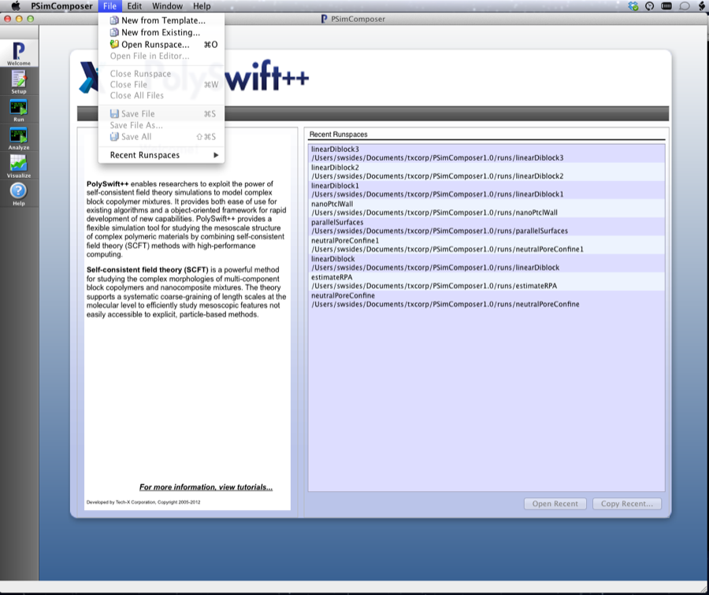

   File Menu

The **New from Template** feature is accessed from the PSimComposer 
**File** menu. Categories of templates from which to choose are listed in 
the left *Available Templates* pane of the **New from Template** window.  
The description of the selected category is displayed in the right
*Description* pane of the **New from Template** window.
The *PSimBase* category contains a number of example simulation
files that are used in *PSim Examples* and available with any PolySwift++ engine license.
As with the example categories, names of examples are listed in the left **Available Templates
Example** pane with the description corresponding to the currently
selected example shown in the right **Description** pane.

.. _pci-PSimBase-category:

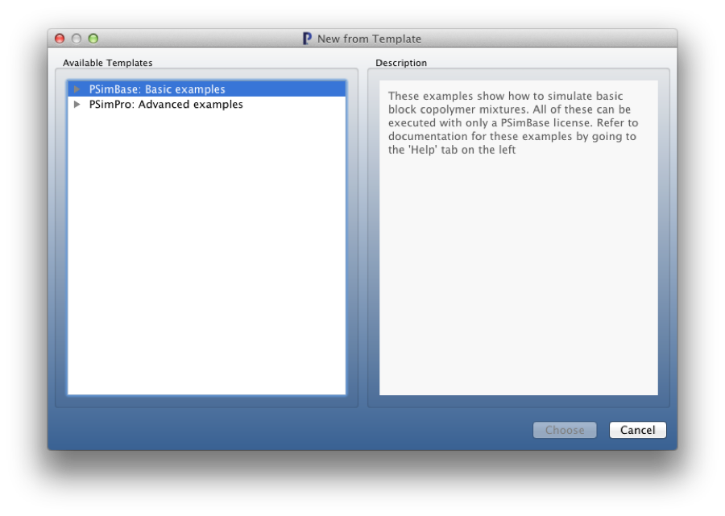

   PSimBase Example list

To open a runspace directory where existing simulation files reside,
select **Open Runspace** from the **File** menu.

.. _pci-file-menu-open-runspace:

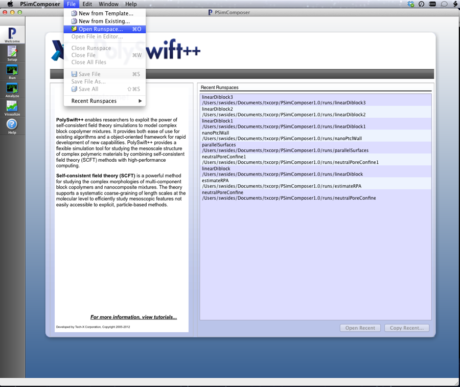

   Open Runspace selection from File menu

The default directory in which runspace directories will be created when 
you use PSimComposer to set up simulations, is the :samp:`runs` directory 
located in the :samp:`PSimComposer1.0` directory that is created
in your home directory when you install.

.. _pci-file-menu-open-runspace-window:

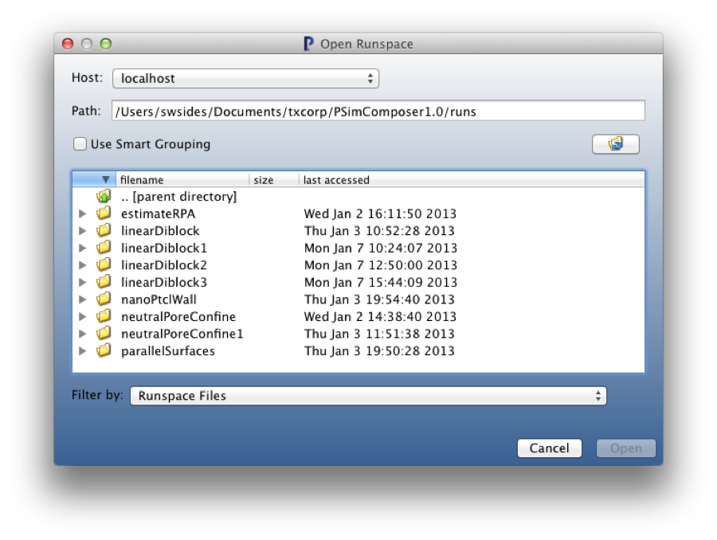

   Open Runspace window

.. _pci-edit-menu:

Edit Menu
~~~~~~~~~~~~~~

The **Edit** menu contains commands that pertain to editing activities 
in the *Editor* pane of the PSimComposer window during **Setup**.

.. _pci-tools-menu:

Tools Menu (Windows)
~~~~~~~~~~~~~~~~~~~~~~~~~~~

The **Tools** menu provides access to global settings for PSimComposer
applications from the icon panel. The **Tools** menu contains the
**Settings** selection. Select **Settings** from the **Tools** menu to
access the **Application Settings** window.

Preferences Menu (MacOSX)
~~~~~~~~~~~~~~~~~~~~~~~~~~~

The main **PSimComposer** menu provides access to the global settings for
PSimComposer applications from the icon panel. The **PSimComposer** menu 
contains the **Preferences** selection. Select **Preferences** from 
the **PSimComposer** menu to access the **Application Settings** window.

.. _pci-tools-menu-applications-item:

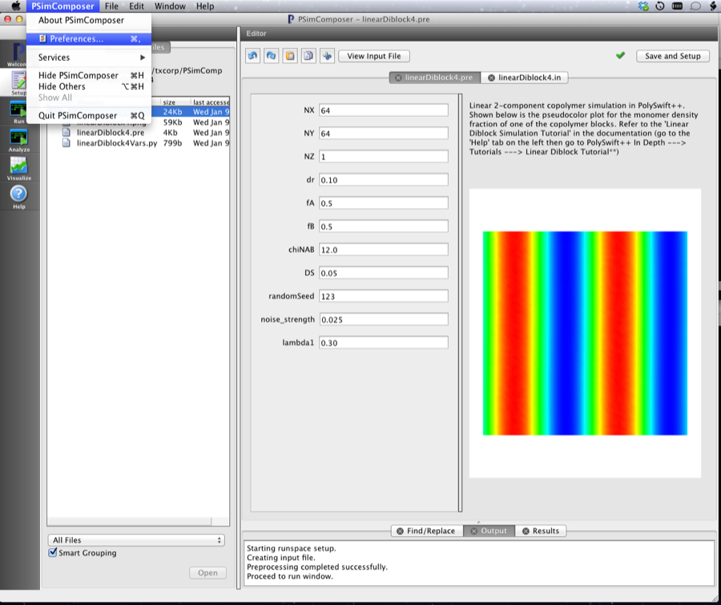

   Select Settings from the Tools menu

Application Settings
~~~~~~~~~~~~~~~~~~~~~~~

General
^^^^^^^^^^

The **Application Settings** window is displayed with **General** highlighted.

General Application Settings apply to default behavior for the
PSimComposer applications such as file and directory actions.

.. _pci-tools-app-set-gen:

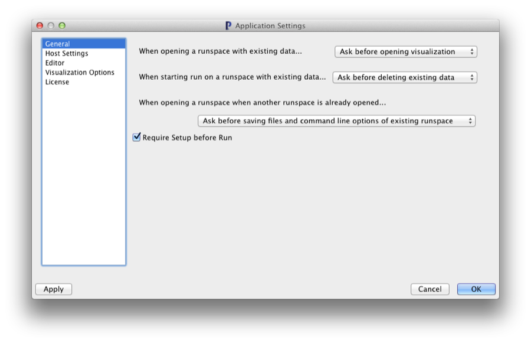

   General Application Settings

The default setting that PSimComposer will use when opening a runspace
with existing data is *Ask before opening visualization*. If you know
that you will always want to visualize data whenever it is available,
you may use the pulldown menu to set the default to *Always open
visualization*. If you prefer to indicate whenever you want to visualize
existing data by using the **Visualize** icon yourself instead of having
PSimComposer open the visualization of existing data for you, you may
use the pulldown menu to set the default to or *Never open
visualization*.

Host Settings
^^^^^^^^^^^^^^^^^^

By default, the PolySwift++ engine runs in serial mode. If you have a multi-core
system capable of parallel processing, you can set the default to parallel
instead of serial by clicking on the **Host Settings** radio button in the
**Application Settings** window. Then click on the MPI Button near the top of the
**Application Settings** window and switch the *Preferred run method:* from *Serial*
to *Parallel (MPI)*. PSimComposer detects the number of available cores for the system on
which it is running and lists this value in the **Cores on machine** field.

PSimComposer reads the PolySwift++ engine license file and sets the default number
of **Cores in license** to match the number of cores specified in the
license file. If you would like to run simulations using fewer processes
than the number of cores for which your software is licensed or perhaps
try some load balancing using more processes than you have cores, you
may change the number of cores by entering a new value in the
**Preferred number of cores** field. When the value in the
**Preferred number of cores** field is set to something other than
the last saved value, PSimComposer places an asterisk in front of the
field label so that you are aware that you have changed the value and
may wish to save the new value.

.. _pci-app-set-engine:

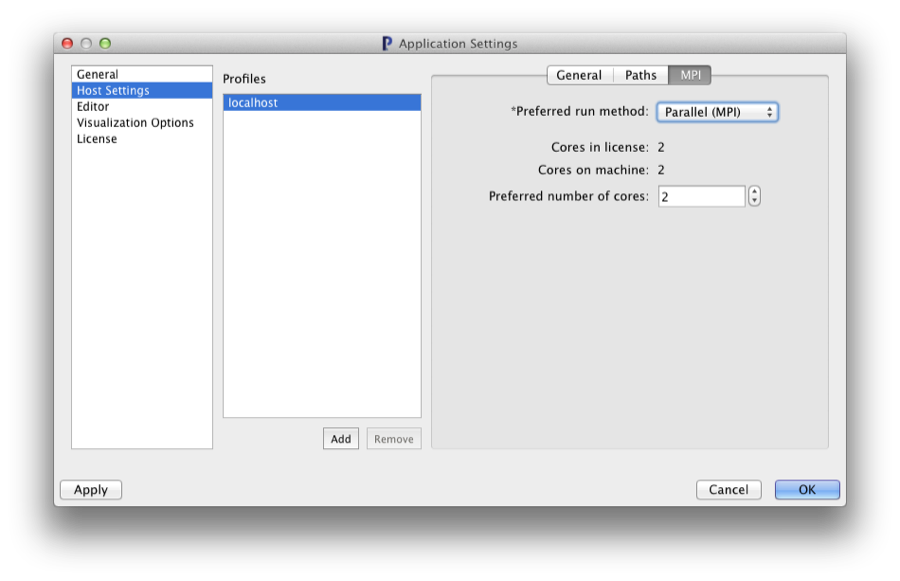

   Application Setting Engine Menu

PSimComposer is the graphical user interface (GUI) part of the PSim
product. The PolySwift++ directory is the directory into which the non-GUI
portion of the PSim simulation product, also referred to as the PolySwift++
engine, was installed. The ability to change the directory path to the
PolySwift++ engine from within PSimComposer is an advanced feature mainly
provided for use in consultation with Tech-X Customer Support. Please do
not change this directory path unless you are an experienced PolySwift++
user. If you are an expert user and have more than one version of PolySwift++
available, you may set the PolySwift++ directory path to point to another
version by checking the **Select custom PolySwift++ directory**
radio button and entering the path to another installation of PolySwift++.
The **Browse** button is available to help you find the path. You can
reset the path back to the default installation of the PolySwift++ engine by
clicking on the **Select default PolySwift++ directory** radio button.

.. _pci-editor-menu:

Editor
^^^^^^^^^^

The editor tab contains default settings for font size. These are editable to the users desired settings.
Any file with the extensions listed in the *Extensions* box will use the settings
under *Files with Fixed-width Font* and all other files under the *All Other Files* sections.

.. _pci-editor:

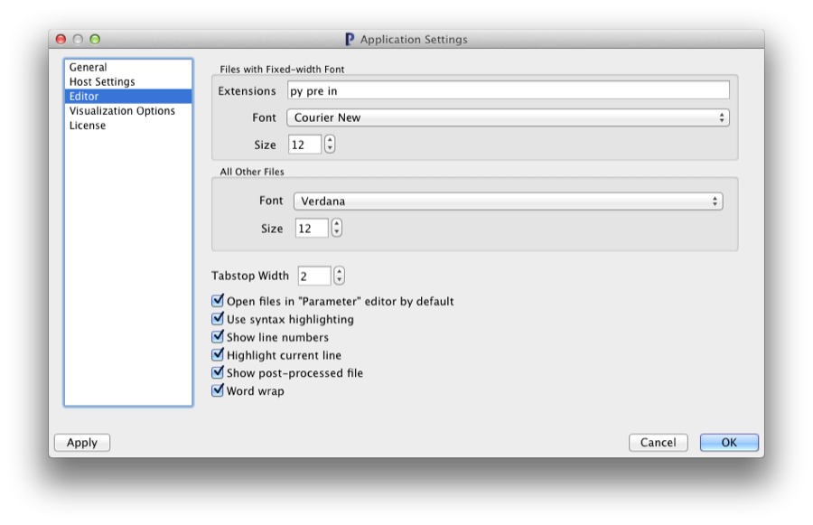

   Editor Menu

.. _pci-visualization-options-menu:

Visualization Options
^^^^^^^^^^^^^^^^^^^^^^

The visualization options tab allows the user control over default settings 
of the *Visualize* tab in PSimComposer. By checking *Manual font sizing* the 
size of the fonts can be controlled. If *Enable VisIt context menu* is selected
it will be possible to right click on the visualization and open VisIt itself 
allowing the user access to every function and feature of VisIt.
It also enables the embedded point and line tools in VisIt as well as some 
of the generic view controls.

.. _pci-visualization:

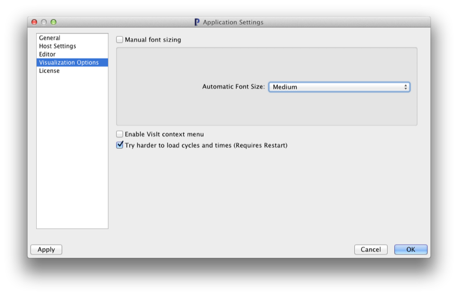

   Visualization Menu

License
^^^^^^^^^

It is possible to review your license, as well as install
a new license if an upgrade or additional packages are purchased.
If the checkbox in the upper right hand corner *Display Full
Details* is checked all information about your license, including
number of cores, expiration date and available packages will be
displayed. To install a new license with a Mac or Linux OS, click
on the *Install New License* button and navigate to where your
new license is located, and hit ok.  To install a new license on
Windows the license must be moved manually into the *C:\Program
Files\Tech-X (Win64)\PSim 1.0\Contents\engine\bin* directory.

.. _pci-license:

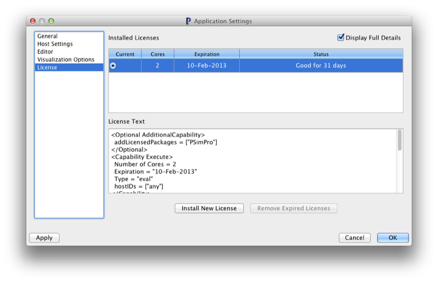

   License Menu

.. ref:`hdf5`.

Output File Naming Conventions
-------------------------------

The first part of the output file name is the name of the input file.
This is often referred to as the *dataset name* or *base name*.

The second part of the output file name indicates the file’s contents,
for example:

    - The name of the field or particle data such as totStyrDens, totEthyDens
      or sphereParticle1
    - History, containing data recorded over time.

The third part of the output file name is the dump number. For the PolySwift++
engine the dump number has 1,000,000 added in order to aid file system sorting.
The final part of the output file name is the suffix. For most of the examples
here, the suffix is 'h5' to denote HDF5 format.
