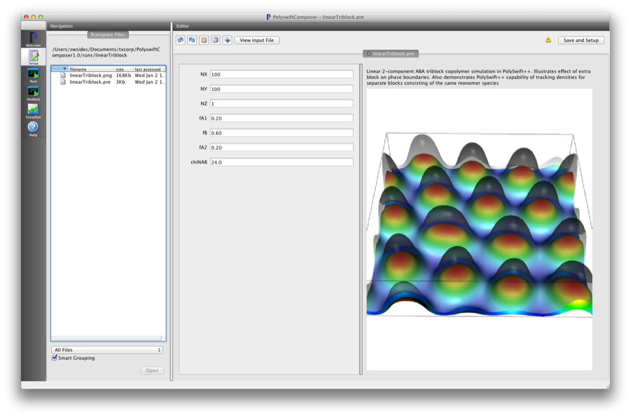
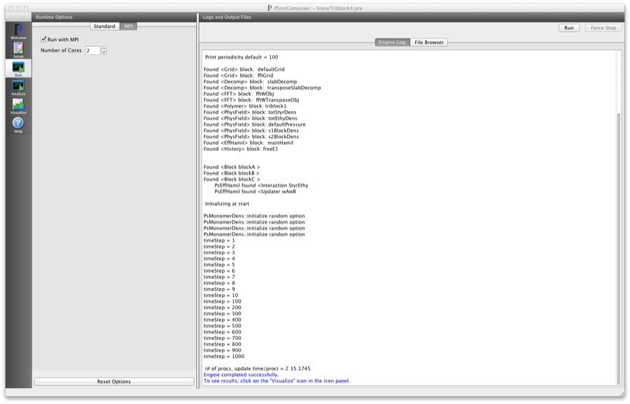
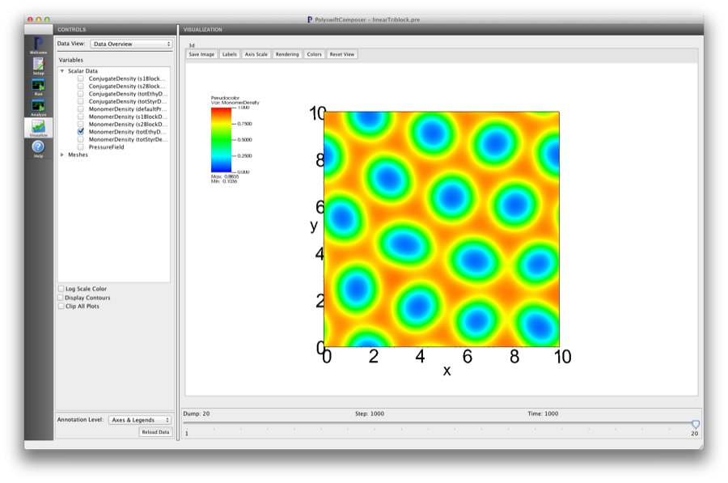

Bulk Linear Triblock (linearTriblock.pre)
------------------------------------------

.. $Id: linearTriblock.rst.template 1379 2012-11-06 20:50:31Z cary $

.. In the index, give physics terms first, then the types, which you
   can find by
   grep \< esPtclInCell/esPtclInCell.pre | grep -v '</' | sed -e 's/^ *//' -e 's/ .*$//' -e 's/^<//' | sort | uniq
   then block kinds, which you can find via
   grep kind esPtclInCell/esPtclInCell.pre | sed -e 's/^.*=//' -e 's/^ *//' | sort | uniq

.. index:: keyword1, keyword2, types, kinds

Keywords:

.. describe:: phase diagram, triblock, multiblock, copolymer, morphologies, bulk behavior

Problem description
^^^^^^^^^^^^^^^^^^^

This simulation can be performed with a PSimBase license.

This example shows how to simulate copolymer chains with multiple blocks using 
PSim by modeling a 2-component linear triblock (ABA). Since there are two 
distinct blocks with the same monomer species, this example also shows how to 
separately track the contributions to the monomer density different blocks.

Input File Features
^^^^^^^^^^^^^^^^^^^

Files: :ref:`linearTriblock.pre`.

The variables in the *Setup* tab are

    - NX (Number of cells in the x-dir)
    - NY (Number of cells in the y-dir)
    - NZ (Number of cells in the z-dir)
    - fA1 (Length fraction of 'head A' block)
    - fB  (Length fraction of 'B' block)
    - fA2 (Length fraction of 'end A' block)
    - chiNAB (Flory :math:`\chi N` parameter between the two chemically distinct blocks"

Note, the two block lengths controled by 'fA1' and 'fA2' consist of the same
 monomer species.

The parameters 'fA1', 'fA2', and 'fB' refer to the triblock length fractions 
of the two outer blocks and one middle block respectively of the ABA triblock 
being simulated.
When changing these parameters note that :math:`f_{A1} + f_{B} + f_{A2} = 1`.
To separately track the contributions from the two 'A' blocks there are two 
extra physical field blocks specified

::

	<PhysField s1BlockDens>
 	  kind = monomerDens
	  type = fieldD3R
	</PhysField>

	<PhysField s2BlockDens>
	  kind = monomerDens
	  type = fieldD3R
	</PhysField>

These blocks are refered to by an optional parameter, 'blockfield', in the input
blocks specifying the triblock model

::

  <Block blockA>
    kind = flexPseudoSpec
    scfield = totStyrDens
    blockfield = s1BlockDens
    ds = DS
    lengthfrac = fA1
    headjoined = [freeEnd]
    tailjoined = [blockB]
  </Block>

  <Block blockC>
    kind = flexPseudoSpec
    scfield = totStyrDens
    blockfield = s2BlockDens
    ds = DS
    lengthfrac = fA2
    headjoined = [blockB]
    tailjoined = [freeEnd]
  </Block>

Creating the run space
^^^^^^^^^^^^^^^^^^^^^^

The Linear Triblock example is accessed from within PSimComposer by the 
following actions:

 * Select the *New from Template* menu item in the *File* menu.
 * In the resulting *New from Template* window, select
   *PSimBase* and then press the arrow button to the left.
 * Select "Linear Triblock" and press the *Choose*
   button.
 * In the resulting dialog, press the *Save* button to create a
   copy of this example in your run area.

The basic variables of this problem should now be settable in
text boxes in the right pane of the "Setup" window, as shown
in :num:`Fig. #lineartriblocksetupwin`.

.. _lineartriblocksetupwin:

   Setup window for the Linear Triblock example.

Running the simulation
^^^^^^^^^^^^^^^^^^^^^^^^^

After performing the above actions, continue as follows:

 * Press the *Save And Setup* button in the upper right corner.
 * Proceed to the run window as instructed by pressing the Run button
   in the left column of buttons.
 * Note: because the initial random state depends on the number of processors,
   the final simulation state can depend on the number of processors chosen
   if running in parallel. The results in this example are produced by running
   on two processors. The parallel run options can be accessed by going to the 'MPI'
   tab on the left side of the *Run* button window.
 * To run the file, click on the *Run* button in the upper right corner.
   of the window. You will see the output of the run in the right pane.
   The run has completed when you see the output, "Engine completed
   successfully."  This is shown in :num:`Fig. #lineartriblockrunwin`.

.. _lineartriblockrunwin:

   The Run window at the end of execution.

Visualizing the results
^^^^^^^^^^^^^^^^^^^^^^^^^^

After performing the above actions, continue as follows:

 * Proceed to the Visualize window as instructed by pressing the
   Visualize button in the left column of buttons.
 * Press the "Open" button to begin visualizing.
 * Go to the *Scalar Data* Variable in the *CONTROLS* panel on the left and
   press the arrow to the left
 * Check one of the *MonomerDensity* boxes (try the totEthyDens database)
   This selects all of the datafiles for this physical field 'totEthyDens'.
   This first *h5 file will be shown first.
 * Move the *Dump* slider at the bottom of the window to the last position
   to see the final simulation state.
 * Click on the *Colors* button in the *Visualization* pane. Different coloring schemes
   can be selected from here as well as scaling the colors between minimum and maximum values.
   As the monomer density fractions take on values between [0, 1], set the min/max values  
   accordingly. This is shown in the following figure

.. _lineartriblockvizwin:

   Visualization of Linear Triblock as a color contour plot.

Further Experiments
^^^^^^^^^^^^^^^^^^^^^^^^^^

Change the length fraction of the end blocks and re-run simulation.
Visualize the separate block density fractions 's1BlockDens' and 's2BlockDens'
to see how the distinct end blocks contribute to the overall monomer density 
'totStyrDens'

Note, the image on the *Setup* window is generated by accessing the full VisIt
capability by right clicking on the *Visualization* pane and starting the 
VisIt GUI.
