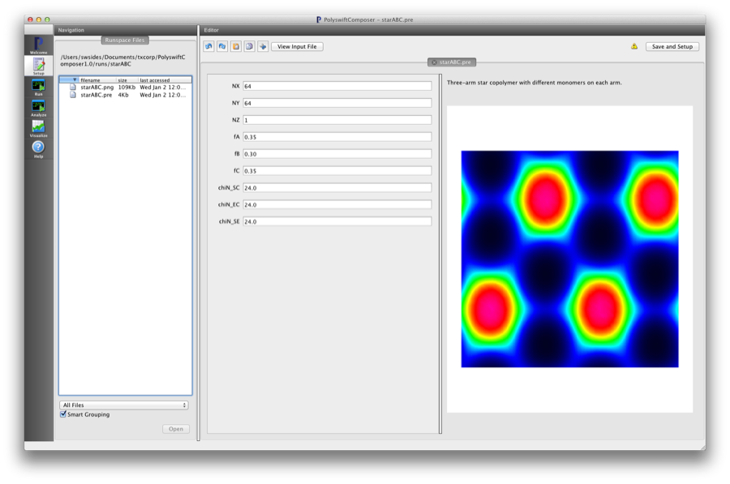
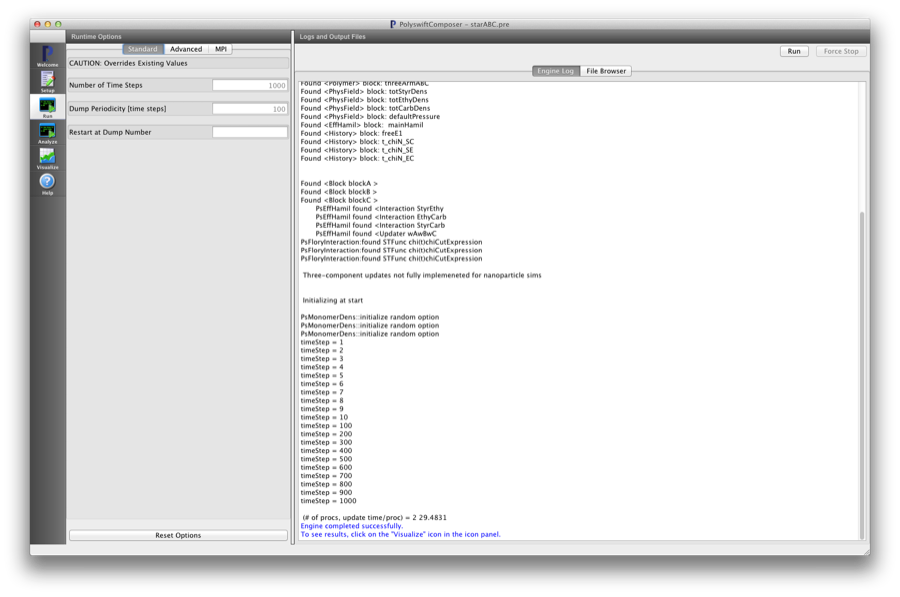
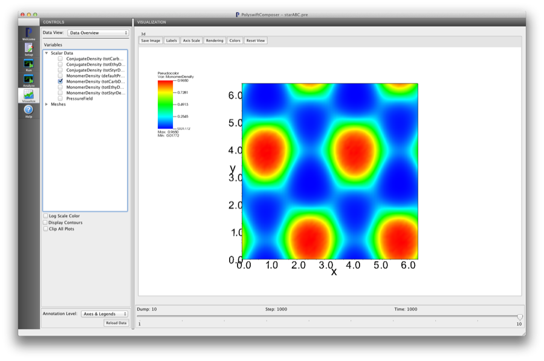

Three-arm ABC Star Copolymer (starABC.pre)
--------------------------------------------

.. $Id: starABC.rst.template 1379 2012-11-06 20:50:31Z cary $

.. In the index, give physics terms first, then the types, which you can find by
   grep \< esPtclInCell/esPtclInCell.pre | grep -v '</' | sed -e 's/^ *//' -e 's/ .*$//' -e 's/^<//' | sort | uniq
   then block kinds, which you can find via
   grep kind esPtclInCell/esPtclInCell.pre | sed -e 's/^.*=//' -e 's/^ *//' | sort | uniq

.. index:: copolymer, multiblock, star

Keywords:

.. describe:: copolymer, multiblock, star

Problem description
^^^^^^^^^^^^^^^^^^^^^^^

This simulation can be performed with a PSimBase license.

This example demonstrates a 3-arm star model in which each arm consists of a different monomer.

Input File Features
^^^^^^^^^^^^^^^^^^^

Files: :ref:`starABC.pre`.

The variables in the *Setup* tab are

    - NX (Number of cells in the x-dir)
    - NY (Number of cells in the y-dir)
    - NZ (Number of cells in the z-dir)
    - fA (Length fraction of 'A' arm)
    - fB (Length fraction of 'B' arm)
    - fC (Length fraction of 'C' arm)
    - chiN_SC (Flory :math:`\chi N` parameter between the 'S' and 'C' arms)
    - chiN_EC (Flory :math:`\chi N` parameter between the 'E' and 'C' arms)
    - chiN_SE (Flory :math:`\chi N` parameter between the 'E' and 'S' arms)

This input file illustrates how to setup a copolymer with branch points where
more than two blocks are joined

::

	<Block blockA>
	  kind = flexPseudoSpec
	  scfield = totStyrDens
	  ds = DS
	  lengthfrac = fA
	  headjoined = [freeEnd]
	  tailjoined = [blockB blockC]
	</Block>

Here the ref:`tailjoined` parameter has more than one block name listed since 
the 'tail' end is located at the 3-arm star junction point.

Creating the run space
^^^^^^^^^^^^^^^^^^^^^^

The 3-arm ABC Star Copolymer example is accessed from within PSimComposer by 
the following actions:

 * Select the *New from Template* menu item in the *File* menu.
 * In the resulting *New from Template* window, select
   *PSimBase* and then press the arrow button to the left.
 * Select "Three-arm ABC Star Copolymer" and press the *Choose*
   button.
 * In the resulting dialog, press the *Save* button to create a
   copy of this example in your run area.

The basic variables of this problem should now be settable in
text boxes in the right pane of the "Setup" window, as shown
in :num:`Fig. #starabcsetupwin`.

.. _starabcsetupwin:

   Setup window for the Three-arm ABC Star Copolymer example.

Running the simulation
^^^^^^^^^^^^^^^^^^^^^^^^^

After performing the above actions, continue as follows:

 * Press the *Save And Setup* button in the upper right corner.
 * Proceed to the run window as instructed by pressing the Run button
   in the left column of buttons.
 * Note: because the initial random state depends on the number of processors,
   the final simulation state can depend on the number of processors chosen
   if running in parallel.  The results in this example are produced by running
   on two processors. The parallel run options can be accessed by going to the 'MPI'
   tab on the left side of the *Run* button window.
 * To run the file, click on the *Run* button in the upper right corner.
   of the window. You will see the output of the run in the right pane.
   The run has completed when you see the output, "Engine completed
   successfully."  This is shown in :num:`Fig. #starabcrunwin`.

.. _starabcrunwin:

   The Run window at the end of execution.

Visualizing the results
^^^^^^^^^^^^^^^^^^^^^^^^^^

After performing the above actions, continue as follows:

 * Proceed to the Visualize window as instructed by pressing the
   Visualize button in the left column of buttons.
 * Press the "Open" button to begin visualizing.
 * Go to the *Scalar Data* Variable in the *CONTROLS* panel on the left and
   press the arrow to the left
 * Check one of the *MonomerDensity* boxes (try the totCarbDens database).
   This selects all of the datafiles for this physical field 'totCarbDens'.
   This first *h5 file will be shown first.
 * Move the *Dump* slider at the bottom of the window to the last position
   to see the final simulation state.

.. _starabcvizwin:

   Visualization of short name as a color contour plot.

Further Experiments
^^^^^^^^^^^^^^^^^^^^^^^^^^

Change the sizes of the blocks and the interaction parameters and explore
this large parameter space.
