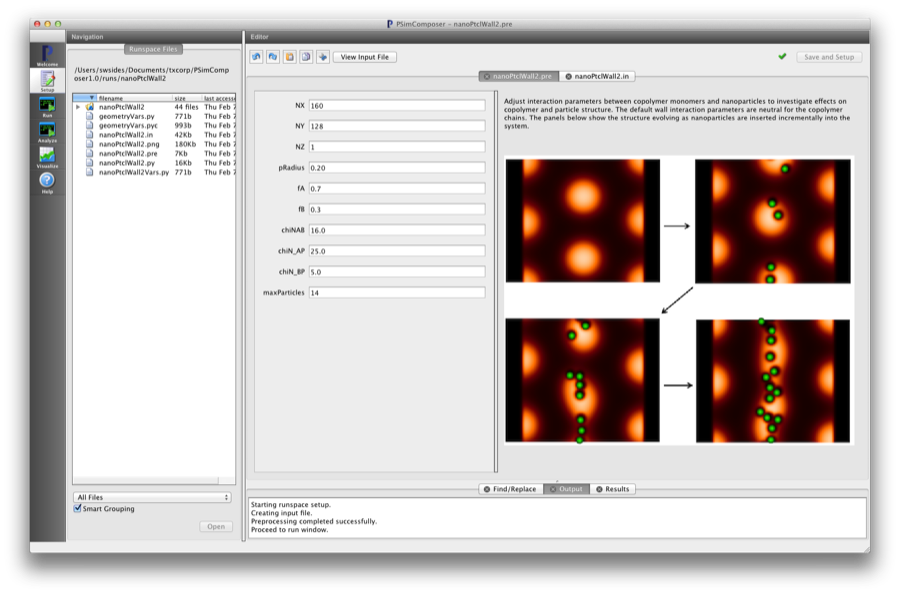
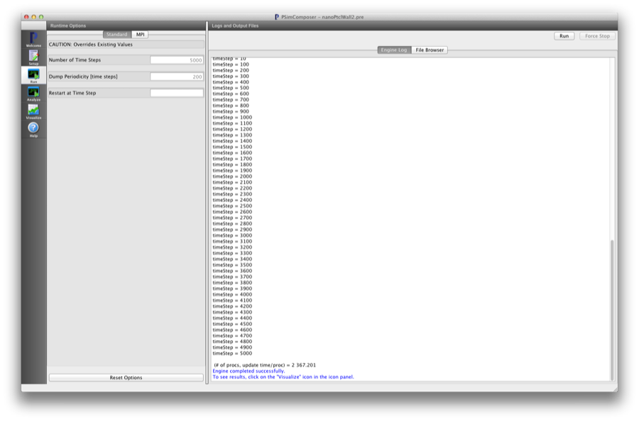
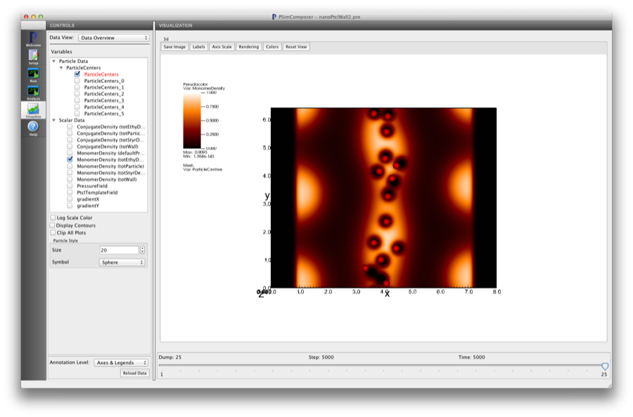

Confined Nanoparticle Composite (nanoPtclWall.pre)
----------------------------------------------------

.. $Id: nanoPtclWall.rst.template 1379 2012-11-06 20:50:31Z cary $

.. In the index, give physics terms first, then the types, which you
   can find by
   grep \< esPtclInCell/esPtclInCell.pre | grep -v '</' | sed -e 's/^ *//' -e 's/ .*$//' -e 's/^<//' | sort | uniq
   then block kinds, which you can find via
   grep kind esPtclInCell/esPtclInCell.pre | sed -e 's/^.*=//' -e 's/^ *//' | sort | uniq

.. index:: nanocomposites, phase transition

Keywords:

.. describe:: nanocomposites, phase transition

Problem description
^^^^^^^^^^^^^^^^^^^

This simulation can be performed with a PSimPlus license.

This example demonstrates the hybrid-SCFT algorithm for incorporating
nanoparticles into a copolymer melt. This example also includes confinement
for copolymers and nanoparticles in the form of parallel, flat surfaces.
These surfaces have neutral specific interactions with each of the copolymer
species and hard-contact interactions with the spherical nanoparticles.
The nanoparticle surfaces are preferentially wet by the minority "B" monomers
on the copolymer chains. This example's default is set to insert nanoparticles
as the simulation proceeds to illustrate the effect of increased nanoparticle
loading. As the number of nanoparticles increases you will be able to see
the separate interior domains become connected.

Input File Features
^^^^^^^^^^^^^^^^^^^

Files: :ref:`nanoPtclWall.pre`.

The variables in the *Setup* tab are

    - NX (Number of cells in the x-dir)
    - NY (Number of cells in the y-dir)
    - NZ (Number of cells in the z-dir)
    - pRadius (Radius of nanoparticles)
      in units of Rg
    - fA (Length fraction of 'A' block)
    - fB (Length fraction of 'B' block)
    - chiNAB Flory chi*N parameter between the two chemically distinct block monomers
    - chiN_AP Flory chi*N parameter between the A monomers and nanoparticle surfaces
    - chiN_BP Flory chi*N parameter between the B monomers and nanoparticle surfaces
    - maxParticles (Maximum number of spherical particles)

Creating the run space
^^^^^^^^^^^^^^^^^^^^^^

The Confined Nanoparticle Composite example is accessed from within
PSimComposer by the following actions:

 * Select the *New from Template* menu item in the *File* menu.
 * In the resulting *New from Template* window, select
   *PSimPlus* and then press the arrow button to the left.
 * Select "Confined Nanoparticle Composite" and press the *Choose*
   button.
 * In the resulting dialog, press the *Save* button to create a
   copy of this example in your run area.

The basic variables of this problem should now be settable in
text boxes in the right pane of the "Setup" window, as shown
in :num:`Fig. #nanoptclwallsetupwin`.

.. _nanoptclwallsetupwin:

   Setup window for the Confined Nanoparticle Composite example.

Running the simulation
^^^^^^^^^^^^^^^^^^^^^^^^^

After performing the above actions, continue as follows:

 * Press the *Save And Setup* button in the upper right corner.
 * Proceed to the run window as instructed by pressing the Run button
   in the left column of buttons.
 * Note: because the initial random state depends on the number of processors,
   the final simulation state can depend on the number of processors chosen
   if running in parallel. The results in this example are produced by running
   on two processors. The parallel run options can be accessed by going to the 'MPI'
   tab on the left side of the *Run* button window.
 * To run the file, click on the *Run* button in the upper right corner.
   of the window. You will see the output of the run in the right pane.
   The run has completed when you see the output, "Engine completed
   successfully."  This is shown in :num:`Fig. #nanoptclwallrunwin`.

.. _nanoptclwallrunwin:

   The Run window at the end of execution.

Visualizing the results
^^^^^^^^^^^^^^^^^^^^^^^^^^

After performing the above actions, continue as follows:

 * Proceed to the Visualize window as instructed by pressing the
   Visualize button in the left column of buttons.
 * Press the "Open" button to begin visualizing.
 * Go to the *Scalar Data* Variable in the *CONTROLS* panel on the left and
   press the arrow to the left
 * Check one of the *MonomerDensity* boxes (try the totEthyDens database)
   This selects all of the datafiles for this physical field 'totEthyDens'.
   This first *h5 file will be shown first. NOTE: do not select the particle
   data before selecting the monomer field data, as the field grid needs
   to be loaded first
 * Go to the *Particle Data* in the *CONTROLS panel and select 'Particle Centers'
   tab and check the red highlighted 'Particle Centers' box.
 * Move the *Dump* slider at the bottom of the window to the last position
   to see the final simulation state.
 * Choose the *Colors* button at the top of the *Visualization* pane and
   select 'orangehot' palette to match the
   :num:`Fig. #nanoptclwallvizwin`.

.. _nanoptclwallvizwin:

   Visualization of Confined Nanoparticle Composite as a color
   contour plot. Note, visualization details such as the color of the nanoparticles
   can be fully accessed through the VisIt GUI (right click on the visualization
   window).

Further Experiments
^^^^^^^^^^^^^^^^^^^^^^^^^^

Change the relative sizes of the nanoparticle/monomer chi interaction parameters
to see the particles segregate to the majority phase of the copolymer.

Change the sizes of the copolymer blocks to see how different phases are
affected by the presence of nanoparticles.

Change the size of the nanoparticles. NOTE, if you want to simulate nanoparticles
that are smaller then the overall resolution of the simulation will have to
be increased.
