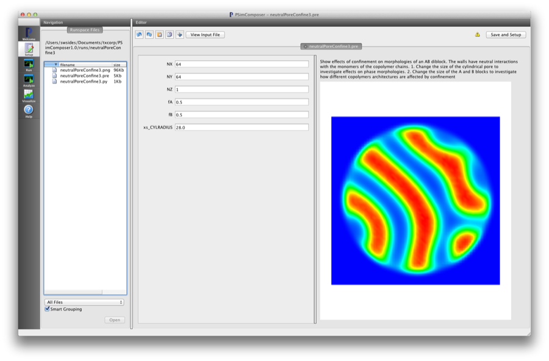
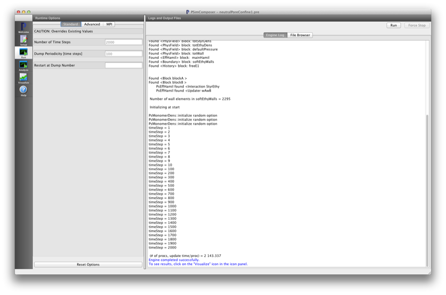

Neutral Pore Confinement (neutralPoreConfine.pre)
---------------------------------------------------

.. $Id: neutralPoreConfine.rst.template 1379 2012-11-06 20:50:31Z cary $

.. In the index, give physics terms first, then the types, which you
   can find by
   grep \< esPtclInCell/esPtclInCell.pre | grep -v '</' | sed -e 's/^ *//' -e 's/ .*$//' -e 's/^<//' | sort | uniq
   then block kinds, which you can find via
   grep kind esPtclInCell/esPtclInCell.pre | sed -e 's/^.*=//' -e 's/^ *//' | sort | uniq

.. index:: phase transition, confinement

Keywords:

.. describe:: phase transition, confinement

Problem description
^^^^^^^^^^^^^^^^^^^

This simulation can be performed with a PSimPlus license.

This example shows the effects of confinement on morphologies of a system of 
AB diblock polymer chains in a cylindrical pore with walls that have neutral 
energetic interactions with the monomers on the copolymer chains. 

Input File Features
^^^^^^^^^^^^^^^^^^^

Files: :ref:`neutralPoreConfine.pre`.

The variables in the *Setup* tab are

    - NX (Number of cells in the x-dir)
    - NY (Number of cells in the y-dir)
    - NZ (Number of cells in the z-dir)
    - fA (Length fraction of 'A' block)
    - fB (Length fraction of 'B' block)
    - xs_CYLRADIUS (Size of cylinder radius) in units of grid cells [float]

Creating the run space
^^^^^^^^^^^^^^^^^^^^^^

The Neutral PoreEstimate RPA example is accessed from within PSimComposer by the following actions:

 * Select the *New from Template* menu item in the *File* menu.
 * In the resulting *New from Template* window, select
   *PSimPlus* and then press the arrow button to the left.
 * Select "Pore Confinement" and press the *Choose* button.
 * In the resulting dialog, press the *Save* button to create a
   copy of this example in your run area.

The basic variables of this problem should now be settable in
text boxes in the right pane of the "Setup" window, as shown
in :num:`Fig. #neutralporeconfinesetupwin`.

.. _neutralporeconfinesetupwin:

   Setup window for the Neutral Pore Confine example.

Running the simulation
^^^^^^^^^^^^^^^^^^^^^^^^^

After performing the above actions, continue as follows:

 * Press the *Save And Setup* button in the upper right corner.
 * Proceed to the run window as instructed by pressing the Run button
   in the left column of buttons.
 * Note: because the initial random state depends on the number of processors,
   the final simulation state can depend on the number of processors chosen
   if running in parallel. The results in this example are produced by running
   on two processors. The parallel run options can be accessed by going to the 'MPI'
   tab on the left side of the *Run* button window.
 * To run the file, click on the *Run* button in the upper right corner.
   of the window. You will see the output of the run in the right pane.
   The run has completed when you see the output, "Engine completed
   successfully."  This is shown in :num:`Fig. #neutralporeconfinerunwin`.

.. _neutralporeconfinerunwin:

   The Run window at the end of execution.

Visualizing the results
^^^^^^^^^^^^^^^^^^^^^^^^^^

After performing the above actions, continue as follows:

 * Proceed to the Visualize window as instructed by pressing the
   Visualize button in the left column of buttons.
 * Press the "Open" button to begin visualizing.
 * Go to the *Scalar Data* Variable in the *CONTROLS* panel on the left and
   press the arrow to the left
 * Check one of the *MonomerDensity* boxes (try the totEthyDens database)
   This selects all of the datafiles for this physical field 'totEthyDens'.
   This first *h5 file will be shown first.
 * Move the *Dump* slider at the bottom of the window to the last position
   to see the final simulation state.

.. _neutralporeconfinevizwin:

.. figure:: neutralPoreConfineVizWin.png
   :scale: 100%
   :align: center

   Visualization of Neutral Pore Confinement as a color contour plot.

Further Experiments
^^^^^^^^^^^^^^^^^^^^^^^^^^

Change the size of the blocks to see how different copolymer architectures are
affected by confinement.

Change the radius of the cylinder 'xs_CYLRADIUS'

Note, the image on the template thumbnail window is generated by running a 3D version
of this example and then accessing the full VisIt capability by right clicking on
the *Visualization* pane and starting the VisIt GUI.
