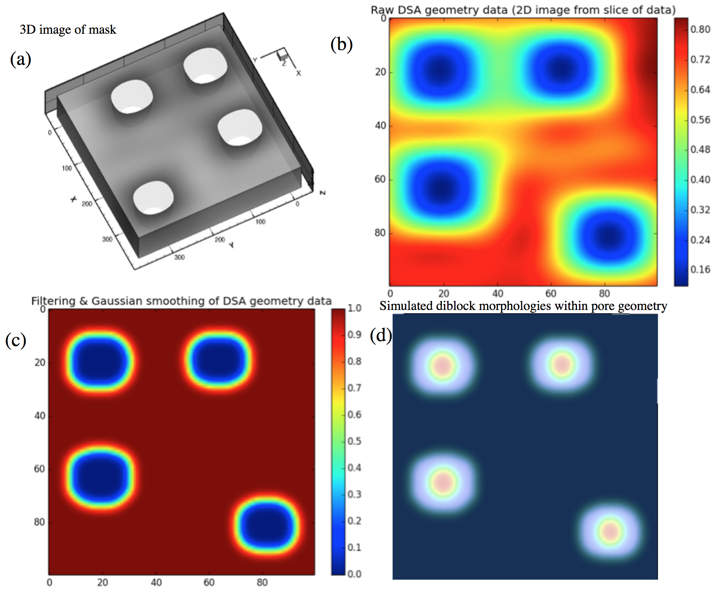
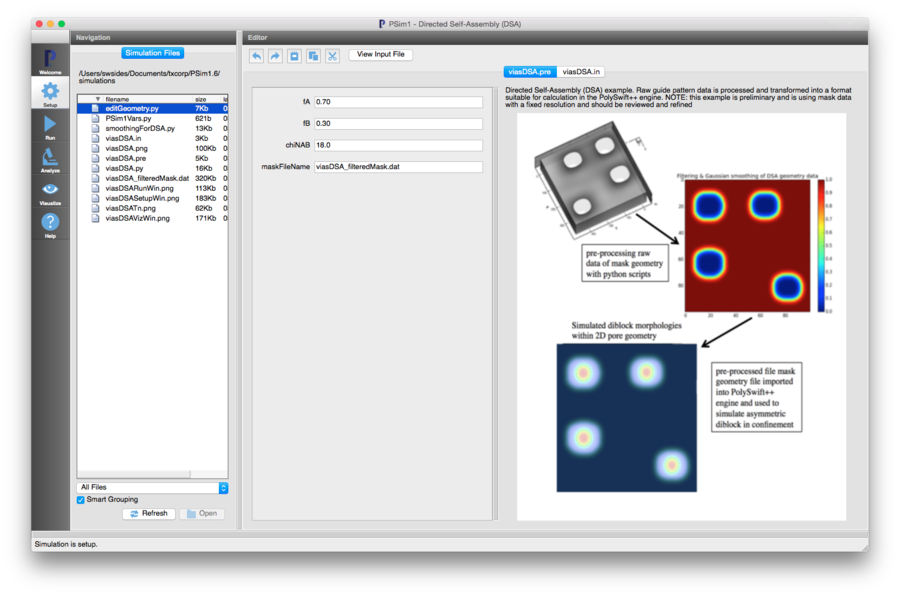
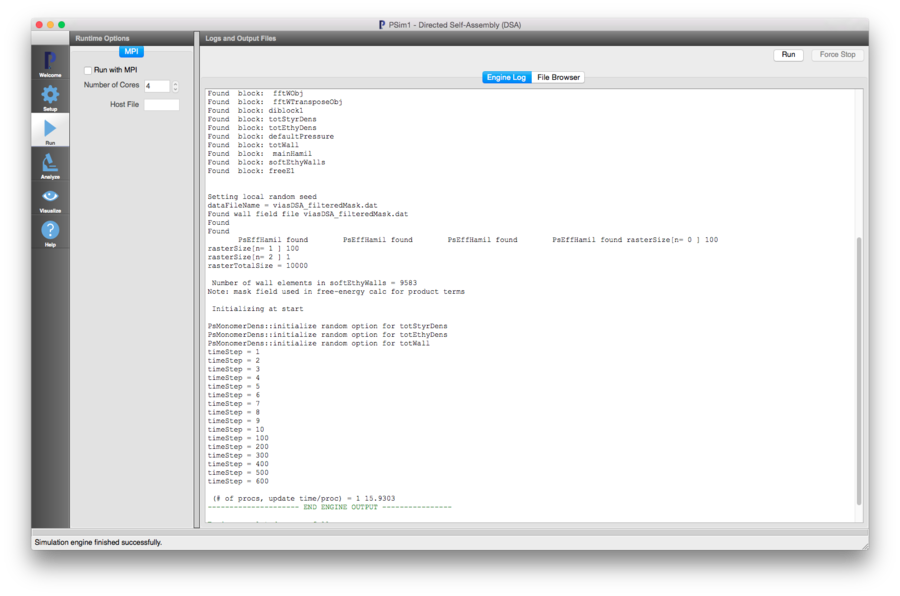
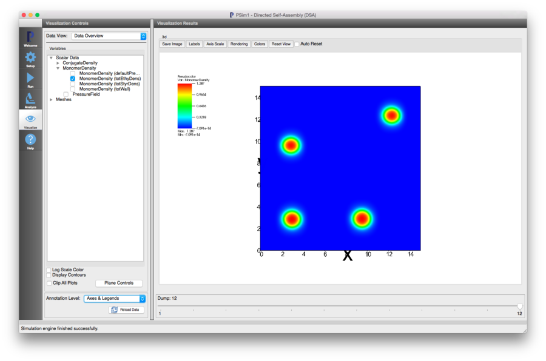

Directed Self Assembly (DSA) (viasDSA.pre)
---------------------------------------------------

.. $Id: viasDSA.rst.template 1379 2012-11-06 20:50:31Z swsides $

.. In the index, give physics terms first, then the types, which you can find by
   grep \< esPtclInCell/esPtclInCell.pre | grep -v '</' | sed -e 's/^ *//' -e 's/ .*$//' -e 's/^<//' | sort | uniq
   then block kinds, which you can find via
   grep kind esPtclInCell/esPtclInCell.pre | sed -e 's/^.*=//' -e 's/^ *//' | sort | uniq

.. index:: directed self-assembly, confinement, vias

Keywords:

.. describe:: directed self-assembly, confinement, vias

Problem description
^^^^^^^^^^^^^^^^^^^^^^^^^^^^^^^^^^^^^^

Example (Beta) of using PSim for simulating copolymer morphologies for directed self-assembly (DSA).
The image in :num:`Fig. #viasdsaprob1` a shows a separately generated image of a typical via hole guide pattern.
The image in :num:`Fig. #viasdsaprob1` b is a 2D slice from the 3D guide-mask data.
The image in :num:`Fig. #viasdsaprob1` c is an image of the filtered and smoothed data shown in the previous
image and is produced by running python pre-processing scripts (described in detail below) on the guide mask data.
The image in :num:`Fig. #viasdsaprob1` d shows a calculation of the DSA patterns formed by a phase-segregated block
copolymer (with a particular formulation) confined in the guide-mask pattern in :num:`Fig. #viasdsaprob1` c.
The guide-mask pattern is shown in this image as a superimposed image with the transparency altered so as to show
both the guide-mask and simulated via holes through the DSA process.
This image superposition was generated in VisIt directly (exposing this capability would need further development in PSim).

.. _viasdsaprob1:

   Images illustrating the workflow for moving from a guide pattern to the simulated 2D via hole patterns generated by
   PolySwift++ calculations.

Input File Features
^^^^^^^^^^^^^^^^^^^^^^^^^^^^^^^^^^^^^^

Files: :ref:`viasDSA.pre`.

The variables in the *Setup* tab are

    - fA (Length fraction of 'A' block)
    - fB (Length fraction of 'B' block)
    - chiNAB (Flory :math:`\chi N` parameter between the two chemically distinct blocks)
    - maskFileName (name of the file with appropriately pre-processed/formatted mask confinement data)

The entire input file setup is specified by the :ref:`viasDSA.pre` file. The variables in the *Setup* tab
are a small subset of the complete input file parameters that are exposed for convenience.

Pre-processing guide-mask patterns
^^^^^^^^^^^^^^^^^^^^^^^^^^^^^^^^^^^^^^

The mask geometry is specified by the file 'viasDSA_filteredMask.dat' for the DSA example in the composer.
This file is generated by editing the raw, original 'guide data'::

  VARIABLES = X, Y, Z, Intensity
  ZONE
   I=101, J=101, K=11, ZONETYPE=ordered
   DATAPACKING=POINT
   -25.000000 -25.000000 93.000000 0.717615
   -21.000000 -25.000000 93.000000 0.704686
   -17.000000 -25.000000 93.000000 0.690067
   -13.000000 -25.000000 93.000000 0.674116
   -9.000000 -25.000000 93.000000 0.657287
   -5.000000 -25.000000 93.000000 0.640083
   -1.000000 -25.000000 93.000000 0.623026
                      .
                      . skipping lines
                      .
   363.000000 375.000000 0.000000 0.441224
   367.000000 375.000000 0.000000 0.450428
   371.000000 375.000000 0.000000 0.458882
   375.000000 375.000000 0.000000 0.466350

For this particular guide data, the file is edited so that the grid in the 'I' and 'J' directions has the sizes '100' and '100'.
This is in order that the domain decomposition for parallel jobs can be performed in an optimal fashion. The remaining pre-processing
steps are:

     - the x,y,z values are transformed to grid locations required by the PolySwift++ boundary object (Carteisan grid cell indices)
     - a 2D slice of the full 3D data file is isolated (for development and testing)
     - a threshold filter is applied so that mask values below/above a threshold value are set to 0/1 respectively
     - a smoothing algorithm is applied so that the edges of the guide mask pattern have the functional form required by PolySwift++.

The resulting guide-mask data file 'viasDSA_filteredMask.dat' (illustrated in :num:`Fig. #viasdsaprob1` c) is shown below::

  VARIABLES = X, Y, Z, Intensity
  ZONE
   I=100, J=100, K=1, ZONETYPE=ordered
   DATAPACKING=POINT
       0      0      0   1.000000
       1      0      0   1.000000
       2      0      0   1.000000
       3      0      0   1.000000
       4      0      0   1.000000
       5      0      0   1.000000
       6      0      0   1.000000
       7      0      0   1.000000
       8      0      0   1.000000
       9      0      0   0.999999
      10      0      0   0.999998
               .
               . skipping lines
               .
      92     99      0   0.999999
      93     99      0   1.000000
      94     99      0   1.000000
      95     99      0   1.000000
      96     99      0   1.000000
      97     99      0   1.000000
      98     99      0   1.000000
      99     99      0   1.000000

For this current example, there are two python scripts that are used for pre-processing/formatting the original guide-mask data:

     - editGeometry.py
     - smoothingForDSA.py

The steps for generating the guide-mask data file 'viasDSA_filteredMask.dat' are listed explicitly below.
For original guide-mask in a file named 'guide-mask-original.dat' one would do the following::

  editGeometry.py --geometryFile=guide-mask-original.dat --outputFile=guide-mask-edit.dat

  ---------- Header in geometry file -----------
  VARIABLES = X, Y, Z, Intensity
  ZONE
   I=101, J=101, K=11, ZONETYPE=ordered
   DATAPACKING=POINT
  ----------------------------------------------
  Dimensions from header --> nx, ny, nz = [  101   101   11  ]

  Reducing header values from I,J=101 --> I,J=100 after editing out edges
  Edited output mask data in  guide-mask-edit.dat

The remaining pre-processing steps are::

 smoothingForDSA.py --geometryFile=guide-mask-edit.dat --outputFile=viasDSA_filteredMask.dat

  ---------- Header in geometry file -----------
  VARIABLES = X, Y, Z, Intensity
  ZONE
   I=100, J=100, K=11, ZONETYPE=ordered
   DATAPACKING=POINT
  ----------------------------------------------
  Dimensions from header --> nx, ny, nz = [  100   100   11  ]

  Making image of:  Raw DSA geometry data (2D image from slice of data)  to file -->  dsa_filter-2d.png
  Normalization for gaussian filter =  1.0
  Convolving gaussian filter with DSA raster data
  Taking 2D slice of data as an example test

  Adjust header info for 2D example

  Making image of:  Filtering & Gaussian smoothing of DSA geometry data  to file -->  dsa_gFiltered_result.png
  Printing 2D slice of data to output file suitable for PSim
  Actual output data dimensions --> nx, ny, nz =  100   100   1

  Filtered/smoothed geometry data in --->  viasDSA_filteredMask.dat

Help information is available for both of these scripts by running them with the '-h' option e.g.::

  smoothingForDSA.py -h
  Usage: smoothingForDSA.py [options]

  Script that pre-processes geometry file for simulating DSA processes
  for DSA lithography project

  Workflow:
    1. Take raw geometry file and process with this script
    2. Move processed geometry file to directory with PSim input files
    3. Set name of processed geometry file in PSim .pre input file
    4. Run simulation

  Options:
    -h, --help            show this help message and exit
    --geometryFile=GEOMETRYFILE
                          File name with geometry data. Script expects specfic
                          format for file
    --outputFile=OUTPUTFILE
                          Output file name w/filtered geometry data, suitable
                          for input to PSim

The pre-processing steps must be run separately and are not currently available
to be run throughthe composer. For this capability more development would be required.

Creating the run space
^^^^^^^^^^^^^^^^^^^^^^^^^^^^^^^^^^^^^^

The Directed Self-Assembly example is accessed from within PSimComposer
by the following actions:

 * Select the *New --> From Example* menu item in the *File* menu.
 * In the resulting *Examples* window, select
   *PSimPlus* and then press the arrow button to the left.
 * Select "Directed Self Assembly (DSA)" and press the *Choose* button.
 * In the resulting dialog, press the *Save* button to create a
   copy of this example in your run area.

The basic variables of this problem should now be settable in
text boxes in the right pane of the "Setup" window, as shown
in :num:`Fig. #viasdsasetupwin`.

.. _viasdsasetupwin:

   Setup window for the Directed Self-Assembly example.

Running the simulation
^^^^^^^^^^^^^^^^^^^^^^^^^^^^^^^^^^^^^^

After performing the above actions, continue as follows:

 * Proceed to the run window as instructed by pressing the Run button
   in the left column of buttons.
 * To run the file, click on the *Run* button in the upper right corner.
   of the window. You will see the output of the run in the right pane.
   The run has completed when you see the output, "Engine completed
   successfully."  This is shown in :num:`Fig. #viasdsarunwin`.

.. _viasdsarunwin:

   The Run window at the end of execution.

Visualizing the results
^^^^^^^^^^^^^^^^^^^^^^^^^^^^^^^^^^^^^^

 * Proceed to the Visualize window as instructed by pressing the
   Visualize button in the left column of buttons.
 * Go to the *Scalar Data* Variable in the *Visualization Controls* panel on the left and
   press the arrow to the left
 * Check one of the *MonomerDensity* boxes (try the totEthyDens database)
   This selects all of the datafiles for this physical field 'totEthyDens'.
   This first *h5 file will be shown first.
 * Move the *Dump* slider at the bottom of the window to the last position
   to see the final simulation state. This is shown in the following figure
  :num:`Fig. #viasdsavizwin`

.. _viasdsavizwin:

   Visualization of Directed Self-Assembly as a color contour plot.

Further Development
^^^^^^^^^^^^^^^^^^^^^^^^^^^^^^^^^^^^^^
