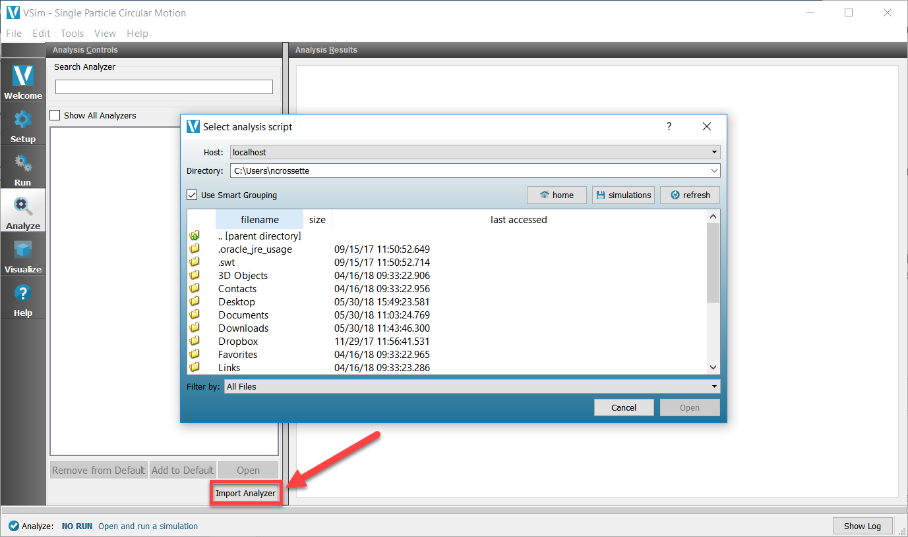

.. _analysisimport:

Import your own analysis script
^^^^^^^^^^^^^^^^^^^^^^^^^^^^^^^^^

If you have created your own analysis script, you can import it
for use in PSimComposer by clicking on the button
"Import Analyzer" at the bottom left of the *Analyze* Tab. The 
pop-up dialog that follows will open to your home user directory.

   Select a Custom Script

Navigate to the location of your analyzer, then click "Open".
On Windows, this will copy your analyzer to the 
``Documents/txcorp/PSim2.0/analyzers`` directory if the default
options were chosen during installation.

Alternatively, you can add your analyzer script to txcorp/PSim2.0/analyzers
prior to opening PSim, and your analyzer will be available when you
check the "Show All Analyzers" box. If the analyzer is added to the
"analyzers" directory while the PSimComposer is open, the Composer
will need to be closed and re-opened for the added analyzer to appear.

On Windows, the analyzers distributed with PSim are available at

``C:\Program Files\Tech-X (Win64)\PSim-2.0\Contents\engine\bin``
if the default options were chosen during installation. 
