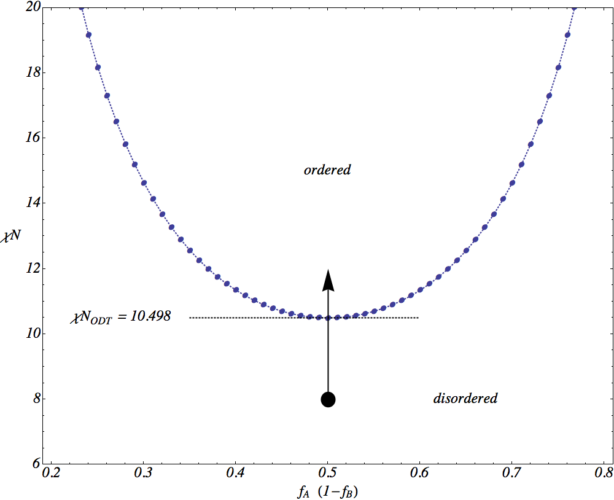
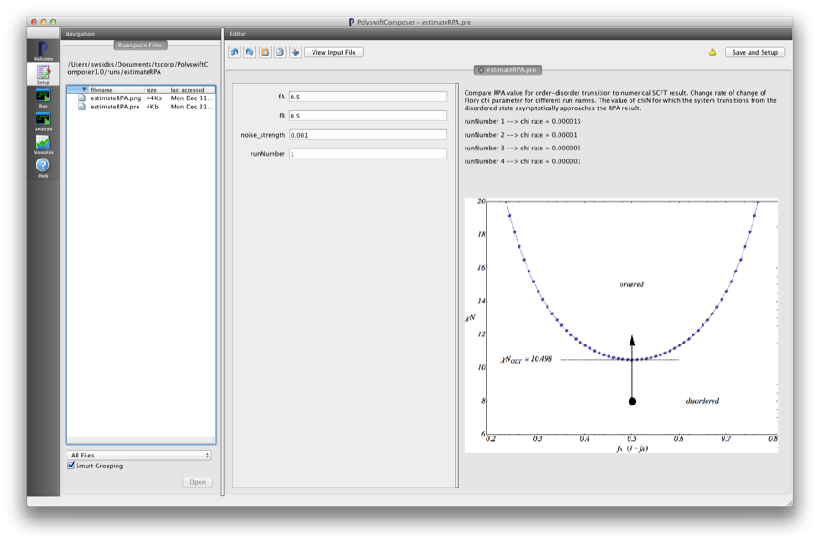
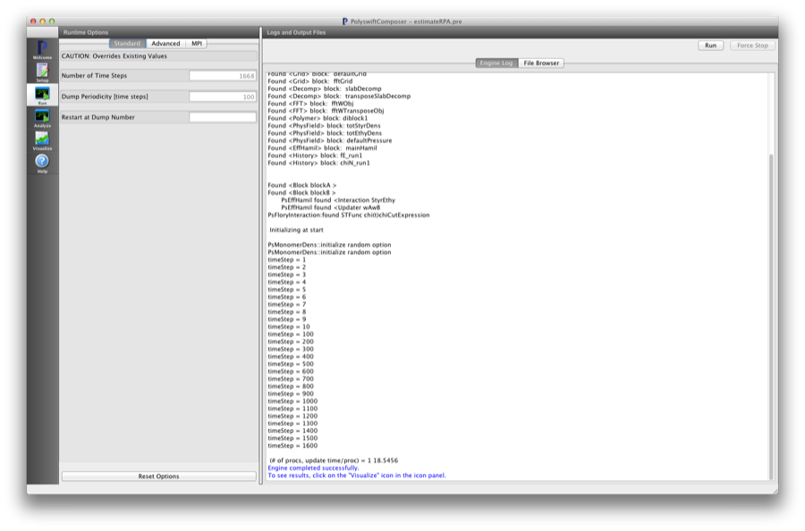
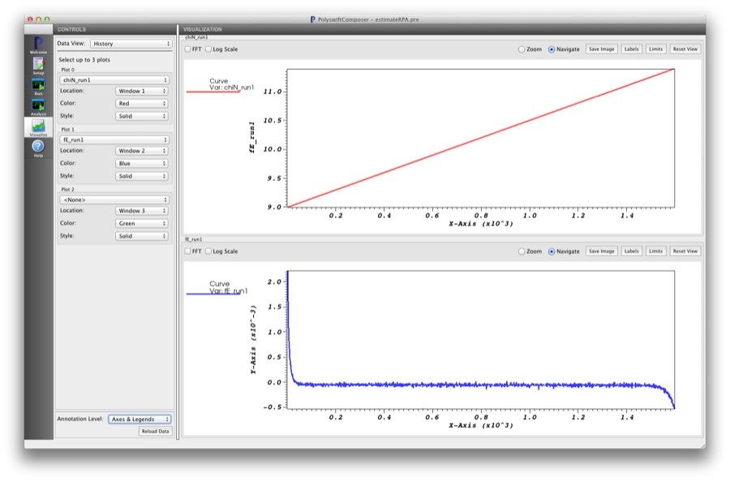
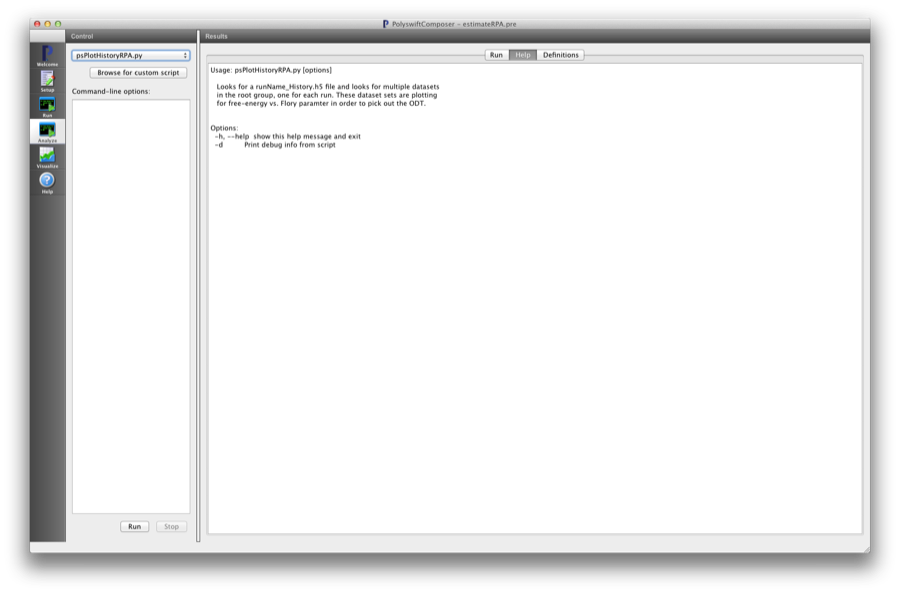
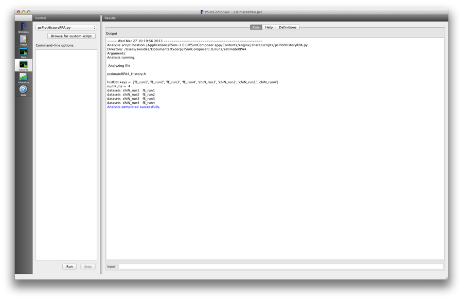
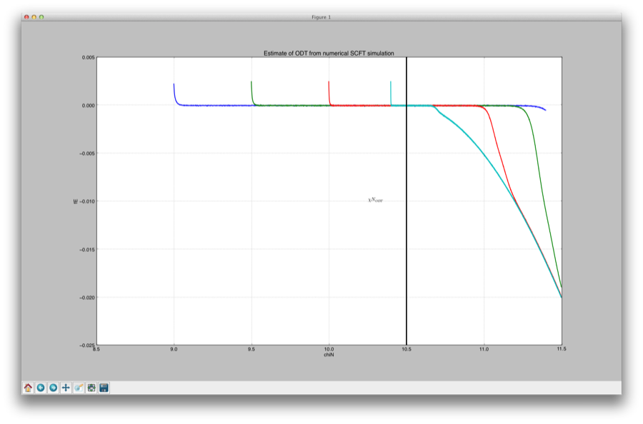
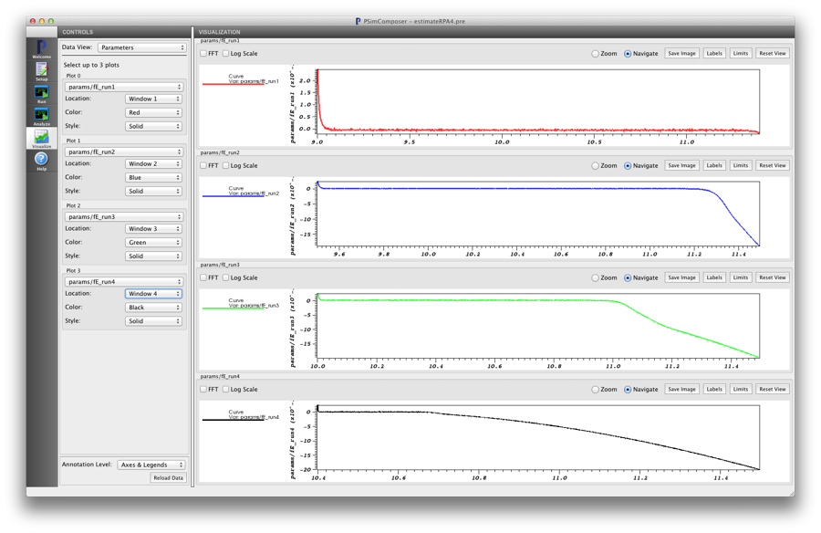

Estimate RPA (estimateRPA.pre)
--------------------------------

.. $Id: estimateRPA.rst.template 1379 2012-11-06 20:50:31Z cary $

.. In the index, give physics terms first, then the types, which you
   can find by
   grep \< esPtclInCell/esPtclInCell.pre | grep -v '</' | sed -e 's/^ *//' -e 's/ .*$//' -e 's/^<//' | sort | uniq
   then block kinds, which you can find via
   grep kind esPtclInCell/esPtclInCell.pre | sed -e 's/^.*=//' -e 's/^ *//' | sort | uniq

.. index:: random-phase approximation, phase transition

Keywords:

.. describe:: random-phase approximation, phase transition

Problem description
^^^^^^^^^^^^^^^^^^^

This simulation can be performed with a PSimBase license.

This example compares numerical SCFT results with Random-Phase approximation.
It shows a simulation of a simple, linear symmetric diblock near the
order-disorder transition (ODT). It illustrates some of the issues for the 
relaxation algorithm in numerical SCFT simulations near a phase boundary.
This example also shows that the numerical SCFT simulation can reproduce the
RPA predicition for the ODT.
The physics features demonstrated are the random-phase approximation,
relaxation times near a phase boundary, and order-disorder transtion for a 
linear diblock.

The Flory interaction parameter, :math:`\chi N`, changes through the course of 
each run. Different runs will change :math:`\chi N` at
different rates to illustrate that the numerical SCFT relaxation has a 
characteristic number of update steps that must be performed
before the system moves from a disordered state to an ordered one. The same 
would be seen if starting from an ordered state and reducing
the interaction parameter. 

The value of :math:`\chi N` for which the system transitions from the 
disordered state asymptotically approaches the RPA result as
the rate of change of the interaction parameter is decreased. The template 
example input file sets the rate of change of :math:`\chi N`
automatically by 'runNumber' for convenience. 
To directly edit the full PSim input file, go to 
the **View Input File** button at the top of the **Setup** page.

  - runNumber 1 --> :math:`\chi N` / update step = 0.000015
  - runNumber 2 --> :math:`\chi N` / update step = 0.00001 
  - runNumber 3 --> :math:`\chi N` / update step = 0.000005
  - runNumber 4 --> :math:`\chi N` / update step = 0.000001

   Random-phase approximation (RPA) of the order-disorder phase transition 
   (ODT) for a linear 2-component copolymer. 

Input File Features
^^^^^^^^^^^^^^^^^^^

Files: :ref:`estimateRPA.pre`.

The variables in the *Setup* tab are

    - fA (Length fraction of 'A' block) 
    - fB (Length fraction of 'B' block)
       - The sum of 'fA' and 'fB' must be 1.o
    - noise_strength (Strength factor for noise term in steepest descent relaxation)
       - Refer to the Linear Diblock Tutorial for details
    - runNumber (Index for selecting history data label and chi sweep rate)
       - Input file uses this run index to select :math:`\chi` rate-of-change.

The following block demonstrates the Flory Chi parameter STFunc for simulated 
annealing.

::

	<Interaction StyrEthy>
	  kind = flory
	  scfields = [totStyrDens totEthyDens]

	  <STFunc chiramp>
	    kind = chiCutExpression
	    chi_lower = 0.08
	    chi_upper = chiHigh
	    chi = chiLow + dchi*t
	  </STFunc>

	</Interaction>

The constant value of :math:`\chi` is replaced by an <STFunc> block that changes
the value as a function of iteration step :math:`t`. The 
'kind=chiCutExpression' refers to a specific derived type an <STFunc> block 
that adjusts the parameter 'chi' as an abitrary function of 't' and has upper 
and lower bounding values of 'chi_lower' and 'chi_upper'. The expression for 
chi is specified in the last line in the <STFunc> block. The linear rate of 
change 'dchi', is chosen in the first section of the input file by the 
'runNumber' selection (see section above).

Creating the run space
^^^^^^^^^^^^^^^^^^^^^^

The Estimate RPA example is accessed from within PSimComposer by the following 
actions:

 * Select the *New from Template* menu item in the *File* menu.
 * In the resulting *New from Template* window, select
   *PSimBase* and then press the arrow button to the left.
 * Select "Estimate RPA transition" and press the *Choose* button.
 * In the resulting dialog, press the *Save* button to create a
   copy of this example in your run area.

The basic variables of this problem should now be settable in
text boxes in the right pane of the "Setup" window, as shown
in :num:`Fig. #estimaterpasetupwin`.

.. _estimaterpasetupwin:

   Setup window for the Estimate 'RPA transition example'.

Running the simulation
^^^^^^^^^^^^^^^^^^^^^^^^^

After performing the above actions, continue as follows:

 * Press the *Save And Setup* button in the upper right corner.
 * Proceed to the run window as instructed by pressing the Run button
   in the left column of buttons.
 * To run the file, click on the *Run* button in the upper right corner
   of the window. You will see the output of the run in the right pane.
   The run has completed when you see the output, "Engine completed
   successfully."  This is shown in :num:`Fig. #estimaterparunwin`.

.. _estimaterparunwin:

   The Run window at the end of execution.

Visualizing the results
^^^^^^^^^^^^^^^^^^^^^^^^^^

After performing the above actions, continue as follows:

 * Proceed to the Visualize window as instructed by pressing the
   Visualize button in the left column of buttons.
 * Press the "Open" button to begin visualizing.
 * Go to the *Data View* in the *CONTROLS* panel on the left and
   select *History*. This will display up to 3 diagnostic
   datasets at one time.
  
.. _estimaterpavizwin:

   Visualization of the :math:`\chi N` parameter and free energy
   as a function of iteration update step

Analyzing the results
^^^^^^^^^^^^^^^^^^^^^^^^^^

To see the asymptotic approach of the estimate of the RPA transition, run the
simulation with different values of the rate of change of :math:`\chi N`. This
can easily be done in this example by going to the *Setup* tab and changing
the 'runNumber' parameter. This automatically selects a different value for the
rate of change of :math:`\chi N`. When the composer asks if you want to delete
the files, select the option to 'Just Run'. This will save the 'History' file
with the datasets for the free-energy. Once all four settings for the 'runNumber'
have been selected and simulated, the 'History' data file will contain the data
needed to estimate the order-disorder transition. Note that the input file 
automatically adjusts the number of steps for each 'runNumber' and the start 
value for :math:`\chi N` in order to minimize the simulation time needed to 
illustrate this example.

An analysis script that collects the data from these four runs and creates a plot is provided for this example.
Go to the *Analyze* tab and select the 'psPlotHistoryRPA.py' Python script from the 'Choose script' pull-down menu.

.. _estimaterpavizwin1:

   Analyze tab window once the 'psPlotHistoryRPA.py script is selected. A help
   message is automatically displayed.

Go the the *Controls* panel to left and push the 'Run' button near the bottom. 
This executes the Python script. Note that custom scripts may be added by the 
user and command line options can be passed to these scripts in the 
'Command-line options' window. The free-energy as a function of :math:`\chi N` 
is plotted for all four runs in a separate window. Each of the separate free-energy
data sets can be viewed separately by going to the 'Visualize' tab and selecting
*History* from the the *Data OverView" menu.

.. _estimaterpavizwin2:

   Analyze tab window once the 'psPlotHistoryRPA.py script has been executed. 
   The script is executed by pushing the 'Run' button. Note, there are no 
   command-line options for this script.

.. _estimaterpavizwin3:

   Python plot window showing results from all four simulation runs described in
   this example.

After the python script is run there is a new file created. This file plots the 
free-energy directly as a function of :math:`\chi N` and can be viewed by 
going to the *Data OverView* tab and selecting *Parameters*.

.. _estimaterpavizwin4:

   Parameters tab after analysis script has been executed. The default is for 
   each separate dataset to be displayed in a unique pane. The plots can be 
   combined by selecting the correct display window.

