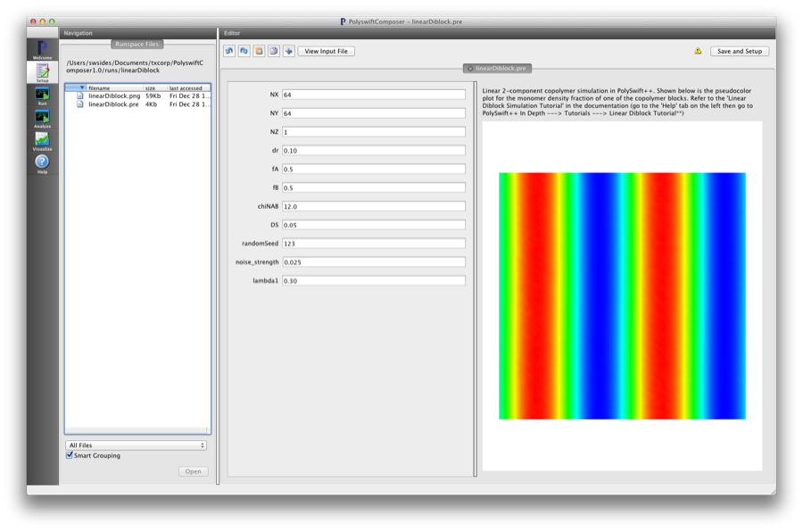
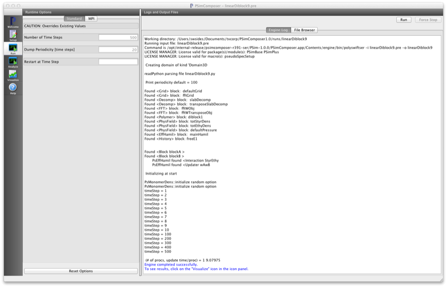
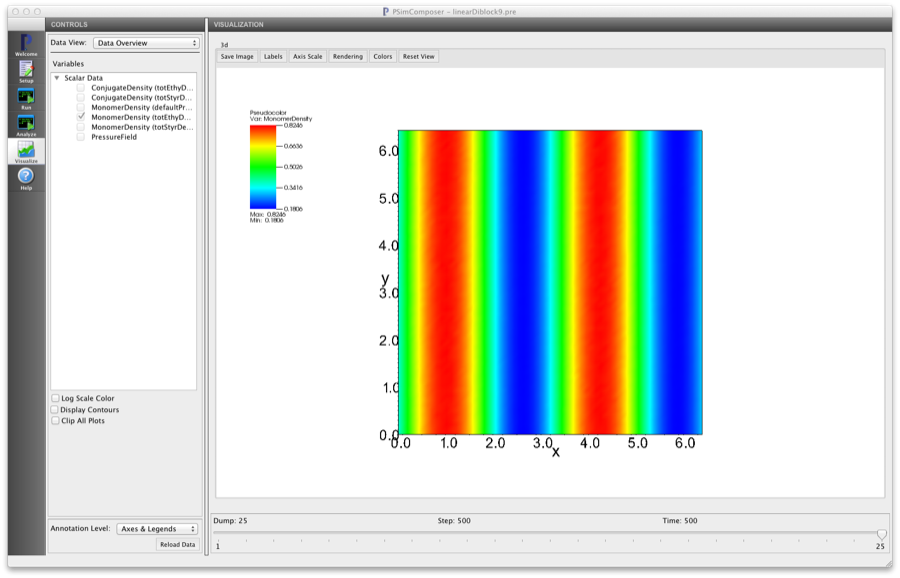

.. _psimbase-linearDiblock:

Bulk Linear Diblock (linearDiblock.pre)
----------------------------------------

.. $Id: linearDiblock.rst.template 1379 2012-11-06 20:50:31Z cary $

.. In the index, give physics terms first, then the types, which you
   can find by
   grep \< esPtclInCell/esPtclInCell.pre | grep -v '</' | sed -e 's/^ *//' -e 's/ .*$//' -e 's/^<//' | sort | uniq
   then block kinds, which you can find via
   grep kind esPtclInCell/esPtclInCell.pre | sed -e 's/^.*=//' -e 's/^ *//' | sort | uniq

.. index:: phase diagram, diblock, copolymer, morphologies, bulk behavior

Keywords:

.. describe:: phase diagram, diblock, copolymer, morphologies, bulk behavior

Problem description
^^^^^^^^^^^^^^^^^^^

This simulation can be performed with a PSimBase license.

This example demonstrates the agreement between numerical self-consistent field
theory calculations in PSim with the known theoretical result
for a linear two-component copolymer system. One can choose (f, chiN) pairs and
explore the phase morphologies of a bulk system of AB-diblock copolymer chains.

Input File Features
^^^^^^^^^^^^^^^^^^^

Files: :ref:`linearDiblock.pre`.

The variables in the *Setup* tab are

    - NX (Number of cells in the x-dir)
    - NY (Number of cells in the y-dir)
    - NZ (Number of cells in the z-dir)
    - dr (Grid cell size in the x-y-z-directions)
    - fA (Length fraction of 'A' block)
    - fB (Length fraction of 'B' block)
    - chiNAB (Flory :math:`\chi N` parameter between the two chemically distinct blocks)
    - DS (Chain contour step size)
    - random_seed (Integer seed that sets the random number generator)
    - noise_strength (Strength factor for noise term in steepest descent relaxation)
    - lambda1 (Size of the first mixing factor for the steepest descent algorithm)

See the :ref:`ld-tutorial-intro` for more details.

Creating the run space
^^^^^^^^^^^^^^^^^^^^^^

The Linear Diblock example is accessed from within PSimComposer by the following actions:

 * Select the *New from Template* menu item in the *File* menu.
 * In the resulting *New from Template* window, select
   *PSimBase* and then press the arrow button to the left.
 * Select "Linear Diblock" and press the *Choose*
   button.
 * In the resulting dialog, press the *Save* button to create a
   copy of this example in your run area.

The basic variables of this problem should now be settable in
text boxes in the right pane of the "Setup" window, as shown
in :num:`Fig. #lineardiblocksetupwin`.

.. _lineardiblocksetupwin:

   Setup window for the Linear Diblock example.

Running the simulation
^^^^^^^^^^^^^^^^^^^^^^^^^

After performing the above actions, continue as follows:

 * Press the *Save And Setup* button in the upper right corner.
 * Proceed to the run window as instructed by pressing the Run button
   in the left column of buttons.
 * Note: because the initial random state depends on the number of processors,
   the final simulation state can depend on the number of processors chosen
   if running in parallel.
 * To run the file, click on the *Run* button in the upper right corner.
   of the window. You will see the output of the run in the right pane.
   The run has completed when you see the output, "Engine completed
   successfully."  This is shown in :num:`Fig. #lineardiblockrunwin`.

.. _lineardiblockrunwin:

   The Run window at the end of execution.

Visualizing the results
^^^^^^^^^^^^^^^^^^^^^^^^^^

After performing the above actions, continue as follows:

 * Proceed to the Visualize window as instructed by pressing the
   Visualize button in the left column of buttons.
 * Go to the *Scalar Data* Variable in the *Visualization Controls* panel on the left and
   press the arrow to the left
 * Check one of the *MonomerDensity* boxes (try the totEthyDens database)
   This selects all of the datafiles for this physical field 'totEthyDens'.
   This first *h5 file will be shown first.
 * Move the *Dump* slider at the bottom of the window to the last position
   to see the final simulation state. This is shown in the following figure
   :num:`Fig. #lineardiblockvizwin`

.. _lineardiblockvizwin:

   Visualization of Linear Diblock examples as a color pseudocolor plot.

Further Experiments
^^^^^^^^^^^^^^^^^^^^^^^^^^

Change the seed value. This will change the random initial condition
of the chemical potential fields and will result in a different set
of intermediate monomer density fields.

Change the overall size of the simulation by changing the number
of cells in the NX, NY. The default for NZ is set to one for 2D simulations.
Change NZ to explore full 3D morphologies.
