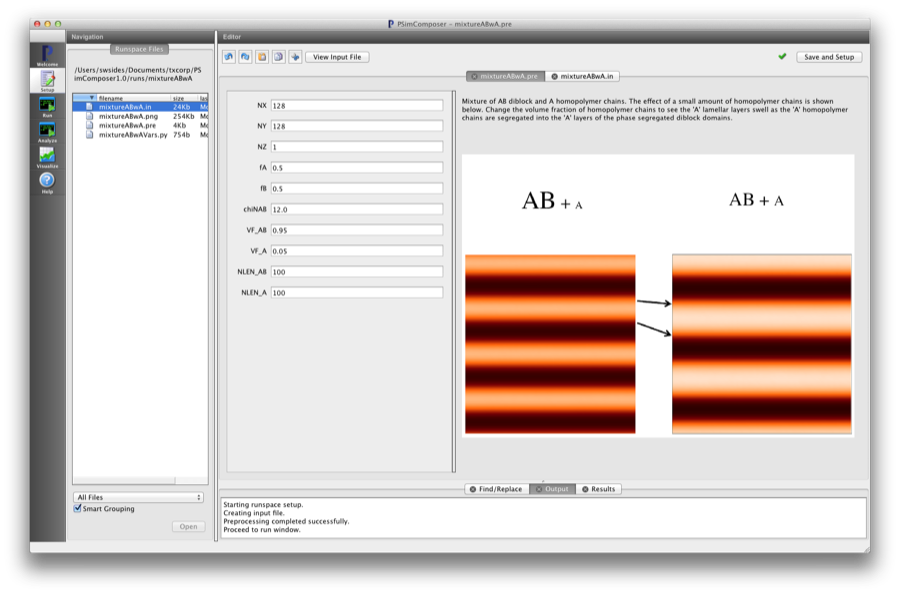
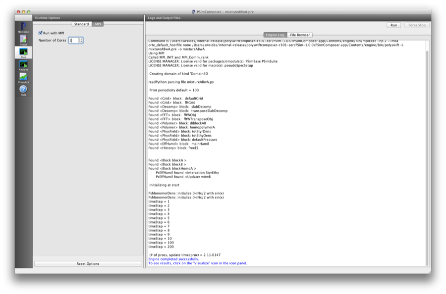
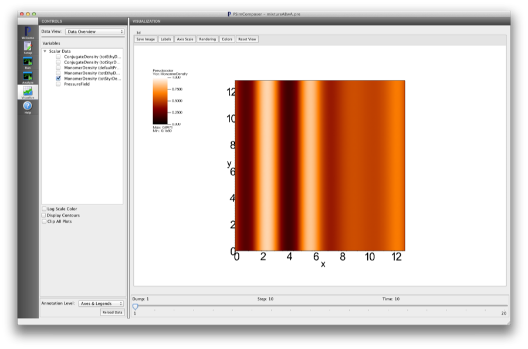
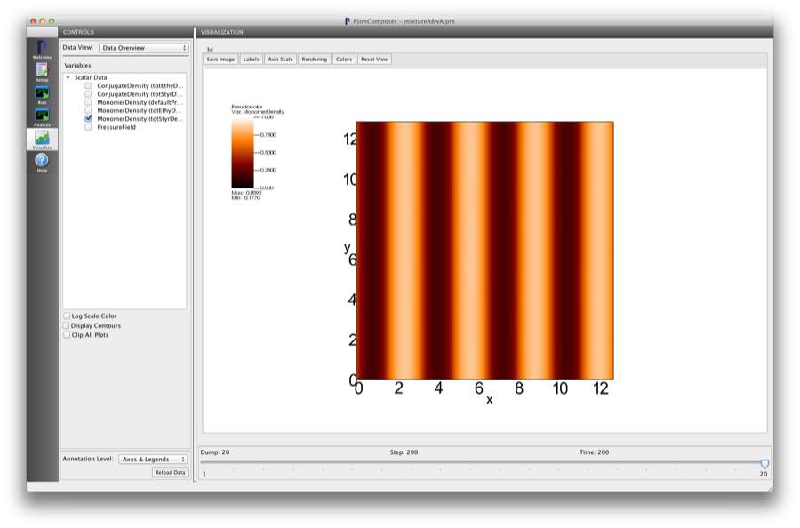

.. _psimbase-mixtureABwA:

Diblock + Homopolymer Mixture (mixtureABwA.pre)
-------------------------------------------------

.. $Id: mixtureABwA.rst.template 1379 2012-11-06 20:50:31Z cary $

.. In the index, give physics terms first, then the types, which you
   can find by
   grep \< esPtclInCell/esPtclInCell.pre | grep -v '</' | sed -e 's/^ *//' -e 's/ .*$//' -e 's/^<//' | sort | uniq
   then block kinds, which you can find via
   grep kind esPtclInCell/esPtclInCell.pre | sed -e 's/^.*=//' -e 's/^ *//' | sort | uniq

.. index:: phase diagram, diblock, copolymer, morphologies, bulk behavior

Keywords:

.. describe:: phase diagram, diblock, copolymer, morphologies, bulk behavior

Problem description
^^^^^^^^^^^^^^^^^^^

This simulation can be performed with a PSimBase license.

This example shows how to setup mixtures of different chain species. For the 
input file in this example, a mixture of AB diblock and A homopolymer chains 
is modeled.

Input File Features
^^^^^^^^^^^^^^^^^^^

Files: :ref:`mixtureABwA.pre`.

The variables in the *Setup* tab are

    - NX (Number of cells in the x-dir)
    - NY (Number of cells in the y-dir)
    - NZ (Number of cells in the z-dir)
    - fA (Length fraction of 'A' block)
    - fB (Length fraction of 'B' block)
    - chiNAB (Flory :math:`\chi N` parameter between the two chemically distinct blocks)
    - VF_AB (Volume fraction of diblock chains)
    - VF_A  (Volume fraction of homopolymer chains)
      The sum of 'VF_AB' and 'VF_A' must be 1.0
    - NLEN_AB (Length of diblock chains)
      The length scale is set by this, the first polymer specified in the input file. This is also the value of :math:`N` used in 'chiNAB'
    - NLEN_A (Length of homopolymer chains)

Creating the run space
^^^^^^^^^^^^^^^^^^^^^^

The Diblock + Homopolymer Mixture example is accessed from within PSimComposer by the following actions:

 * Select the *New from Template* menu item in the *File* menu.
 * In the resulting *New from Template* window, select
   *PSimBase* and then press the arrow button to the left.
 * Select "Diblock+Homopolymer Mixture" and press the *Choose* button.
 * In the resulting dialog, press the *Save* button to create a
   copy of this example in your run area.

The basic variables of this problem should now be settable in
text boxes in the right pane of the "Setup" window, as shown
in :num:`Fig. #mixtureabwasetupwin`.

.. _mixtureabwasetupwin:

   Setup window for the Short Name example.
.. The caption has to be separated by one line.

Running the simulation
^^^^^^^^^^^^^^^^^^^^^^^^^

After performing the above actions, continue as follows:

 * Press the *Save And Setup* button in the upper right corner.
 * Proceed to the run window as instructed by pressing the Run button
   in the left column of buttons.
 * Note: because the initial random state depends on the number of processors,
   the final simulation state can depend on the number of processors chosen
   if running in parallel. The results in this example are produced by running
   on two processors. The parallel run options can be accessed by going to the 'MPI'
   tab on the left side of the *Run* button window.
 * To run the file, click on the *Run* button in the upper right corner.
   of the window. You will see the output of the run in the right pane.
   The run has completed when you see the output, "Engine completed
   successfully."  This is shown in :num:`Fig. #mixtureabwarunwin`.

.. _mixtureabwarunwin:

   The Run window at the end of execution.

Visualizing the results
^^^^^^^^^^^^^^^^^^^^^^^^^^

After performing the above actions, continue as follows:

 * Proceed to the Visualize window as instructed by pressing the
   Visualize button in the left column of buttons.
 * Press the "Open" button to begin visualizing.
 * Go to the *Scalar Data* Variable in the *CONTROLS* panel on the left and
   press the arrow to the left
 * Check one of the *MonomerDensity* boxes (try the totEthyDens database)
   This selects all of the datafiles for this physical field 'totEthyDens'.
   This first *h5 file will be shown first.
 * Move the *Dump* slider at the bottom of the window to the last position
   to see the final simulation state.
 * Click on the *Colors* button in the *Visualization* pane. Different coloring schemes
   can be selected from here as well as scaling the colors between minimum and maximum values.
   As the monomer density fractions take on values between [0, 1], set the min/max values  
   accordingly. This is shown in the following figure (choose the color palette 'orangehot')

   Visualization of Diblock + Homopolymer Mixture as a color contour plot at beginning of
   simulation. Shows the initial condition used to 'seed' the simulation.

.. _mixtureabwavizwin:

   Visualization of Diblock + Homopolymer Mixture as a color contour plot at end of simulation.

Further Experiments
^^^^^^^^^^^^^^^^^^^^^^^^^^

Change the relative lengths of the diblock and homopolymer (NLEN_AB, NLEN_A 
respectively) to see how the phase morphologies change for a given diblock 
architecture and :math:`\chi` value.

Change the relative volume fractions of the homopolymer and diblock (VF_AB, 
VF_A respectively) to see how the phase morphologies change for a given 
diblock architecture and :math:`\chi` value.
