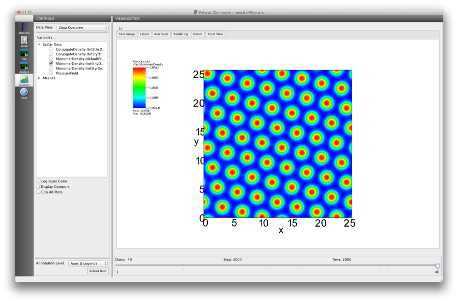

Spectral Filtering (spectralFilter.pre)
----------------------------------------

.. $Id: spectralFilter.rst.template 1379 2012-11-06 20:50:31Z cary $

.. In the index, give physics terms first, then the types, which you
   can find by
   grep \< esPtclInCell/esPtclInCell.pre | grep -v '</' | sed -e 's/^ *//' -e 's/ .*$//' -e 's/^<//' | sort | uniq
   then block kinds, which you can find via
   grep kind esPtclInCell/esPtclInCell.pre | sed -e 's/^.*=//' -e 's/^ *//' | sort | uniq

.. index:: random-phase approximation, phase transition

Keywords:

.. describe:: random-phase approximation, phase transition

Problem description
^^^^^^^^^^^^^^^^^^^

This simulation can be performed with a PSimBase license.

Spectral filtering to remove defects.

Input File Features
^^^^^^^^^^^^^^^^^^^

Files: :ref:`spectralFilter.pre`.

The variables in the *Setup* tab are

    - NX (Number of cells in the x-dir)
    - NY (Number of cells in the y-dir)
    - NZ (Number of cells in the z-dir)
    - fA (Length fraction of 'A' block)
    - fB (Length fraction of 'B' block)
    - chiNAB (Flory :math:`\chi N` parameter between the two chemically distinct blocks)
    - CUTOFF_STRENGTH (Strength of the spectral filtering)

The following demonstrates the <Updater> block that implements spectral 
filtering. (See the bibliography for details).
The main <EffHamil> block has a parameter 'updaterSequence' 
that specifies which <Updater> blocks should be applied

::

	<EffHamil mainHamil>

	  kind = canonicalMF
	  updaterSequence = [wAwB specFilter]

	  <Updater wAwB>
	    kind = steepestDescent
	    type = incompressible
	    relaxlambdas = [0.20 0.10]
	    noise = 0.02
	    updatefields = [totStyrDens totEthyDens]
 	    interactions = [StyrEthy]
	  </Updater>

	  <Updater specFilter>

	    kind = multiSpecFilter
	    fftKind = fftWObj

	    applyFrequency = 200
	    applyStart = 500
	    applyEnd = ENDSTEPS
	    updatefields = [totStyrDens totEthyDens]
	    cutoffFactor = CUTOFF_STRENGTH
	    specCellSizes = [4 4 1]

	  </Updater>

Note that the 'specFilter' block name must be set in the 'updaterSequence' name
list.

Creating the run space
^^^^^^^^^^^^^^^^^^^^^^

The Spectral Filtering example is accessed from within PSimComposer by the following actions:

 * Select the *New from Template* menu item in the *File* menu.
 * In the resulting *New from Template* window, select
   *PSimBase* and then press the arrow button to the left.
 * Select "Spectral Filtering" and press the *Choose*
   button.
 * In the resulting dialog, press the *Save* button to create a
   copy of this example in your run area.

The basic variables of this problem should now be settable in
text boxes in the right pane of the "Setup" window, as shown
in :num:`Fig. #spectralfiltersetupwin`.

.. The reference above and the label link below must be all lower case

.. _spectralfiltersetupwin:

   Setup window for the Spectral Filtering example.

Running the simulation
^^^^^^^^^^^^^^^^^^^^^^^^^

After performing the above actions, continue as follows:

 * Press the *Save And Setup* button in the upper right corner.
 * Proceed to the run window as instructed by pressing the Run button
   in the left column of buttons.
 * Note: because the initial random state depends on the number of processors,
   the final simulation state can depend on the number of processors chosen
   if running in parallel. The results in this example are produced by running
   on two processors. The parallel run options can be accessed by going to the 'MPI'
   tab on the left side of the *Run* button window.
 * To run the file, click on the *Run* button in the upper right corner.
   of the window. You will see the output of the run in the right pane.
   The run has completed when you see the output, "Engine completed
   successfully."  This is shown in :num:`Fig. #spectralfilterrunwin`.

.. _spectralfilterrunwin:

   The Run window at the end of execution.

Visualizing the results
^^^^^^^^^^^^^^^^^^^^^^^^^^

After performing the above actions, continue as follows:

 * Proceed to the Visualize window as instructed by pressing the
   Visualize button in the left column of buttons.
 * Press the "Open" button to begin visualizing.
 * Go to the *Scalar Data* in the *CONTROLS* panel on the left and
   press the arrow to the left
 * Check one of the *MonomerDensity* boxes (try the totEthyDens database)
   This selects all of the datafiles for this physical field 'totEthyDens'.
   This first *h5 file will be shown first.
 * Move the *Dump* slider at the bottom of the window to the last position
   to see the final simulation state.

.. _spectralfiltervizwin:

   Visualization of Spectral Filter as a color contour plot.

The free-energy data shows large spikes when the spectral filter is
applied. The iteration steps in between applications of the filter allow
the system to relax to a new state. See the figure below as an example.

.. _spectralfiltervizwin:

   Visualization of Spectral Filter as a color contour plot.

Further Experiments
^^^^^^^^^^^^^^^^^^^^^^^^^^

Change the filtering strength to see how this effects the number of defects
at the end of the simulation.

Change the size of the blocks to see how defects for different morphologies
are affected by spectral filtering.

Change the size of the system grid to see different numbers of defects at the
beginning of the simulation.
