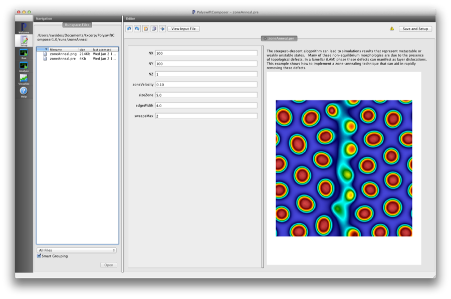
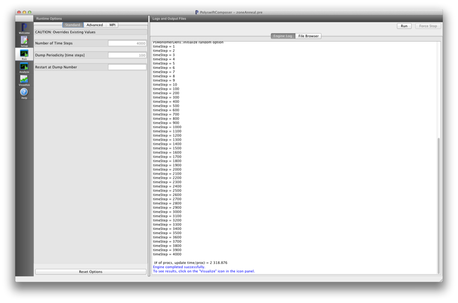
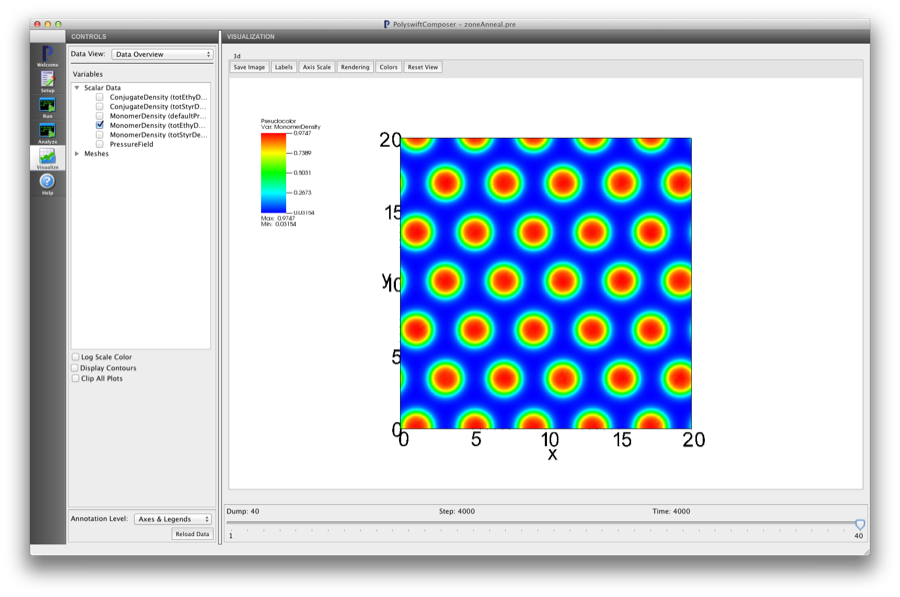

Zone Annealing (zoneAnneal.pre)
-----------------------------------

.. $Id: zoneAnneal.rst.template 1379 2012-11-06 20:50:31Z cary $

.. In the index, give physics terms first, then the types, which you
   can find by
   grep \< esPtclInCell/esPtclInCell.pre | grep -v '</' | sed -e 's/^ *//' -e 's/ .*$//' -e 's/^<//' | sort | uniq
   then block kinds, which you can find via
   grep kind esPtclInCell/esPtclInCell.pre | sed -e 's/^.*=//' -e 's/^ *//' | sort | uniq

.. index:: random-phase approximation, phase transition

Keywords:

.. describe:: random-phase approximation, phase transition

Problem description
^^^^^^^^^^^^^^^^^^^
This simulation can be performed with a PSimBase license.

The steepest-descent alogorithm can lead to simulations results that represent 
metastable or weakly unstable states. Many of these non-equilibrium 
morphologies are due to the presence of topological defects. In a lamellar 
(LAM) phase these defects can manifest as layer dislocations. This example 
shows how to implement a zone-annealing technique that can aid in rapidly
removing these defects. 

Input File Features
^^^^^^^^^^^^^^^^^^^

Files: :ref:`zoneAnneal.pre`.

The variables in the *Setup* tab are

    - NX (Number of cells in the x-dir)
    - NY (Number of cells in the y-dir)
    - NZ (Number of cells in the z-dir)
    - zoneVelocity (Velocity of center of zone)
    - sizeZone (Number of grid cells across width of moving zone)
    - edgeWidth (Controls width of zone edges)
    - sweepsMax (Number of sweeps before zone is turned off)

The following block demonstrates the STFunc 'switchMovTanhSlab' that the Flory
interaction block uses to implement the zone annealing technique

::

  <Interaction StyrEthy>

    kind = flory
    scfields = [totStyrDens totEthyDens]

    <STFunc chirzoneY>
      kind = switchMovTanhSlab
      widthParam = edgeWidth
      zoneSize = sizeZone
      chiNmax = 8.0
      chiNmin = 20.0
      zoneBuffers = [ xzoneBuffer yzoneBuffer ]
      expression = -80.0 + zoneVelocity*t
      maxSweeps = sweepsMax
    </STFunc>

  </Interaction>

Creating the run space
^^^^^^^^^^^^^^^^^^^^^^

The Zone Annealing example is accessed from within PSimComposer by the 
following actions:

 * Select the *New from Template* menu item in the *File* menu.
 * In the resulting *New from Template* window, select
   *PSimBase* and then press the arrow button to the left.
 * Select "Zone Annealing" and press the *Choose*
   button.
 * In the resulting dialog, press the *Save* button to create a
   copy of this example in your run area.

The basic variables of this problem should now be settable in
text boxes in the right pane of the "Setup" window, as shown
in :num:`Fig. #zoneannealsetupwin`.

.. _zoneannealsetupwin:

   Setup window for the Zone Annealing example.

Running the simulation
^^^^^^^^^^^^^^^^^^^^^^^^^

After performing the above actions, continue as follows:

 * Press the *Save And Setup* button in the upper right corner.
 * Proceed to the run window as instructed by pressing the Run button
   in the left column of buttons.
 * Note: because the initial random state depends on the number of processors,
   the final simulation state can depend on the number of processors chosen
   if running in parallel. The results in this example are produced by running
   on two processors. The parallel run options can be accessed by going to the 'MPI'
   tab on the left side of the *Run* button window.
 * To run the file, click on the *Run* button in the upper right corner.
   of the window. You will see the output of the run in the right pane.
   The run has completed when you see the output, "Engine completed
   successfully."  This is shown in :num:`Fig. #zoneannealrunwin`.

.. _zoneannealrunwin:

   The Run window at the end of execution.

Visualizing the results
^^^^^^^^^^^^^^^^^^^^^^^^^^

After performing the above actions, continue as follows:

 * Proceed to the Visualize window as instructed by pressing the
   Visualize button in the left column of buttons.
 * Press the "Open" button to begin visualizing.
 * Go to the *Scalar Data* Variable in the *CONTROLS* panel on the left and
   press the arrow to the left
 * Check one of the *MonomerDensity* boxes (try the totEthyDens database)
   This selects all of the datafiles for this physical field 'totEthyDens'.
   This first *h5 file will be shown first.
 * Move the *Dump* slider at the bottom of the window to the last position
   to see the final simulation state.

.. _zoneannealvizwin:

   Visualization of Zone Anneal as a color contour plot.

Further Experiments
^^^^^^^^^^^^^^^^^^^^^^^^^^

Change the overall size of the system (NX, NY, and/or NZ) to see the zone
annealing effects on a simulation with more topological defects.

Change the size and speed of the annealing zone to see effect on long-range
ordering.
