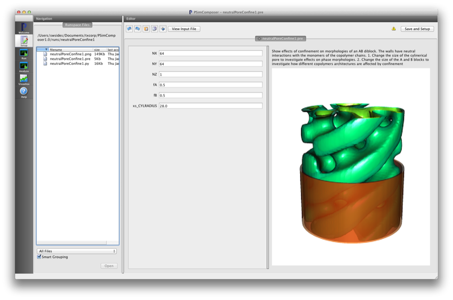

Multi-Resolution Grid (chompstAMR.pre)
-------------------------------------------------------------------------

.. $Id: chompstAMR.rst.template 1379 2012-11-06 20:50:31Z swsides $

.. In the index, give physics terms first, then the types, which you
   can find by
   grep \< esPtclInCell/esPtclInCell.pre | grep -v '</' | sed -e 's/^ *//' -e 's/ .*$//' -e 's/^<//' | sort | uniq
   then block kinds, which you can find via
   grep kind esPtclInCell/esPtclInCell.pre | sed -e 's/^.*=//' -e 's/^ *//' | sort | uniq

.. index:: multi-grid, linear solvers

Keywords:

.. describe:: multi-grid, linear solvers

Problem description
^^^^^^^^^^^^^^^^^^^

Example of SCFT calculation using the Chompst library to solve the single chain propagator in the theory.

Input File Features
^^^^^^^^^^^^^^^^^^^

Files: :ref:`chompstAMR.pre`.

The variables in the *Setup* tab are

    - NX (Number of cells in the x-dir)
    - NY (Number of cells in the y-dir)
    - NZ (Number of cells in the z-dir)
    - fA (Length fraction of 'A' block)
    - fB (Length fraction of 'B' block)

Creating the run space
^^^^^^^^^^^^^^^^^^^^^^^^^

The Multi-Resolution Grid example is accessed from within PSimComposer by the following actions:

 * Select the *New from Template* menu item in the *File* menu.
 * In the resulting *New from Template* window, select
   *PSimBase* and then press the arrow button to the left.
 * Select "Multi-Resolution Grid" and press the *Choose* button.
 * In the resulting dialog, press the *Save* button to create a
   copy of this example in your run area.

The basic variables of this problem should now be settable in
text boxes in the right pane of the "Setup" window, as shown
in :num:`Fig. #chompstamrsetupwin`.

.. _chompstamrsetupwin:

   Setup window for the Neutral Pore Confine example.

Running the simulation
^^^^^^^^^^^^^^^^^^^^^^^^^

After performing the above actions, continue as follows:

 * Press the *Save And Setup* button in the upper right corner.
 * Proceed to the run window as instructed by pressing the Run button
   in the left column of buttons.
 * To run the file, click on the *Run* button in the upper right corner.
   of the window. You will see the output of the run in the right pane.
   The run has completed when you see the output, "Engine completed
   successfully."  This is shown in :num:`Fig. #chompstamrrunwin`.

.. _chompstamrrunwin:

.. figure:: chompstAMRRunWin.png
   :scale: 100%
   :align: center

   The Run window at the end of execution.

Visualizing the results
^^^^^^^^^^^^^^^^^^^^^^^^^^

After performing the above actions, continue as follows:

 * Proceed to the Visualize window as instructed by pressing the
   Visualize button in the left column of buttons.
 * Press the "Open" button to begin visualizing.
 * Go to the *Scalar Data* in the *CONTROLS* panel on the left and
   press the arrow to the left
 * Check one of the *MonomerDensity* boxes (try the totEthyDens database)
   This selects all of the datafiles for this physical field 'totEthyDens'.
   This first *h5 file will be shown first.
 * Move the *Dump* slider at the bottom of the window to the last position
   to see the final simulation state.

.. _chompstamrvizwin:

.. figure:: chompstAMRVizWin.png
   :scale: 100%
   :align: center

   Visualization of Mult-Resolution Grid as a color contour plot.

Further Experiments
^^^^^^^^^^^^^^^^^^^^^^^^^^

Change the refinement ratio to see how accuracy of monomer density fields is affected
