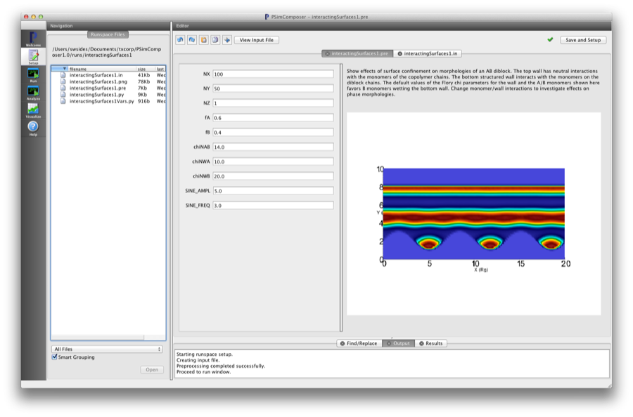
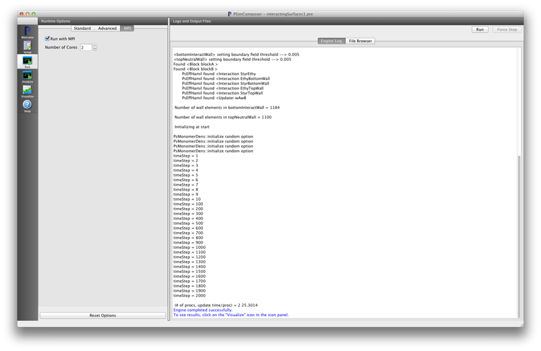
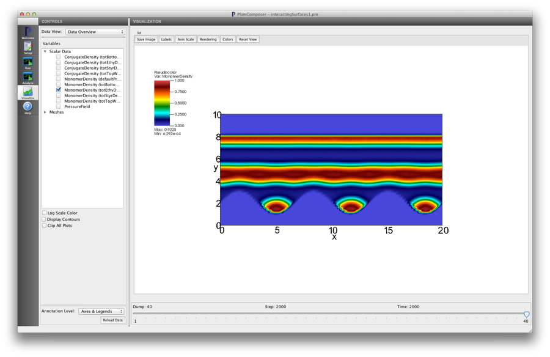

Interacting Surfaces (interactingSurfaces.pre)
-------------------------------------------------

.. $Id: interactingSurfaces.rst.template 1379 2012-11-06 20:50:31Z cary $

.. In the index, give physics terms first, then the types, which you
   can find by
   grep \< esPtclInCell/esPtclInCell.pre | grep -v '</' | sed -e 's/^ *//' -e 's/ .*$//' -e 's/^<//' | sort | uniq
   then block kinds, which you can find via
   grep kind esPtclInCell/esPtclInCell.pre | sed -e 's/^.*=//' -e 's/^ *//' | sort | uniq

.. index:: confinement, phase transition

Keywords:

.. describe:: confinement, phase transition

Problem description
^^^^^^^^^^^^^^^^^^^

This simulation can be performed with a PSimPlus license.

This example explores the effects of structured interacting surfaces on coplymer
morphology. It demonstrates the python function for specifying geometry.

Input File Features
^^^^^^^^^^^^^^^^^^^

Files: :ref:`interactingSurfaces.pre`.

The variables in the *Setup* tab are

    - NX (Number of cells in the x-dir)
    - NY (Number of cells in the y-dir)
    - NZ (Number of cells in the z-dir)
    - fA (Length fraction of 'A' block)
    - fB (Length fraction of 'B' block)
    - chiNAB (Flory chi parameter)
      between the two chemically distinct blocks of the confined
      copolymer chains
    - chiNWA (Flory parameter)
      Interaction parameter between the A monomers and bottom wall surface
    - chiNWB (Flory parameter)
      Interaction parameter between the B monomers and bottom wall surface
    - SINE_AMPL (Wall shape parameter)
      Amplitude of sine function defining bottom wall
    - SINE_FREQ (Wall shape paramter)
      Frequency of sine function defining bottom wall

Creating the run space
^^^^^^^^^^^^^^^^^^^^^^

The Interacting Surfaces example is accessed from within PSimComposer
by the following actions:

 * Select the *New from Template* menu item in the *File* menu.
 * In the resulting *New from Template* window, select
   *PSimPlus* and then press the arrow button to the left.
 * Select "Interacting Surfaces" and press the *Choose* button.
 * In the resulting dialog, press the *Save* button to create a
   copy of this example in your run area.

The basic variables of this problem should now be settable in
text boxes in the right pane of the "Setup" window, as shown
in :num:`Fig. #interactingsurfacessetupwin`.

.. _interactingsurfacessetupwin:

   Setup window for the Interacting Surfaces example.

Running the simulation
^^^^^^^^^^^^^^^^^^^^^^^^^

After performing the above actions, continue as follows:

 * Press the *Save And Setup* button in the upper right corner.
 * Proceed to the run window as instructed by pressing the
   Run button in the left column of buttons.
 * Note: because the initial random state depends on the number of processors,
   the final simulation state can depend on the number of processors chosen
   if running in parallel. The results in this example are produced by running
   on two processors. The parallel run options can be accessed by going to the 'MPI'
   tab on the left side of the *Run* button window.
 * To run the file, click on the *Run* button in the upper
   right corner of the window.
   You will see the output of the run in the right pane.
   The run has completed when you see the output, "Engine completed
   successfully."  This is shown in :num:`Fig. #interactingsurfacesrunwin`.

.. _interactingsurfacesrunwin:

   The Run window at the end of execution.

Visualizing the results
^^^^^^^^^^^^^^^^^^^^^^^^^^

After performing the above actions, continue as follows:

 * Proceed to the Visualize window as instructed by pressing the
   Visualize button in the left column of buttons.
 * Press the "Open" button to begin visualizing.
 * Go to the *Scalar Data* Variable in the *CONTROLS* panel on the left and
   press the arrow to the left
 * Check one of the *MonomerDensity* boxes (try the totEthyDens database)
   This selects all of the datafiles for this physical field 'totEthyDens'.
   This first *h5 file will be shown first.
 * Move the *Dump* slider at the bottom of the window to the last position
   to see the final simulation state.
 * Choose the *Colors* button at the top of the *Visualization* pane and
   select 'hot_desaturated' palette to match the
   :num:`Fig. #interactingsurfacesvizwin`.

.. _interactingsurfacesvizwin:

   Visualization of Interacting Surfaces as a color contour plot.

Further Experiments
^^^^^^^^^^^^^^^^^^^^^^^^^^

Change the wall interaction parameters to see how the morphologies
are effected.

Change the 'sine amplitude' and 'sine frequency' bottom wall parameters
to see how the structure of the wall effects the morphologies.
