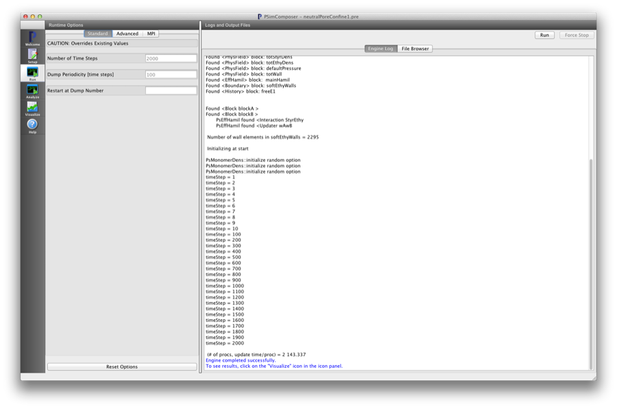
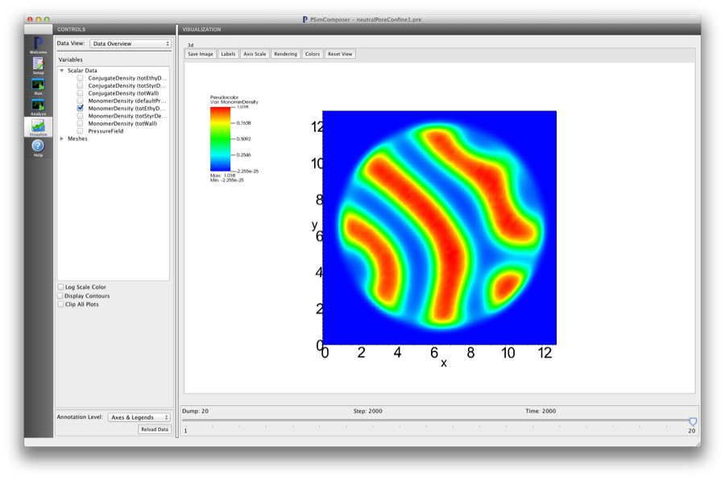

Polydispsersity (polyDisperse.pre)
---------------------------------------------------

.. $Id: polyDisperse.rst.template 1379 2012-11-06 20:50:31Z cary $

.. In the index, give physics terms first, then the types, which you
   can find by
   grep \< esPtclInCell/esPtclInCell.pre | grep -v '</' | sed -e 's/^ *//' -e 's/ .*$//' -e 's/^<//' | sort | uniq
   then block kinds, which you can find via
   grep kind esPtclInCell/esPtclInCell.pre | sed -e 's/^.*=//' -e 's/^ *//' | sort | uniq

.. index:: polydispersity, confinement

Keywords:

.. describe:: polydispersity, confinement

Problem description
^^^^^^^^^^^^^^^^^^^

Show effects of confinement on morphologies of a system of AB diblock polymer chains
in a cylindrical pore with walls that have neutral energetic interactions with the
monomers on the copolymer chains.This simulation can be performed with a PSimPlus license.

Input File Features
^^^^^^^^^^^^^^^^^^^

Files: :ref:`polyDisperse.pre`.

The variables in the *Setup* tab are

    - NX (Number of cells in the x-dir)
    - NY (Number of cells in the y-dir)
    - NZ (Number of cells in the z-dir)
    - fA (Length fraction of 'A' block)
    - fB (Length fraction of 'B' block)
    - xs_CYLRADIUS (Size of cylinder radius)
      in units of grid cells [float]

Creating the run space
^^^^^^^^^^^^^^^^^^^^^^

The Neutral PoreEstimate RPA example is accessed from within PSimComposer by the following actions:

 * Select the *New from Template* menu item in the *File* menu.
 * In the resulting *New from Template* window, select
   *PSimBase* and then press the arrow button to the left.
 * Select "Neutral Pore Confine" and press the *Choose* button.
 * In the resulting dialog, press the *Save* button to create a
   copy of this example in your run area.

The basic variables of this problem should now be settable in
text boxes in the right pane of the "Setup" window, as shown
in :num:`Fig. #polydispersesetupwin`.

.. _polydispersesetupwin:

.. figure:: polyDisperseSetupWin.png
   :scale: 100%
   :align: center
   :alt: image 1

   Setup window for the Neutral Pore Confine example.

Running the simulation
^^^^^^^^^^^^^^^^^^^^^^^^^

After performing the above actions, continue as follows:

 * Press the *Save And Setup* button in the upper right corner.
 * Proceed to the run window as instructed by pressing the Run button
   in the left column of buttons.
 * To run the file, click on the *Run* button in the upper right corner.
   of the window. You will see the output of the run in the right pane.
   The run has completed when you see the output, "Engine completed
   successfully."  This is shown in :num:`Fig. #polydisperserunwin`.

.. _polydisperserunwin:

   The Run window at the end of execution.

Visualizing the results
^^^^^^^^^^^^^^^^^^^^^^^^^^

After performing the above actions, continue as follows:

 * Proceed to the Visualize window as instructed by pressing the
   Visualize button in the left column of buttons.
 * Press the "Open" button to begin visualizing.

Here you should describe how to get to the particular
visualization that demonstrates the answer.  You should end with
pointing to the visualization,  :num:`Fig. #polydispersevizwin`.

.. _polydispersevizwin:

   Visualization of Neutral Pore Confinement as a color contour plot.

Further Experiments
^^^^^^^^^^^^^^^^^^^^^^^^^^

Describe something they might see as interesting by changing and
xvar value or a value in the Run panel.

Describe something else they might see as interesting by changing
and xvar value or a value in the Run panel.
