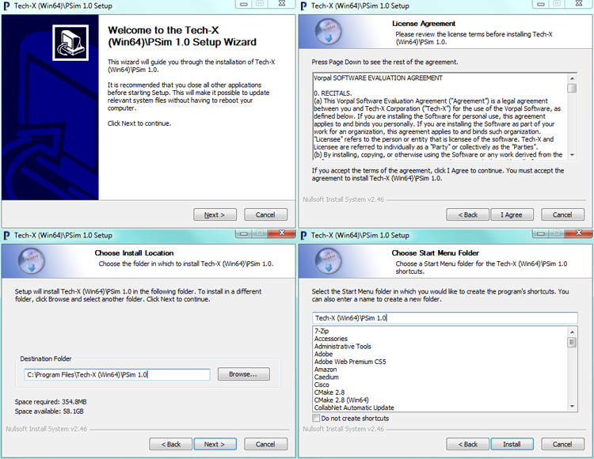
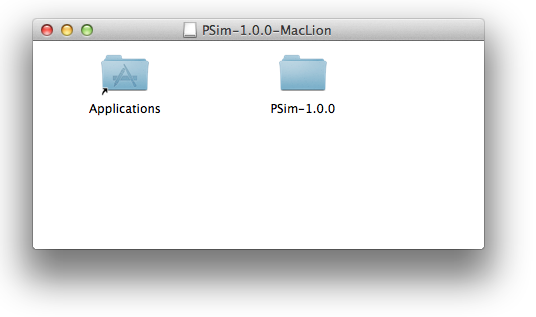

.. _installation:

Installation
--------------------------------------

For all operating systems, installation places

    - PolySwift++ computational engine (polyswiftser and polyswift)
    - PSimComposer, the graphical user interface to PolySwift++
    - PSim documentation (.pdf files)

on your computer.

.. _polyswift-installation:

PSim Installation Instructions
^^^^^^^^^^^^^^^^^^^^^^^^^^^^^^^^^^^^^^^^^^^^^^^^^^^^^^^^^^^^^^^^^^^^

.. SWS: not sure why this was added 03/01/2013
.. Linux Software Installation
.. ~~~~~~~~~~~~~~~~~~~~~~~~~~~~~~~~~~~~~~~~~
.. In preparation for PolySwift++ 1.2.0

Windows PSim Software Installation
~~~~~~~~~~~~~~~~~~~~~~~~~~~~~~~~~~~~~~~~~~~
The PSim distribution package for Windows, both 32-bit and
64-bit, is a self-extracting executable.  Invoke the installer by
double clicking on it. The default installation path is:

For 32-bit application on 32-bit Windows:

::

     C:\Program Files\Tech-X\PSim 1.0

For 32-bit application on 64-bit Windows:

::

    C:\Program Files (x86)\Tech-X\PSim 1.0

For 64-bit application on 64-bit Windows:

::

    C:\Program Files\Tech-X (Win64)\PSim 1.0

To open the PSim software, go to the Start Menu, click on the
Tech-X folder, click on PSim 1.0, then click on PSimComposer.
See :ref:`winInstFig`.

.. _winInstFig:

   Dialogs for Windows installation.

Mac OS X PSim Software Installation
~~~~~~~~~~~~~~~~~~~~~~~~~~~~~~~~~~~~~~~~~~~

MacOS El Capitan or previous Users:
......................................

The PSim distribution package for Mac OS X is a .dmg installer.
Invoke the installer by double clicking on it.  Drag the
PSim folder into your Applications folder (visible in the
installer window). From the Application folder, double click on
the PSimComposer icon in the PSim folder. See
:ref:`macInstFig`.  This default installation path is:

::

    /Applications/PSim-'version'

.. _macInstFig:

   Dialog for the Mac installer.

MacOS Sierra or later Users:
......................................

For MacOS Sierra or later, special steps must be taken because
of the newer security features.

First Method
-------------

* Make sure you have deleted ALL instances of the version of PSim that
  you are about to install: from the Applications folder, from
  Documents/txcorp, and from your Desktop. Empty these folders from
  Trash as well.
* Unmount any PSim installer disk image. DO NOT CLICK ON IT!
* In a terminal window, run:

::

   sudo spctl --master-disable

* Upon doing so, in System Preferences... Security & Privacy, you
  should see that the radio button for *Allow apps downloaded from:*
  is set to *Anywhere*.
* Open the disk image in your download folder.
* A window should open that shows your Application folder and a
  PSim-1.X folder.
* Drag the PSim-1.X folder into the Applications folder, then run
  PSimComposer from inside PSim-1.X folder that is inside the
  Applications folder.
* Open PSim-1.X from the Applications folder. If you get the message
  "PSimComposer can't be opened because it is from an unidentified
  developer" go to Apple menu > System Preferences > Security &
  Privacy > General. In the lower part of the GUI select "App Store
  and identified developers" and a message will appear below:
  "PSimComposer was blocked from opening because it is not from an
  identified developer". Click on "Open Anyway".
* Now you can open PSim-1.X from the Applications folder and add a
  license.
* AFTER adding the license, in a terminal, you may run

::

   sudo spctl --master-enable

* To restore default security preferences.

Second Method
-------------

* Make sure you have deleted ALL instances of the version of PSim
  that you are about to install, including desktop icons.
* Unmount any PSim installer disk image.
* Double click on the PSim installer disk image to mount it.
* A window should open up that shows your Application folder and a
  PSim-1.X folder.
* Drag the PSim-1.X folder into the Applications folder.
* In a terminal window, run:

::

   sudo spctl —add /Applications/PSim-1.X/PSimComposer.app

* Run PSimComposer from inside that PSim folder.
* Open PSim-1.X from the Applications folder. If you get the message
  "PSimComposer can't be opened because it is from an unidentified
  developer" go to Apple menu > System Preferences > Security &
  Privacy > General. In the lower part of the GUI select "App Store
  and identified developers" and a message will appear below:
  "PSimComposer was blocked from opening because it is not from an
  identified developer". Click on "Open Anyway".
* You will now be able to add a PSim license.

If you open PSim and get a message saying "License File Not
Found", make sure that the path for your license starts with:

::

   /Applications/PSim-1.X/...

If it does not, please provide full information to support@txcorp.com.

Linux Software Installation
~~~~~~~~~~~~~~~~~~~~~~~~~~~~~~~~~~~~~~~~~

The PSim distribution package for Linux is a gzipped tarball.
Unpack the gzipped tarball into the directory in which you wish
to install PSim.  A typical location would be

::

    /usr/local/PSim

The unzip and untar command is
::

    $ tar -zxvf PSim-'version'-Linux64.tar.gz

To run PSimComposer, execute the command

::

    $ cd PSim-'version'-Linux64
    $ ./PSimComposer.sh

from within the installation directory.

.. _included-software:

Included Software
^^^^^^^^^^^^^^^^^^^^^^^^^^^^^^^^^^

Upon completing the installation process, the following software will be
installed on your computer.

.. _polyswiftcomposer:

PSimComposer
~~~~~~~~~~~~~~~~

PSimComposer is a graphical user interface for

    - Creating and editing PolySwift++ input files
    - Executing PolySwift++ engine
    - Analyzing PolySwift++ generated data
    - Visualizing PolySwift++ generated data
    - Viewing the documentation.

The PSimComposer editor and validator have built-in functions
and graphical components that help you to create well-formed
input files. Example input files, ranging in complexity from
beginning to advanced, are included with PSimComposer.  New
PolySwift++ users can use these examples as templates.

The PSimComposer Run pane invokes PolySwift++ with user definable
settings for number of steps, number of data dumps, and restart
file, if any.  It also allows selection of serial versus parallel
PolySwift++.

PSimComposer now allows selection of analysis programs, either
supplied with PolySwift++ or user written.

The visualization in PSimComposer is provided by the graphical analysis tool
`VisIt <https://wci.llnl.gov/codes/visit/>`_.  VisIt is embedded
within PSimComposer. Data generated by PolySwift++ or by analysis programs
automatically appears in the Visualization pane.

All documentation can be seen from within PSimComposer, fully
cross-referenced.

.. _polyswift:

PolySwift++
~~~~~~~~~~~~

PolySwift++, the computational engine, runs both as a serial and
parallel code for multi-processor / multi-core systems that
support MPI. PolySwift++ now comes in the specialized PSim packages.
PolySwift++ is embedded within PSimComposer.

.. _python:

Python
~~~~~~~~~~~~

Python is an open-source, interpreted scripting language managed
by the Python Software Foundation. For more information about
Python, see: `http://www.python.org/ <http://www.python.org/>`_

PSim uses Python to process input files, allowing users to set
up simulations with math functions, variable substitutions, and
macros.

PolySwift++ uses its own embedded version of the Python interpreter to
pre-process input files and execute any Python code in an input
file.  Python is also included within PSimComposer.

.. _mpi:

MPI
~~~~~~~~~~~~~~~

The Message Passing Interface (MPI) is an application programming
interface (API) for communicating between processes that execute
in parallel.  There are many implementations.  The Linux and Mac
versions come with the OpenMPI
(`http://www.open-mpi.org/ <http://www.open-mpi.org/>`_)
implementation of MPI.  The Windows
versions come with the Microsoft MPI implementation
(`http://www.microsoft.com/ <http://www.microsoft.com/>`_).  The
appropriate MPI implemention is embedded within PSimComposer.

PSim Documentation
^^^^^^^^^^^^^^^^^^^^^^^^^^^^^^^^^^

All documentation is accessible from within the PSimComposer
interface, as well as online at the `PSim Support Website <http://www.txcorp.com/support/psim/psim-documentation>`_.
