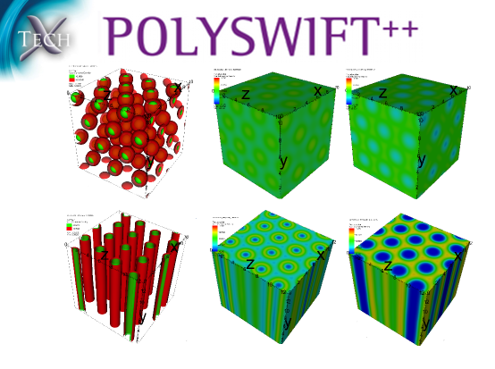

.. _background:

Background
+++++++++++++++++++

PSim provides a flexible simulation tool for studying the mesoscale
structure of complex polymeric materials by combining self-consistent field
theory (SCFT) methods with high-performance computing. The PolySwift++ engine
enables a wide range of systems to be explored, including confined copolymer 
mixtures and nanocomposites

Self-consistent field theory (SCFT) is a powerful method for
studying the complex morphologies of multi-component block copolymers and
blend mixtures. The theory enables a systematic coarse-graining of length
scales at the molecular level to efficiently describe mesoscale features of
phase-separated block copolymer mixtures.
Numerical solutions to the SCFT description of these complex fluids,
enables these methods to be extended to systems including confinement and
nanoparticles.

Code Design
************

The Polyswift++ engine is an object-oriented code that exploits many of the 
advanced design principles of the C++ language. The input files are parsed by 
the TxBase libraries and consist of hierarchical attribute sets. Copolymer 
architecture, solution methods and boundaries can be specified in a flexible 
manner from an input file.

SCFT theory
************

Self-consistent field theory (SCFT) for dense polymer melts [1]_ [2]_
has been successful in describing
complex morphologies for pure block copolymers in bulk.
SCFT provides a method whereby the Hamiltonian of a complex system
may be transformed
into a field theory description, whose mean-field solution is amenable
to a battery of analytic and numerical methods.
Recently, a numerical method has been used to solve the SCFT equations
that does not require foreknowledge about the equilibrium morphologies,
allowing more flexibility in applications and greater predictive
capability than the fully spectral [3]_ approach by Matsen.
The numerical simulation details are thoroughly discussed in
Refs. [4]_ [5]_ [6]_ and [7]_.

A field theory transformation allows discrete density operators describing
the Hamiltonian of the copolymer system to be replaced by "smeared out"
density fields.
This transformation permits the complicated chain-chain interactions
to be reformulated in terms of a single chain interacting with a chemical
potential field :math:`\omega`.
The monomer density fields can be composed from restricted chain partition
functions :math:`q({\vec r}, s)`
that may be calculated as the solution to a modified diffusion equation [7]_ .
The :math:`{\vec r}` argument is a spatial position,
and :math:`s` is a distance along the contour of the polymer chain.
Numerical SCFT results are obtained from a fully-flexible chain model
which uses a modified diffusion equation to calculate the restricted chain
partition functions for each block on the copolymer.
In a field theory for fully flexible polymers,
the modified diffusion equation for the restricted, single-chain partition
function takes on the form:

.. math::
  :nowrap:

  \begin{eqnarray}
  \frac{\partial q({\vec r},s) }{\partial s} =
   R_{{\rm g}0}^2 \nabla^2 q({\vec r},s) - \omega({\vec r}) q({\vec r},s)
  \end{eqnarray}

where :math:`R_{{\rm g}0}^2` is the unperturbed radius of gyration.
These diffusion equations are subject to the initial conditions
:math:`q({\vec r}, s) = 1`.

..  References
..  --------------

.. [1] "Functional Integrals and Polymer Statistics", K.F. Freed, Adv. Chem. Phys., 22, p1 (1972).
        
.. [2] "Theory of Inhomogeneous Multicomponent Polymer Systems", K.M Hong, J. Noolandi, Macromolecules 14 p727-736 (1981).

.. [3]  "Stable and Unstable Phases of a Diblock Copolymer Melt", M.W. Matsen, M. Schick, Phys. Rev. Lett., 72, p2660-2663, (1994).

.. [4] "Combinatorial Screening of Complex Block Copolymer Assembly with Self-Consistent Field Theory", F. Drolet, G.H. Fredrickson, Phys. Rev. Lett., 83, 21, p4317-4320, (1999).

.. [5] "Parallel algorithm for numerical self-consistent field theory simulations of block copolymer structure", S.W. Sides, G.H. Fredrickson, Polymer 44, p5859-5866, (2003).

.. [6] "Composite mesostructures by nano-confinement", Y. Wu, G. Cheng, K. Katsov, S.W. Sides, J. Wang, J. Tang, G.H. Fredrickson, M. Moskovits, G.D. Stucky, Nature Materials, 3, p816, (2004).

.. [7] "Field-Theoretic Computer Simulation Methods for Polymers and Complex Fluids",   G.H. Fredrickson, V. Ganesan, F. Drolet, Macromolecules, 35, p16-39, (2002).
