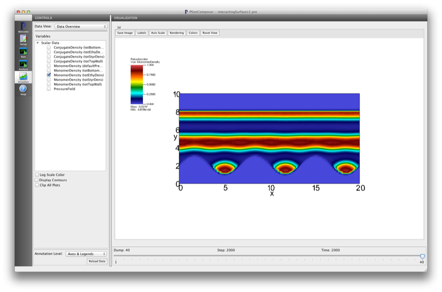

.. _is-tutorial-lesson-1:

Lesson 1: Model/Simulation detail for interacting surfaces
-----------------------------------------------------------------------

.. _is-1-definition-of-diblock:

Definition of interactingSurfaces
^^^^^^^^^^^^^^^^^^^^^^^^^^^^^^^^^^^^

Now that we have examined the conceptual model for interactingSurfaces, we are
ready to define the interactingSurfaces simulation, which includes five 
physical fields, a model definition block, boundaries and the other blocks 
necessary for all copolymer simulations (see :ref:`ld-tutorial-intro`). In 
addition to the blocks necessary for bulk simulations, this input
file involves:

    - Physical field definitions for the surfaces

    - Model definition (includes special updater parameters and wall-polymer interactions)

    - Boundary object definitions (one for the top wall and one for the bottom 
      wall)

As needed, refer back to the *PSim User Guide* section, 
:ref:`basic-concepts-for-all-simulations` and :ref:`ld-tutorial-intro` for 
simulation/model details that apply to bulk simulations as well as simulations with confinement

Blocks in Input File
^^^^^^^^^^^^^^^^^^^^^^^^^^^^

The following three blocks in the file :file:`interactingSurfaces.pre` setup 
the physical fields. There are two fields for the monomer densities, one for the
monomers on the 'A' block and one for the monomers on the 'B' block. The
third field is a constraint field needed to maintain the incompressibility
constraint used in this simulation. These are similar to the blocks for the bulk
case (see :ref:`ld-tutorial-lesson-1-symmetric-diblock`)

For the *Interacting Surfaces* examples there are two extra physical fields,
one for the density field that defines the top wall and one for the bottom wall.
There are separate fields for the walls because different interactions will be
defined between the copolymer monomers and the top/bottom surfaces.

::

	<PhysField totTopWall>
	  kind = monomerDens
	  type = fieldD3R
	</PhysField>

	<PhysField totBottomWall>
	  kind = monomerDens
	  type = fieldD3R
	</PhysField>

These physical fields contribute to the :math:`\varrho_W ({\vec r})` field.
The boundary objects themselves are defined in the <Boundary> input
blocks.

::

	################################################
	# A Boundary object
	################################################

	# Defines left(bottom) and right(top) edges
	# of flat walls... along Y for both 2D and 3D
	# domain decomp
	$ WALLEDGE_NEGY = float(10.0)
	$ WALLEDGE_POSY = float(NY - WALLEDGE_NEGY)

	# Sets the hyperbolic tangent profile
	$ WIDTHPARAM = float(0.1/DX)

	<Boundary bottomInteractWall>
	  kind = fixedWall
	  boundaryfield = totBottomWall

	  <STFunc walls>
	    kind = pyfunc
	    name = lowSineWall
	    paramKeys = [ widthParam walledge amplitude freq ]
	    paramValues = [ WIDTHPARAM  WALLEDGE_NEGY SINE_AMPL SINE_FREQ ]
	  </STFunc>

	</Boundary>

	<Boundary topNeutralWall>
	  kind = fixedWall
	  boundaryfield = totTopWall

	    <STFunc walls>
	      kind = pyfunc
	      name = highFlatWall
	      paramKeys = [ widthParam walledge ]
	      paramValues = [ WIDTHPARAM  WALLEDGE_POSY ]
	    </STFunc>

	</Boundary>

The parameters 'WALLEDGE_NEGY', 'WALLEDGE_POSY' and 'WIDTHPARAM'
are set up as a convenience outside of the <Boundary> objects.
The <Boundary> blocks here are of 'kind=fixedWall'.
These are constraints that do not change as the simulation proceeds.
These boundary blocks have two main functions: (1) specifying the
spatial location of the walls and (2) the properties
of the wall with respect to the monomeric species.
The 'boundaryfield' parameter takes the name of a physical field
corresponding to a wall.
This physical field appears in <Interaction> blocks elsewhere in
the input file that defines the relative preferences for each monomer
species to be attracted to or repelled from the confining surface.
The <Boundary> block can also be a container for an <STFunc> that
defines the spatial extent of the confinement field.
For this example, the <STFunc> is of 'kind = pyfunc' which uses
the Python/C API to import an external python function in the file
'interactingSurface.py'. For more details see :ref:`is-tutorial-lesson-2`.

The next block is the <EffHamil> block and contains various updaters and 
interactions that define the energetics of the model and relaxation methods.

::

	#########################################################
	# Effective Hamiltonian: defines energetic SCFT model
	#########################################################
	<EffHamil mainHamil>

	  kind = canonicalMF
	  updaterSequence = [wAwB]

	  <Updater wAwB>

	    kind = steepestDescent
	    type = incompressible
	    relaxlambdas = [0.20 0.10]
	    noise = 0.02

	    updatefields = [totStyrDens totEthyDens]
	    interactions = [StyrEthy EthyBottomWall StyrBottomWall EthyTopWall StyrTopWall]
	    constraints = [EthyBottomWall StyrBottomWall EthyTopWall StyrTopWall]

	  </Updater>

	  <Interaction StyrEthy>
	    kind = flory
	    chi = chiAB
	    scfields = [totStyrDens totEthyDens]
	  </Interaction>

The 'interactions' parameter must have each of the <Interaction> block names 
in which the 'updatefields' names appear. For simulations with constraints, 
the <Interaction> block names that contribute to the boundary constraints, 
must be listed in the 'constraints' parameter.	  
The wall-monomer interactions below, are defined within the same
<EffHamil> block

::

	  ###################################
          # Bottom wall interaction blocks
	  ###################################
	  <Interaction EthyBottomWall>
	    kind = floryWall
	    chi = CHI_WALL_ETHY
	    scfields = [totBottomWall totEthyDens]
	    wallField = totBottomWall
	  </Interaction>

	  <Interaction StyrBottomWall>
	    kind = floryWall
	    chi = CHI_WALL_STYR
	    scfields = [totBottomWall totStyrDens]
	    wallField = totBottomWall
	  </Interaction>

	  ###################################
	  # Top wall interaction blocks
	  # These are hardwired to be equal
	  # and therefore effectively neutral
	  ###################################
	  <Interaction EthyTopWall>
	    kind = floryWall
	    chi = 0.20
	    scfields = [totTopWall totEthyDens]
	    wallField = totTopWall
	  </Interaction>

	  <Interaction StyrTopWall>
	    kind = floryWall
	    chi = 0.20
	    scfields = [totTopWall totStyrDens]
	    wallField = totTopWall
	  </Interaction>

        </EffHamil>

Note that since separate physical fields are associated with the <Boundary> 
blocks defining the top/bottom walls, different interactions with the 
monomeric species can be set for each surface.

Visualize interactingSurfaces Using PSimComposer
^^^^^^^^^^^^^^^^^^^^^^^^^^^^^^^^^^^^^^^^^^^^^^^^^^

This section explains how to visualize the data generated for 
the :file:`interactingSurfaces.pre` file by running PSimComposer.

    .. note::
       In addition to PSimComposer, other commonly used tools for
       visualizing PolySwift++ data are:

    - `Mathematica <http://www.mathematica.org/>`_

    - `VisIt <https://wci.llnl.gov/codes/visit/>`_  from Lawrence Livermore National Laboratory
      

#. From within PSimComposer, click on the *Visualize* icon in the icon panel 
   on the far left.
#. Click on the **Open** button.
#. In the **CONTROLS** pane, in the **Variables** list of the 
   **Data Overview** data view, click on the arrow next to *Scalar Data*.
#. Click on the **Colors** button and choose the limits to be [0-1] and select 
   'Hot Desaturated' from the palette.

Select the *MonomerDensity (totTopWall)* to see the field assocated with the 
top surface.

.. figure:: images/IS-Lesson1-screenshot-visualize-001.png
   :align: center
   :scale: 100%
   
   PSimComposer showing the physical field for the top wall confinement. 
   (Note, the wall densities)

Deselect the 'totTopWall' and select the *MonomerDensity (totBottomWall)* to 
see the field assocated with the bottom, structured surface.

   
   PSimComposer showing the physical field for the bottom ('sine wall') 
   surface confinement

Note, the wall densities are fixed and do not enter the theoretical treatment 
in the same way. Therefore, the conjugate densities associated with the wall 
fields are not used in the simulation. They are by default initialized to 
random values and not updated.

Deselect the 'totBottomWall' and select the *MonomerDensity (defaultPressure)* 
to see the field associated with all constraints in simulation. This field is 
constructed automatically within the algorithm.

   
   PSimComposer showing the physical field for all constraints.

Deselect 'defaultPressure' and select the *MonomerDensity (totEthyDens)* to 
see the field associated with minority monomeric species. The first density 
configuration for Dump:1 is

   
   PSimComposer showing the physical field for 'totEthyDens'. Note, the 
   regions of constraint can be seen where all polymer densities are ~0.0.

Move the Dump slider to the end to see the equilibrium configuration

