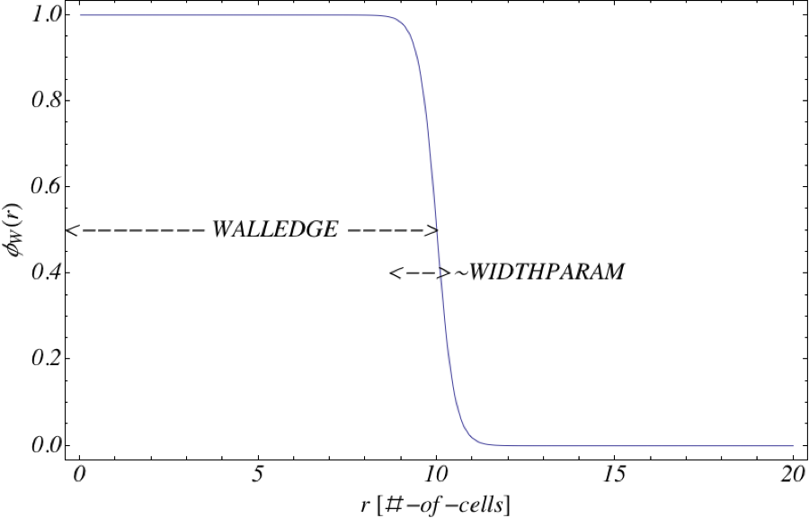

.. _is-tutorial-lesson-2:

Lesson 2: Specifying Geometry
--------------------------------------------------------

.. _is-2-definition-of-diblock:

Details of the Boundary Block
^^^^^^^^^^^^^^^^^^^^^^^^^^^^^^^^^^^^

Now that we have examined the entire input file for interactingSurfaces, we are
ready to examine how to specify boundaries. This includes:

    - Wall parameters

    - Boundary input blocks

    - Python geometry file 'interactingSurfaces.py'

As needed, refer back to the *PSim User Guide* section, 
:ref:`basic-concepts-for-all-simulations`.

Wall Parameters
^^^^^^^^^^^^^^^^^^^^^^^^^^^^^^^^^^^^^

The variables defined above the <Boundary> blocks are

   - The position/size of the bottom wall 'WALLEDGE_NEGY'

   - The position/size of the top wall 'WALLEDGE_POSY' (defined
     in terms of the bottom wall and size of the system)

   - The width parameter of the edge of the fixed walls 'WIDTHPARAM'
     (scaled so that the width size stays constant as the grid size, DX is 
     adjusted)

Setting these parameters is a convenience so the values set in the
<Boundary> block below can be documented clearly.

   
Boundary Block
^^^^^^^^^^^^^^^^^^^^^^^^^^^^^^^^^^^^^

The Boundary block specifying the bottom wall is:

::

	<Boundary bottomInteractWall>

	  kind = fixedWall
	  boundaryfield = totBottomWall

	  <STFunc walls>
	    kind = pyfunc
	    name = lowSineWall
	    paramKeys = [ widthParam walledge amplitude freq ]
	    paramValues = [ WIDTHPARAM  WALLEDGE_NEGY SINE_AMPL SINE_FREQ ]
	  </STFunc>

        </Boundary>

As mentioned in the previous lesson, boundary blocks have two main functions:
(1) specifying the spatial location of the walls and
(2) the properties of the wall with respect to the monomeric species.
The 'boundaryfield' parameter takes the name of a physical field
corresponding to a wall.
This physical field appears in <Interaction> blocks that
define the relative preferences for each monomer
species to be attracted to or repelled from the confining surface.
This 'Boundary' block is also a container for an <STFunc> block
that defines the spatial extent of the confinement.
For this example, the <STFunc> is of :samp:`kind = pyfunc` which uses
the Python/C API to import functions from an externals file.
The Python method that is used to define the spatial region
of the wall is set in the parameter :samp:`name = lowSineWall`.

For an input file name of 'simName.pre', PSim
automatically looks for a Python file with the name 'simName.py'.
This Python file is expected to contain methods that define functions
needed by the blocks that refer to these methods by name.
For a simulation using the input file 'interactingSurfaces.pre', the
Python methods are contained in the file 'interactingSurface.py'.

::

	#	
	# Sine modulated flat wall on "low" side of system
	#
	def lowSineWall(x, y, z, t, params={'widthParam':1.0,
                                            'walledge':10,
                                            'amplitude':3.0,
                                            'freq':4.0}):
         global NX
	 global NY
	 global NZ

	 # Convert dictionary to variable assigments
	 widthParam = params['widthParam']
	 walledge   = params['walledge']
	 amplitude  = params['amplitude']
	 freq       = params['freq']

	 if (NZ == 1):
	   r = [x,y,1]
	   negEdge = [x,0,1]
	 else:
	   r = [x,y,z]
	   negEdge = [x,0,z]

	 negRdis = rdistance(r,negEdge)
	 negRdis = negRdis - (amplitude*math.sin(freq*2.0*math.pi*x/NX))
    
         tanhval = math.tanh((walledge-negRdis)/widthParam)
         wallValue = (tanhval+1)/2.0
	 return wallValue

This Python function generates a wall with the sine wave profile seen
in the template example. The structure of the 'edge' of the wall follows
a hyperbolic tangent profile (as do most of the wall edge functions for the
template examples provided). A schematic of the functional form of the wall
edge is shown here

   Schematic of function form of wall 'edge'

The function 'lowSineWall' sets the position of the bottom wall (walledge),
the width of the wall edge (widthParam), the amplitude of the sine function 
(amplitude) and the frequency of the sine function (freq), such that 'freq' 
number of periods fits into the length of the simulation grid.
The STFunc block takes this function and uses it to generate a scalar as a 
function of (x,y,z) position in the grid. This scalar is used to set the 
appropriate value of the constraint field that defines the surfaces.

Keeping the specifics of the geometry external to the PolySwift++ engine 
allows the same algorithms to be used, as the geometry construction changes. 
Note: future releases will implement interactive, constructive geometry 
software to specify confinement.
The external Python file contains the methods

::

	# Distance between point r and r0 (r is a python vector [x,y,z])
	def rdistance(r,r0):

	# Sine modulated flat wall on "low" side of system
	def lowSineWall(x, y, z, t, params={'widthParam':1.0,'walledge':10,'amplitude':3.0,'freq':4.0}):

	# Sine modulated flat wall on "high" side of system
	def highSineWall(x, y, z, t, params={'widthParam':1.0,'walledge':10,'amplitude':3.0,'freq':4.0}):

	# Simple flat wall on "low" side of system
	def lowFlatWall(x, y, z, t, params={'widthParam':1.0,'walledge':10 }):
 
	# Simple flat wall on "high" side of system
	def highFlatWall(x, y, z, t, params={'widthParam':1.0, 'walledge':10 }):

which can be used to set other kinds of surfaces. Keeping the Python geometry 
functions external, allows developers to more easily prototype new geometries. 
In principle, any arbitrary function can be used to define surfaces for PSim 
simulations.
