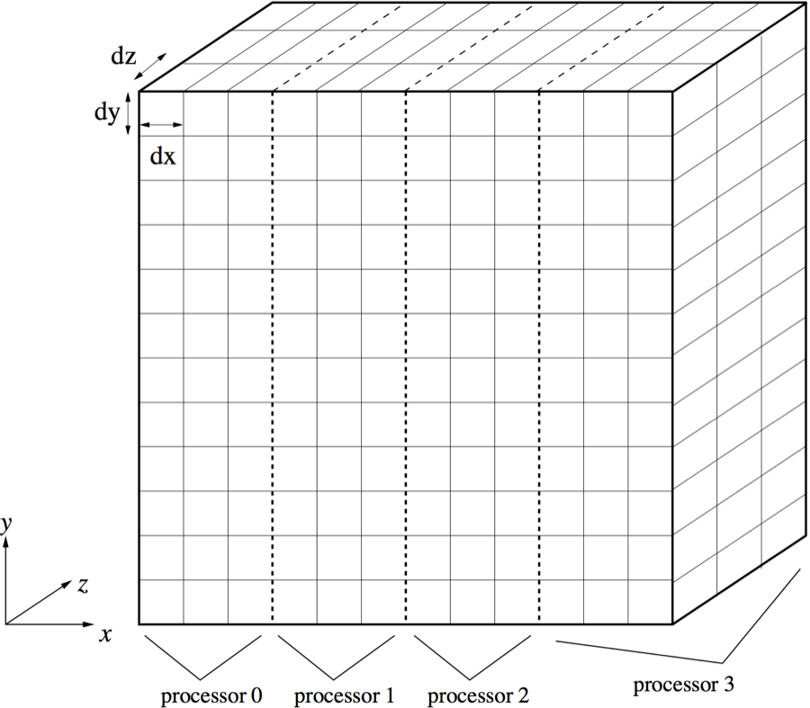
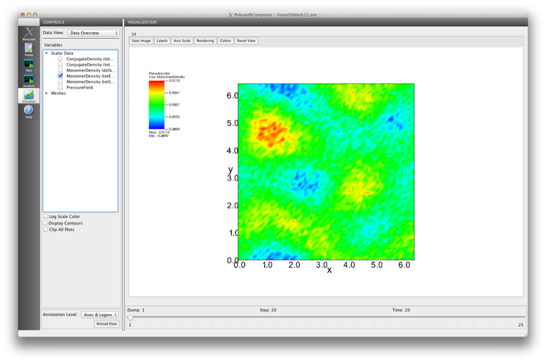
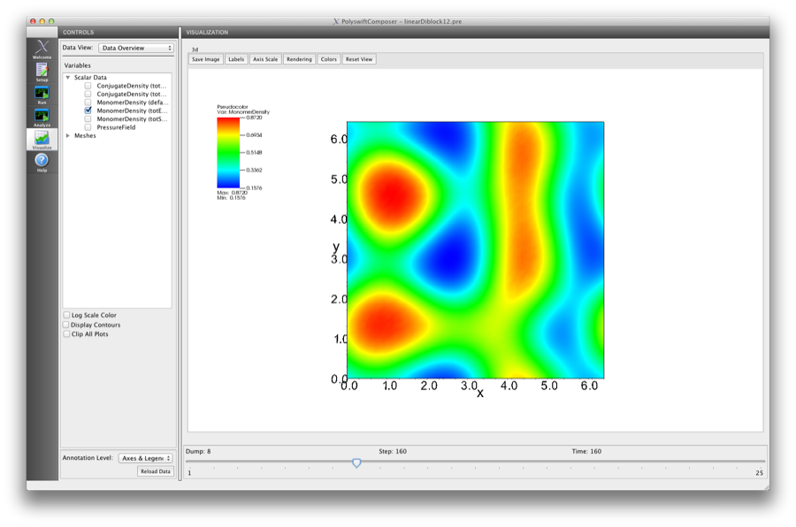
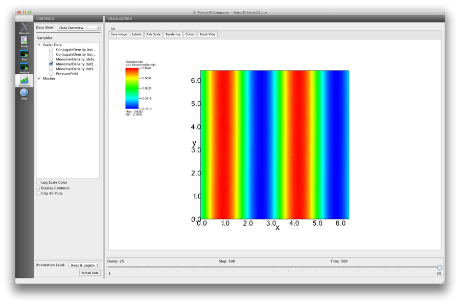
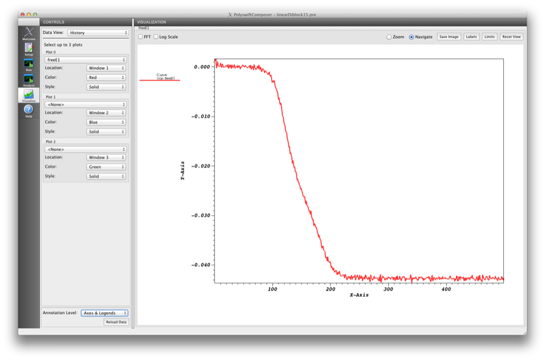

.. _ld-tutorial-lesson-1-symmetric-diblock:

Lesson 1: Model/Simulation detail for a 2-component AB diblock
-----------------------------------------------------------------------

.. _ld-1-definition-of-diblock:

Definition of linearDiblock
^^^^^^^^^^^^^^^^^^^^^^^^^^^^^^

Now that we have examined the conceptual model for linearDiblock, we are
ready to define the linearDiblock simulation, which includes 3 three physical 
fields, a model definition block, and a copolymer definition block. 
The process involves:

    - Variable definition

    - Simulation parameter definition

    - Grid definition

    - Decomposition definition

    - Physical field defintion

    - Model definition (includes updaters and interactions)

    - Diblock copolymer definition

    - Diagnostics definition

As needed, refer back to the *PSim In Depth* section, :ref:`basic-concepts-for-all-simulations`.

.. _ld-1-variable-definition:

Variable Definition
~~~~~~~~~~~~~~~~~~~~~~

The input file imports any needed macros and defines variables. The
linearDiblock example uses the macro pseudospectral.mac, which contains
input block setup appropriate for the pseudospectral method of solving
the modified diffusion equations in the theory.

    - :ref:`ld-1-variables-for-the-grid`

    - :ref:`ld-1-variables-copolymer-block-sizes`

    - :ref:`ld-1-variables-for-monomer-interaction-strength`

    - :ref:`ld-1-variables-for-relaxation-algorithm`

By changing the variables, we can quickly change aspects of the
simulation.

.. _ld-1-variables-for-the-grid:

Variables for the Grid 
++++++++++++++++++++++++++++++++++++++++++

The variables for the grid input block comprise:

    - Number of cells in the simulation grid along the x axis (:samp:`NX`),
      y axis (:samp:`NY`), and z axis (:samp:`NZ`)

    - Length of a grid cell in x-dir (:samp:`dx`), y-dir (:samp:`dy`),
      and z-dir (:samp:`dz`)

The dimensions, or lengths, of the grid in the example are:

    - X = :samp:`6.4` :math:`R_g`

    - Y = :samp:`6.4` :math:`R_g`

    - Z = (For 2D simulations NZ=1)

where :math:`R_g` sets the length scale. The radius of gyration of the 
unperturbed chain is given by

     .. math::
        R_g^2 = \frac{b^2 N}{6}

where :math:`b` is the statistical segment length and :math:`N` is the number of
statistically independent chain segments.

The figure, 
:ref:`user-defined-cartesian-grid-forlinearDiblock-by-polyswift-fig`,
displays the grid for the linearDiblock simulation. The grid cells sizes are 
denoted by 'dx, dy and dz'. The slab domain decomposition is needed for the 
FFT implementation of the pseudospectral method of solving for the chain 
propagators in the numerical theory [].
(The domain decomposition example shown is for four MPI processors on a 
grid of size NX = 12, NY = 12, NZ = 3).

.. _user-defined-cartesian-grid-forlinearDiblock-by-polyswift-fig:

   User-defined Cartesian grid for linearDiblock used by PolySwift++

.. _ld-1-variables-copolymer-block-sizes:

Variables for the Copolymer Block Sizes
++++++++++++++++++++++++++++++++++++++++++

The variables for the copolymer block sizes include:

    - length fraction of the A block (:samp:`fA`)

    - length fraction of the B block (:samp:`fB`)

The total for each copolymer must be one (:math:`fA + fB = 1`)

.. _ld-1-variables-for-monomer-interaction-strength:

Variables for the Monomer Interaction Strength
++++++++++++++++++++++++++++++++++++++++++++++++++

The variables for the monomer interactions parameterize the strength
of the Flory segregation strength.

   - The Flory :math:`\chi` parameter (:samp:`chiAB`)

   - The number of statistical segment lengths in the copolymer :math:`N`
     (:samp:`NLEN`).

The product :math:`\chi N` sets the over segregation strength. The parameter NLEN
appears later in the <Polymer> object and is used to set the length scale for the theory. If other <Polymer> objects appear in the input file the NLEN in the first <Polymer>
object is used to set the length scale for entire model.

.. _ld-1-variables-for-relaxation-algorithm:

Variables for the Relaxation Algorithm
++++++++++++++++++++++++++++++++++++++++++

The variables that control the steepest descent relaxation algorithm include

    - The size of the first mixing factor :math:`\lambda`  (:samp:`lambda1`)

    - The size of the second mixing factor :math:`\lambda^{'}` 
      (:samp:`lambda2`). 
      For convenience, this is set to half of the first mixing parameter

    - The strength of the gaussian noise added to the field updates
      (:samp:`noise_stregnth`). This is added in order to aid relaxation and 
      keep the simulation from reaching the homogeneous phase when starting 
      from a random initial state.

The :math:`\lambda` relaxation paramters control updating the chemical potential
fields :math:`\omega` (conjugate to the monomer densities) through the following
expressions

          .. math::

	     \omega_A^{n+1} - \omega_A^{n} = 
	      \lambda^{'} \frac{\delta {\tilde F}}{\delta \phi_B^n} +
	      \lambda     \frac{\delta {\tilde F}}{\delta \phi_A^n}

	      \omega_A^{n+1} - \omega_A^{n} = 
	       \lambda^{'} \left [ \phi_A^n - \bar{\phi}_A - \frac{\omega_B^n - p^n}{\chi N}  \right ] +
    	       \lambda     \left [ \phi_B^n - \bar{\phi}_B - \frac{\omega_A^n - p^n}{\chi N}
                \right ]

and

	.. math::

	   \omega_B^{n+1} - \omega_B^{n} = 
	       \lambda         \frac{\delta {\tilde F}}{\delta \phi_B^n} +
	       \lambda^{'}     \frac{\delta {\tilde F}}{\delta \phi_A^n} 

	    \omega_B^{n+1} - \omega_B^{n} = 
	        \lambda     \left [ \phi_A^n - \bar{\phi}_A - \frac{\omega_B^n - p^n}{\chi N}  \right ] +
		\lambda{'}  \left [ \phi_B^n - \bar{\phi}_B - \frac{\omega_A^n - p^n}{\chi N}  \right ]

.. _ld-1-variable-definition-section-in-pre-file:
   
Variable Definition Section in Pre File
++++++++++++++++++++++++++++++++++++++++++

The variable definition section of the :file:`linearDiblock.pre` file follows.

Each line defining a variable begins with a dollar sign :samp:`$`.

::

	##########
	#
	# Primary variables (defined in terms of constants)
	#
	##########

	$ NX = 64
	$ NY = 64
	$ NZ = 1
	
	$ dr = 0.10
	$ DX = dr
	$ DY = dr
	$ DZ = dr

        $ DS = 0.05

	$ fA = 0.5
	$ fB = 0.5

	$ noise_strength = 0.025
	$ lambda1 = 0.30
	$ lambda2 = lambda1 * 0.50
        $ randomSeed = 123

	$ chiNAB = 12.0
	$ NLEN = 100.0
   
    
.. note::
   Comment lines to highlight the beginning of the variables
   section of the pre file explain the meaning of the variables.

.. note::
   Tech-X recommends that you always use comment lines both to make the
   various sections of the pre file easy to find and to clarify the purpose
   of parameters in each section.

.. _ld-1-simulation-parameter-definition:

Simulation Parameter Definition
^^^^^^^^^^^^^^^^^^^^^^^^^^^^^^^

Following the variable definition section, the input file defines the
top-level simulation parameters.

Top-level simulation parameters specify the global data that is not
specific to any object in the simulation. The :file:`linearDiblock.pre` file 
defines two simulation parameters:

    - nsteps

    - dumpPeriodicity

The :option:`nsteps` parameter specifies the number of update steps in the
simulation. If PSim must be restarted, it uses nsteps to determine the
number of additional steps to run. The linearDiblock example has 1000 update 
steps.

The :option:`dumpPeriodicity` parameter specifies the number of update steps 
that must elapse before PSim dumps the output of the simulation into output
files. The linearDiblock example dumps output to files after every 10 time
steps. Because the linearDiblock example has 10 update steps, it dumps output
once, at the end of the simulation. For more information, see 
:ref:`basic-concepts-for-all-simulations`.

You can override the values of the nsteps, and dumpPeriodicity parameters by
adding options to the polyswift command line. For more information, see 
:ref:`user-guide-running-polyswift-from-the-command-line`.

For the complete list of top-level simulation parameters, see the
*PSim Reference Manual*.

The top-level simulation parameter definition section of
the :file:`linearDiblock.pre` file follows.

::

	##########################################################
	#            Domain parameters and defaults              #
	##########################################################

	nsteps = 500           # timesteps in relaxation algorithm
	dumpPeriodicity = 20   # dump period

    
.. _ld-1-grid-definition:

Grid Definition
^^^^^^^^^^^^^^^^^^

Following the section defining the top-level simulation parameters, the
input file defines the Cartesian grid. The pseudospec macro sets up the
grid and domain decomposition blocks for this simulation. See 
:ref:`programming-concepts-polyswift-macros-pssetup-macro` for details of 
the pseudospec macro and see the *PSim Reference Manual* for details of the 
<Grid> and <Decomp> blocks. This macro is loaded in the following
lines in the :file:`linearDiblock.pre` file

::

	$ import pseudoSpecSetup
	setupPS(NX, NY, NZ, DX, DY, DZ, "'off'")

Input Blocks in the Input File
^^^^^^^^^^^^^^^^^^^^^^^^^^^^^^

The following three blocks in the file :file:`linearDiblock.pre` set up the
physical fields. There are two fields for the monomer densities; one for the
monomers on the 'A' block and one for the monomers on the 'B' block. The
third field is a constraint field needed to maintain the incompressibility
constraint used in this simulation. For additional monomer types, an extra
<PhysField> block need to be added along with additional blocks defining
their interactions (see below).

::

	#######################################################
	# Physical observable fields
	#######################################################

	<PhysField totStyrDens>
	  kind = monomerDens
	  type = fieldD3R
	</PhysField>

	<PhysField totEthyDens>
	  kind = monomerDens
	  type = fieldD3R
	</PhysField>

	<PhysField defaultPressure>
	  kind = constraint
	  type = fieldD3R
	</PhysField>

The next block is the <EffHamil> block and holds the updaters and 
interactions that define the energetics of the
model and relaxation methods.

::

	#########################################################
	# Effective Hamiltonian: defines energetic SCFT model
	#########################################################
	<EffHamil mainHamil>

	  kind = canonicalMF
	  updaterSequence = [wAwB]

	  <Updater wAwB>

	    kind = steepestDescent
	    type = incompressible
	    relaxlambdas = [lambda1 lambda2]
	    noise = noise_strength
	    updatefields = [totStyrDens totEthyDens]
	    interactions = [StyrEthy]

	  </Updater>

	  <Interaction StyrEthy>
	    kind = flory
	    chi = chiAB
	    scfields = [totStyrDens totEthyDens]
	  </Interaction>

        </EffHamil>

For some problems, additional updaters need to be specified. The order
in which they are to be applied is set by the parameter 'updaterSequence'.
Only one <Updater> block is needed for this example. The <Interaction> block
specifies the Flory interaction model. The parameter 'chi' sets the Flory
interaction strength :math:`\chi`. The 'scfields' parameters specfies which
monomer species that the :math:`\chi` parameter is setting the segregation 
strength between. For additional monomer species, additional <Interaction> 
blocks would be required. For example, if the model contains A,B and C monomers 
there would need to be three interaction blocks (AB, AC and BC). 

The linear diblock architecture is specified in the next block.

::

     <Polymer diblock1>

       kind = blockCopolymer
       volfrac = 1.0
       length = NLEN

The 'length' parameter corresponds to :math:`N` in the theory and 'volfrac'
is the volume fraction of this diblock species. Since this is the only copolymer
in the system the volume fraction is one. For multiple species the code checks
that all polymeric and solvent species sum to unity.

The <Polymer> block holds <Block> objects. For a diblock there are two blocks 
listed 'blockA' and 'blockB'. The kind parameter specifies the model and 
solution method namely, a flexible Gaussian coil model solved with a 
pseudospectral method.

::

       <Block blockA>
         kind = flexPseudoSpec
	 scfield = totStyrDens
	 ds = DS
	 lengthfrac = fA
	 headjoined = [freeEnd]
	 tailjoined = [blockB]
       </Block>

The flexible Gaussian model leads to the following modified diffusion equation 
for the restricted partition function of the polymer chains.

    .. math::

      \frac{\partial q}{\partial s}  =  \left \{
       \begin{array}{cc} 
         R_{{\rm g}0}^2 \nabla^2 q({\vec r},s) - i N w_A q({\vec r},s), & 0 < s < f \\  \\
         R_{{\rm g}0}^2 \nabla^2 q({\vec r},s) - i N w_B q({\vec r},s), & f < s < 1
       \end{array} \right .

This block implements the following algorithm for calculating the restricted 
partition function :math:`q({\vec r},s)`
needed for calulating the coarse grained monomer density fields

	.. math::

	   q({\vec r},s + \Delta s) =  \exp \left[\Delta s (\nabla^2 - w({\vec r})) \right ] q({\vec r},s)

	   q({\vec r},s + \Delta s) \approx e^{- w({\vec r}) \Delta s / 2} e^{\Delta s \nabla^2} e^{- w({\vec r}) \Delta s / 2} q({\vec r},s)

	   q({\vec r},s + \Delta s) \approx e^{- w({\vec r}) \Delta s / 2} {\hat F}^{-1} \left [ e^{- \Delta s \ k^2}
	         {\hat F}  \left  [ e^{- w({\vec r}) \Delta s / 2} q({\vec r},s)  \right ]  \right ]

The 'scfield' parameter lists the name of the physical field object 
corresponding to a particular monomer species. So the <Block> object 
'blockA' contains the physical field 'totStyrDens' (ie 'A') and <Block> 
object 'blockB' contains the physical field 'totEthyDens' (ie 'B'). The sizes 
of each block (fA and fB) set the parameter 'lengthfrac' in each block.

::

       <Block blockB>
         kind = flexPseudoSpec
	 scfield = totEthyDens
	 ds = DS
	 lengthfrac = fB
	 headjoined = [blockA]
	 tailjoined = [freeEnd]
       </Block>

The connectivity information specifying a linear diblock is set with the 
'headjoined' and 'tailjoined' parameters. The 'blockA' above has one 
free-end and the other end connected to only one block, namely 'blockB'. 
The 'blockB' has one free-end and the other end connected to only one block, 
namely 'blockA'. 

The next block specifies optional diagnostics. This block causes the free-energy
of the system modeled by the <EffHamil> block 'wAwB' to be dumped to a dataset
in a 'History' file.

::

     <History freeE1>
       kind = freeEnergy
       updaterName = wAwB
     </History>

The expression for the free-energy calculated by this diagnostic is

    .. math::

       {\tilde F} =  V^{-1} \int d{\vec r}
        \left [  \chi N (\phi_A - \bar{\phi}_A) (\phi_B - \bar{\phi}_B)
	     - \omega_A \phi_A - \omega_B \phi_B
	      - p(1 - \phi_A - \phi_B) \right ]  - \ln Q[\omega_A,\omega_B]

where the free-energy has been scaled by :math:`N/\rho_0 V` and shifted by 
the free-energy of the disordered phase.

Visualize linearDiblock Using PSimComposer
^^^^^^^^^^^^^^^^^^^^^^^^^^^^^^^^^^^^^^^^^^^^^^^^^^

Please refer to documentation for running the input file associated with 
this tutorial at :ref:`psimbase-linearDiblock`

This section explains how to visualize the data generated for 
the :file:`linearDiblock.pre` file by running PSimComposer.

    .. note::
       In addition to PSimComposer, other commonly used tools for
       visualizing PolySwift++ data are:

    - `Mathematica <http://www.mathematica.org/>`_

    - `VisIt <https://wci.llnl.gov/codes/visit/>`_  from Lawrence Livermore National Laboratory
      

#. From within PSimComposer, click on the *Visualize* icon in the icon 
   panel on the far left.
#. Click on the **Open** button.
#. In the **CONTROLS** pane, in the **Variables** list of the **Data Overview**
   data view, click on the arrow next to *Scalar Data*.
#. Select *MonomerDensity (totEthyDens)* (you may need to resize the 
   **CONTROLS** pane so the complete titles may be seen.

The initial 2D contour rendering is not as clear as the 'Pseudocolor' plot 
capability. Click off the "Display Contours" box.

.. _ld-screenshot-visualize-001:

   
   PSimComposer initial view displaying 2D pseudocolor of monomer density for 
   the 'totEthyDens' species

Move the 'Dump' slider to visualize the data files in time. In this way, one 
can follow the relaxation procedure.

.. _ld-screenshot-visualize-002:

   
   PSimComposer intermediate view displaying 2D pseudocolor of monomer density 
   for the 'totEthyDens' block

Move the 'Dump' slider to the end of the run to view the fully equilibrated 
state.

.. _ld-screenshot-visualize-003:

   
   PSimComposer final view displaying 2D pseudocolor of monomer density for 
   the 'totEthyDens' block

This grid size for this tutorial is sufficiently small that the ordered 
lamellar phase should be seen regardless of random seed or processor number. 
The orientation of the layers may be different than the figure above but the 
free-energy should be close (small differences possible due to effect of box 
constraint).

To view the free-energy values in the file :file:`linearDiblock*History.h5` go 
back to the **CONTROLS** pane and select the **Data Overview** menu and go to 
the **History** selection

.. _ld-screenshot-visualize-004:

   
   PSimComposer displaying single history dataset for the free-energy of the 
   AB diblock bulk system

In Lesson 2 of this Linear Diblock Simulation Tutorial, you will adjust 
parameters that control the resolution of the simulation and the run time, 
see :ref:`ld-tutorial-lesson-2-iteration-steps`.
