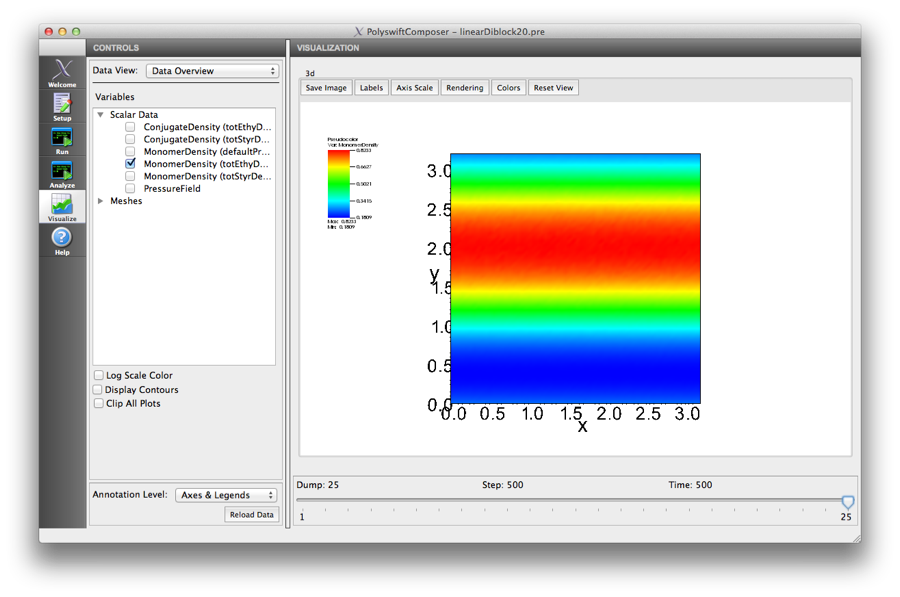
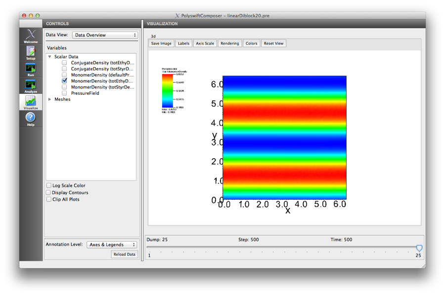
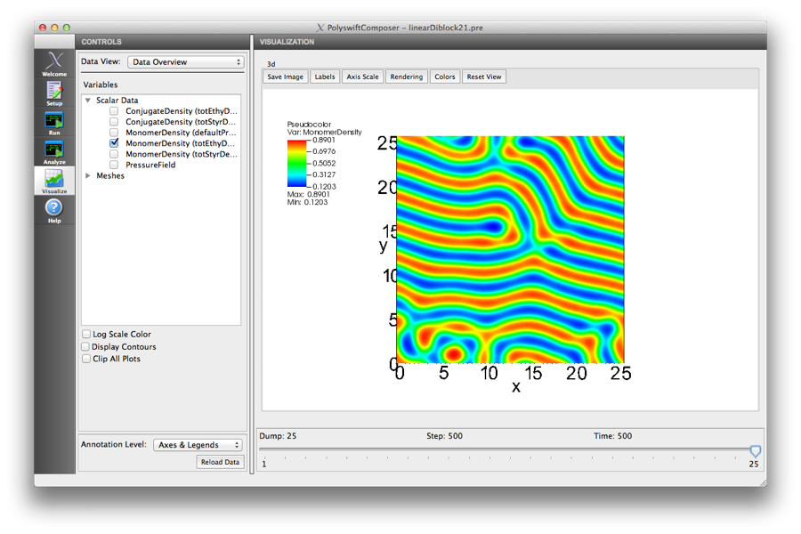
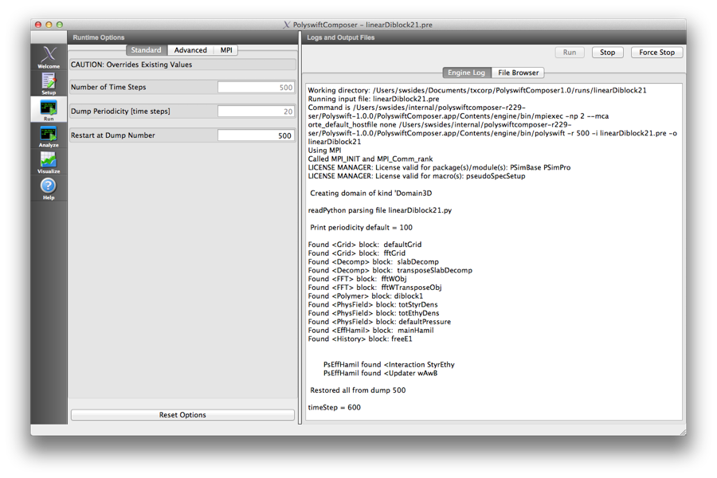
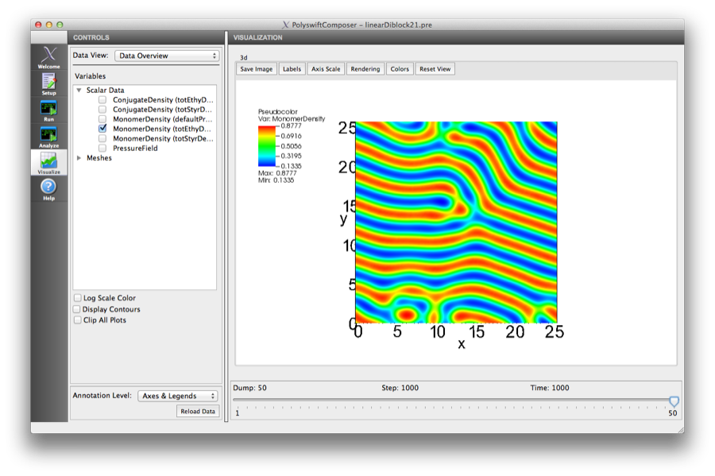

.. _ld-tutorial-lesson-2-iteration-steps:

Lesson 2: Increase the resolution of the simulaton
------------------------------------------------------------------------------------------------
    
Starting with an example simulation in your area of interest and making
changes to the example is a practical way to create a new simulation. If
you visualize the output as you make changes, you can see whether you
are getting the results you expect or whether you need to review and
modify your initial changes before making further changes.

Now that we have examined the sections of the :file:`linearDiblock.pre` file in
detail and visualized the output in PSimComposer, we are ready to make
changes to the linearDiblock.pre file. In this lesson we will:

    - Increase the grid resolution

    - Increase the grid size (simulation size)

    - Increase the number of update steps (restart capability)

Increase the grid resolution
^^^^^^^^^^^^^^^^^^^^^^^^^^^^^^^^

The first change we are going to make in the linearDiblock.pre file is
simple. We are going to increase the resolution of the grid from
:math:`dx=dy=0.1 R_g \rightarrow 0.05 R_g`. For a fixed grid size, this
effectively reduces the overall simulation length in each direction.

   

Increase the grid size (simulation size)
^^^^^^^^^^^^^^^^^^^^^^^^^^^^^^^^^^^^^^^^^^^^

The second change we are going to make in the linearDiblock.pre file is to
increase the grid size from :math:`NX=NY=64 \rightarrow 128` while keeping the
new grid cell size of :math:`dx=dy=0.05 R_g`. This restores the overall system
length in Lesson 1 but now at a higher spatial resolution

Increase the number of time steps
^^^^^^^^^^^^^^^^^^^^^^^^^^^^^^^^^^^^^^^

The PolySwift++ engine currently solves for the mean-field (fluctuation-free)
solution of the copolymer SCFT equations. Iterative methods are used
to advance the current state of the simulation at step :math:`n_i` to
a state closer to the mean-field solution at step :math:`n_{i+1}`.
Increasing the total number of time steps :math:`n_T` will tend to
produce results closer to the true, mean-field solution.

This is most clearly seen in a system sufficiently large for topological
defects to form. Keeping the same overall grid size, change the
grid cell size to :math:`dx=dy=0.2 R_g`. This effectively doubles the
overall system (while reducing the resolution). In this way, one can
more quickly illustrate the effect of changing the number of time
steps in a system that does not rapidly reach a completely ordered state.

   PSimComposer view of Standard section of Runtime Options
   
The overall order is lamellar, however topological defects such as edge
dislocations can clearly be seen. To increase the number of time steps
one can restart the simulation from any dumped state. Restart this simulation
by going to the **Run Pane** and going to the *Standard* runtime options.
Then enter '500' into the 'Restart At Dump Number' box, this will restart
the simulation from the last dumped state. If the other parameters are
left unchanged, this will run the simulation for another 500 time steps.
defects to form.

   Run Pane with restart parameter set and Log information after run is restart

After running for 1000 time steps the system is closer to an ordered state,
however the relaxation is clearly becoming trapped in a state with topological
defects. These features are seen in experimental systems and a variety
of methods can be used to remove them to produce a completely ordered, equilibrium
state. These experimental methods have inspired numerical techniques that are
demonstrated in the *Spectral Filtering* and *Zone Annealing* examples.

In Lesson 3 of this Linear Diblock Simulation Tutorial, you will adjust parameters that
control the block sizes and interaction strengths. Then, one can investigate the entire
morphology phase diagram in :ref:`ld-tutorial-lesson-3-phase-diagram`.
