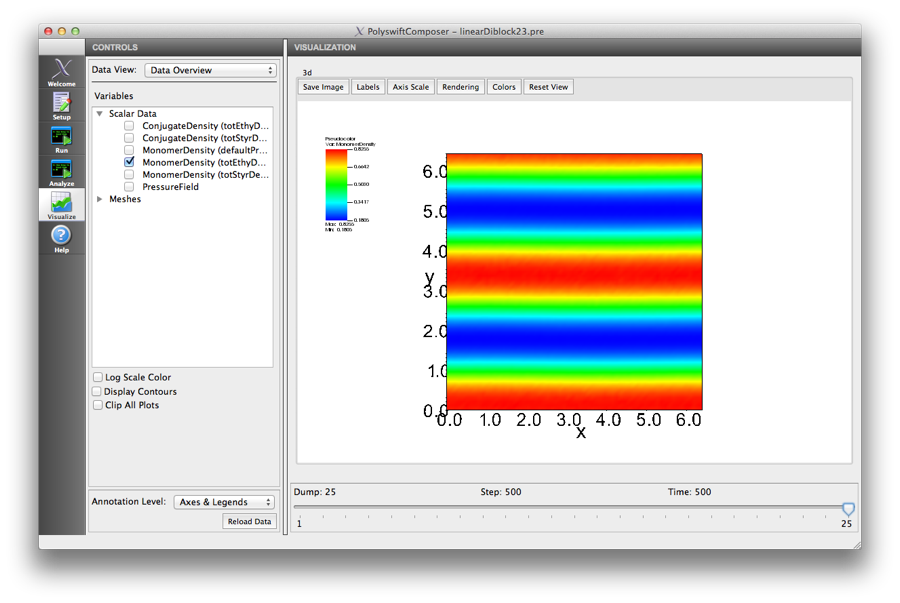

.. _ld-tutorial-lesson-3-phase-diagram:

Lesson 3: Explore morphology phase diagram
---------------------------------------------------------------------------

This lesson will show how PSim can be used to explore the morphology
phase diagram for the well known 2-component AB linear diblock model. The 
examples below will be simulations for small 2D systems as these run to 
completion quickly.
Exploring the full phase diagram would require 3D simulations that will need
a large, parallel compute cluster. (Remote execution on clusters will be 
available in v 1.2.0).

The figure :ref:`phase-diagram-sch` shows a schematic of the well known SCFT 
phase diagram for an AB diblock. The three points labeled in the 
phase diagram are three pairs of (f, :math:`\chi N`) values corresponding to 
different morphologies in the phase diagram. Using the 'Linear Diblock' 
example change the (f, :math:`\chi N`) values and run the simulation through
PSimComposer to generate the result.

.. _phase-diagram-sch:

   Schematic of phase diagram calculated from fully spectral SCFT method, that
   requires foreknowledge of space groups that copolymer domains will form.

Lamellar phase morphology (LAM)
^^^^^^^^^^^^^^^^^^^^^^^^^^^^^^^^^

The first example is for :math:`f = 0.5` and :math:`\chi N = 12.0`. These are 
the default settings for this template example

Disordered, homogeneous phase (DIS)
^^^^^^^^^^^^^^^^^^^^^^^^^^^^^^^^^^^^^

The next example is for :math:`f = 0.5` and :math:`\chi N = 8.0`

.. figure:: images/LD_Lesson3_DIS.png
   :align: center
   :scale: 100%
   :alt: LD_Lesson3_DIS.png

Hexgonally packed cylinders (HEX)
^^^^^^^^^^^^^^^^^^^^^^^^^^^^^^^^^^^

The next example is for :math:`f = 0.3` and :math:`\chi N = 18.0`

A summary of the results you should see is below. The images of the monomer 
density fields are from larger PSim simulations to more clearly illustrate 
the calculated morphologies.

.. _phase-diagram-summary:

   2-component linear diblock phase diagram results from PolySwift++
